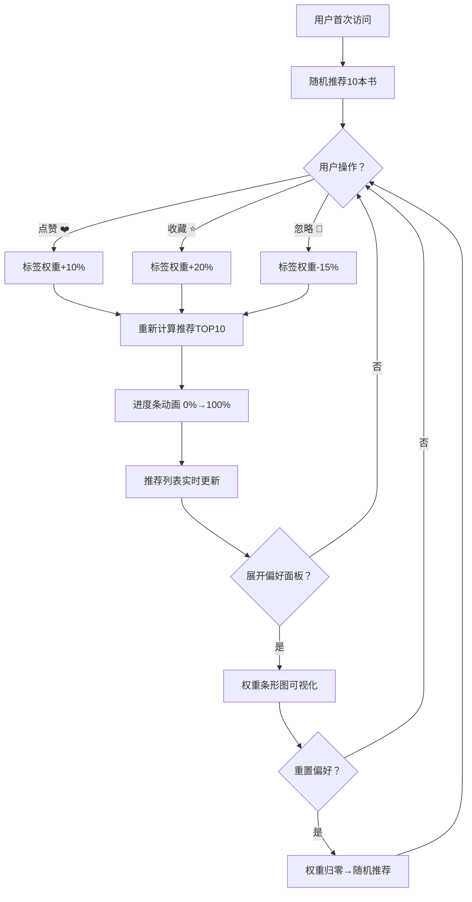

## 1. 产品概述

「书海导览·个性推荐引擎」是一款面向独立读者的智能书单推荐Web应用，通过实时分析用户的点赞、收藏、忽略等行为，动态调整书籍标签权重算法，为读者生成个性化推荐。应用将推荐算法逻辑可视化，让用户直观理解偏好变化过程。

- 核心价值：将个性化推荐算法的"黑箱"打开，让读者亲眼看到自己的阅读偏好如何影响推荐结果
- 目标用户：独立博客读者、热爱阅读的知识工作者、对推荐算法感兴趣的技术爱好者

---

## 2. 核心功能

### 2.1 用户角色
| 角色 | 注册方式 | 核心权限 |
|------|---------|----------|
| 普通读者 | 无需注册，本地会话 | 浏览推荐、点赞/收藏/忽略、查看偏好权重、重置偏好 |

### 2.2 功能模块
1. **主页面**：推荐列表、书籍卡片、操作按钮、进度条反馈
2. **偏好面板**：可折叠侧边栏、标签权重条形图、重置按钮

### 2.3 页面详情
| 页面名称 | 模块名称 | 功能描述 |
|---------|---------|----------|
| 主页面 | 推荐列表 | 瀑布流式卡片网格，展示TOP10推荐书籍，支持响应式布局 |
| 主页面 | 书籍卡片 | 封面图标（首字母渐变圆形）、书名、作者、标签、操作按钮 |
| 主页面 | 卡片展开 | 点击卡片展开详情：简介、推荐理由、标签权重贡献 |
| 主页面 | 操作反馈 | 点赞弹跳动画、收藏光晕脉冲、操作后进度条重算提示 |
| 主页面 | 推荐进度条 | 操作后顶部出现，1秒内从0%到100%，表示重新计算 |
| 偏好面板 | 折叠控制 | 右侧可折叠/展开面板，默认收起，滑入滑出动画 |
| 偏好面板 | 权重条形图 | 所有标签权重可视化，冷暖渐变配色，0.5秒动画过渡 |
| 偏好面板 | 重置按钮 | 一键归零所有权重，恢复初始随机推荐 |

---

## 3. 核心流程

用户首次访问 → 系统随机推荐10本书 → 用户浏览卡片 → 点击点赞/收藏/忽略 → 后端调整对应标签权重（点赞+10%、收藏+20%、忽略-15%）→ 后端重新按权重排序生成TOP10 → 顶部进度条动画 → 推荐列表实时更新 → 展开偏好面板查看权重条形图 → 可重置偏好

---

## 4. 用户界面设计

### 4.1 设计风格
- **主色调**：深蓝灰背景 `#1A1A2E`，半透明白卡片 `rgba(255,255,255,0.08)`
- **强调色**：海蓝 `#00D2FF`（进度条、链接）、珊瑚红 `#FF6B6B`（爱心、高亮）
- **渐变配色**：封面图标根据主标签生成HSL色相渐变，权重条形从冷色 `#4A90D9` 过渡到暖色 `#FF6B6B`
- **按钮风格**：圆角胶囊按钮，悬停时背景透明度提升，点击缩放反馈
- **字体**：系统字体栈 `-apple-system, BlinkMacSystemFont, 'Segoe UI', sans-serif`
- **字号层级**：标题 18px（bold）、正文 14px（regular）、标签 12px（medium）
- **布局风格**：响应式CSS Grid瀑布流，右侧可折叠偏好面板
- **动画风格**：所有过渡 0.3s ease，权重变化 0.5s EaseOut，进度条 1s 线性

### 4.2 页面设计概览
| 页面名称 | 模块名称 | UI元素 |
|---------|---------|--------|
| 主页面 | 头部 | 应用标题「书海导览」、副标题、偏好面板切换按钮 |
| 主页面 | 进度条 | 顶部100%宽度，海蓝渐变，操作后触发 |
| 主页面 | 推荐网格 | CSS Grid `minmax(280px, 1fr)`，gap 24px，卡片间距 |
| 主页面 | 书籍卡片 | 圆角16px，hover scale 1.05 + 阴影位移，首字母渐变圆形封面 |
| 主页面 | 卡片操作栏 | 爱心（点赞）、星星（收藏）、叉号（忽略）三个图标按钮 |
| 主页面 | 操作提示 | 卡片底部短暂提示文字，2秒淡出 |
| 主页面 | 展开详情 | 卡片点击后高度平滑扩展，显示简介和推荐理由 |
| 偏好面板 | 容器 | 固定右侧，宽度320px，深色背景 + 左侧边框海蓝光效 |
| 偏好面板 | 头部 | 面板标题、重置按钮、关闭图标 |
| 偏好面板 | 条形图 | requestAnimationFrame动画，冷暖色渐变，数值标注 |

### 4.3 响应式设计
- **桌面端（>768px）**：Grid每行3-4张卡片，偏好面板完整显示
- **平板端（768px）**：Grid每行2张卡片，偏好面板覆盖层
- **手机端（480px）**：Grid每行1张卡片，偏好面板全屏弹出
- **触控优化**：按钮最小点击区域44×44px，移动端增加间距

---

## 5. 性能与约束
- 推荐算法执行时间 ≤ 100ms
- API响应时间（GET /api/recommendations）≤ 150ms
- 动画帧率保持 60FPS
- 偏好面板条形图使用 requestAnimationFrame 驱动，不阻塞主线程
