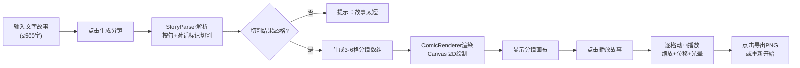

## 1. 产品概述

「叙事之箱·分镜生成器」是一款面向漫画爱好者的创意交互工具，用户输入一段文字故事后，系统自动将其拆解为3-6个漫画分镜格子，并配以黑白线稿风格的抽象插画，通过动态衔接动画讲述完整故事。

- 目标用户：漫画创作者、故事作者、创意爱好者
- 核心价值：降低漫画分镜创作门槛，将文字快速转化为可视化的分镜脚本

## 2. 核心功能

### 2.1 功能模块
1. **故事输入区**：多行文本输入框、字数统计、生成分镜按钮
2. **分镜画布区**：3行×2列网格布局、6个分镜格子、空镜标记
3. **播放控制区**：播放故事动画、动态衔接效果、黄色光晕高亮
4. **导出操作区**：导出PNG图像、重新开始重置

### 2.2 页面详情

| 页面名称 | 模块名称 | 功能描述 |
|---------|---------|---------|
| 主页面 | 故事输入区 | 多行文本框（≤500字），实时字数统计，按语义断句+对话标记解析 |
| 主页面 | 分镜画布区 | 6格网格布局（3×2），Canvas 2D渲染黑白线稿，格子序号、角色简笔画、对话框 |
| 主页面 | 播放控制区 | 缩放+位移动画（0.5×→1×，左移20px，0.6s ease-out）、淡出效果（0.4s）、闪烁黄色光晕 |
| 主页面 | 导出操作区 | 拼接所有格子为PNG下载、清空输入和画布 |

## 3. 核心流程

用户操作主流程：

## 4. 用户界面设计

### 4.1 设计风格
- **主色调**：深灰背景 #2C2C2C，白色卡片 #FAFAFA
- **按钮色系**：青蓝 #4A90D9（生成）、橙 #F5A623（播放）、绿 #7ED321（导出）、红 #D0021B（重置）
- **按钮样式**：圆角矩形，hover亮度+15%，box-shadow inset凹陷效果
- **字体**：清晰易读的无衬线字体，正文14px，标题18px
- **布局风格**：卡片式居中布局（900px宽），圆角12px，阴影0 4px 20px rgba(0,0,0,0.2)
- **视觉元素**：黑白线稿风格分镜，椭圆/云朵形对话框，抽象角色简笔画

### 4.2 页面设计概览

| 页面名称 | 模块名称 | UI元素 |
|---------|---------|--------|
| 主页面 | 故事输入区 | 多行文本框（浅灰边框，focus青蓝边框）、字数统计标签、生成分镜按钮（青蓝） |
| 主页面 | 分镜画布区 | 白色背景画布，6格正方形（180px），4px灰色间距，格子hover浅黄色闪烁 |
| 主页面 | 底部按钮区 | 四色按钮并排，pointer光标，平滑过渡动画 |

### 4.3 响应式设计
- 桌面端优先（≥960px）：卡片900px，格子180px
- 移动端（<960px）：卡片铺满全宽，格子缩小为120px

### 4.4 性能要求
- 生成分镜响应时间：≤800ms（解析+绘制）
- 动画帧率：60fps（requestAnimationFrame）
- 输入响应延迟：<100ms
