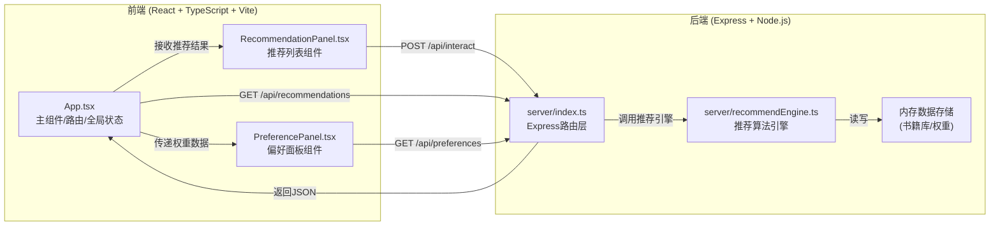
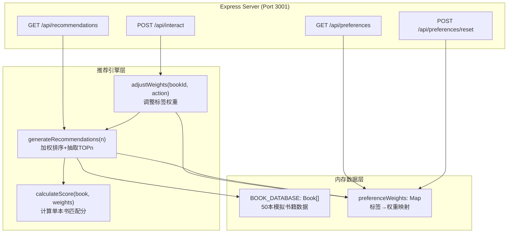
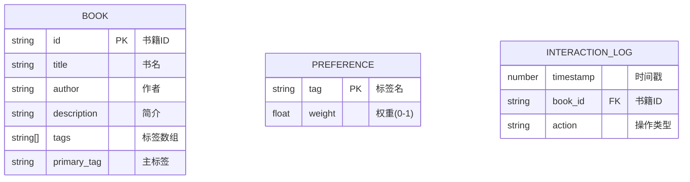

## 1. 架构设计



**数据流向说明：**
1. 前端初始化 → `App.tsx` 调用 `GET /api/recommendations` 获取初始推荐
2. 用户操作卡片 → `RecommendationPanel.tsx` 调用 `POST /api/interact` 发送行为
3. 后端路由 `server/index.ts` 接收请求 → 调用 `recommendEngine.ts` 调整权重
4. 引擎从内存读取50本书籍库 → 按标签权重加权排序 → 返回TOP10
5. 前端收到新推荐 → 更新 `RecommendationPanel` 渲染
6. 展开偏好面板 → `PreferencePanel.tsx` 调用 `GET /api/preferences` 获取权重 → 渲染条形图

---

## 2. 技术描述

- **前端框架**：React@18 + ReactDOM@18
- **前端语言**：TypeScript@5（strict模式，target ES2020）
- **构建工具**：Vite@5 + @vitejs/plugin-react@4
- **后端框架**：Express@4
- **后端运行**：ts-node@10（直接执行TypeScript）
- **类型定义**：@types/express@4、@types/node@20、@types/react@18、@types/react-dom@18
- **初始化方式**：手动配置（非vite-init命令，按用户指定文件结构创建）
- **数据库**：内存存储（JavaScript Map/Object，无持久化）
- **HTTP代理**：Vite内置dev server代理 `/api/*` → `http://localhost:3001`

---

## 3. 路由定义

### 前端应用路由（单页面，无react-router）
| 路由 | 用途 |
|------|------|
| `/` | 主页面：推荐列表 + 偏好面板 |

### 后端API路由
| 方法 | 路由 | 用途 | 响应时间要求 |
|------|------|------|-------------|
| GET | `/api/recommendations` | 获取推荐列表（TOP10） | ≤150ms |
| POST | `/api/interact` | 记录用户操作并重新生成推荐 | ≤100ms（算法） |
| GET | `/api/preferences` | 获取当前所有标签权重 | ≤50ms |
| POST | `/api/preferences/reset` | 重置所有权重为0 | ≤50ms |

---

## 4. API定义

### TypeScript 类型定义

```typescript
// 共享类型定义（前后端通用）
interface Book {
  id: string;
  title: string;
  author: string;
  description: string;
  tags: string[];        // 3-5个标签
  primaryTag: string;    // 主标签（决定封面颜色）
  recommendReason?: string; // 推荐理由（后端计算后补充）
  matchScore?: number;   // 匹配分数（0-1）
}

type InteractionType = 'like' | 'favorite' | 'ignore';

interface InteractionRequest {
  bookId: string;
  action: InteractionType;
}

interface RecommendationResponse {
  books: Book[];
  timestamp: number;
}

interface PreferenceMap {
  [tag: string]: number;  // 权重范围 0-1
}

interface PreferencesResponse {
  weights: PreferenceMap;
  allTags: string[];
}
```

### 请求/响应Schema

#### GET /api/recommendations
**响应 200 OK：**
```json
{
  "books": [
    {
      "id": "b001",
      "title": "三体",
      "author": "刘慈欣",
      "description": "地球文明与三体文明的生死博弈...",
      "tags": ["科幻", "太空", "硬核"],
      "primaryTag": "科幻",
      "recommendReason": "您对科幻标签的偏好度较高(0.85)",
      "matchScore": 0.92
    }
  ],
  "timestamp": 1717900000000
}
```

#### POST /api/interact
**请求体：**
```json
{
  "bookId": "b001",
  "action": "like"
}
```
**响应 200 OK：** 同 `GET /api/recommendations` 结构

#### GET /api/preferences
**响应 200 OK：**
```json
{
  "weights": {
    "科幻": 0.85,
    "历史": 0.30,
    "推理": 0.55,
    "浪漫": 0.10
  },
  "allTags": ["科幻", "历史", "推理", "浪漫", "武侠", "哲学", "悬疑", "传记", "奇幻", "文学"]
}
```

---

## 5. 服务端架构图



**算法逻辑说明：**
- **权重调整规则**：`点赞 +10%`、`收藏 +20%`、`忽略 -15%`，所有权重 clamp 到 [0, 1]
- **匹配分公式**：`score = Σ(权重[tag] for tag in book.tags) / len(book.tags)`
- **首次访问**：所有权重为0 → 随机shuffle抽取10本
- **推荐结果**：`matchScore` 降序排序，取前10，分数相同时随机打散

---

## 6. 数据模型

### 6.1 数据模型定义



### 6.2 初始数据说明（内存预置）

- **标签池（10个）**：科幻、历史、推理、浪漫、武侠、哲学、悬疑、传记、奇幻、文学
- **模拟书籍**：50本，每本随机分配3-5个标签，其中一个为主标签，涵盖古今中外名著
- **初始权重**：全部为0（首次随机推荐）
- **标签→色相映射**（用于封面渐变色）：
  - 科幻: 210°(蓝)、历史: 30°(橙)、推理: 270°(紫)、浪漫: 330°(粉)
  - 武侠: 0°(红)、哲学: 180°(青)、悬疑: 240°(深蓝)、传记: 60°(金)
  - 奇幻: 140°(绿)、文学: 90°(黄绿)

### 6.3 性能优化策略
- 书籍库与权重均为内存操作，O(n)复杂度（n=50），确保 ≤100ms
- 推荐结果缓存：权重未变化时直接返回上次结果
- 前端状态：React useState + useEffect，避免不必要的重渲染
- 条形图动画：requestAnimationFrame 分帧更新，CSS transition 兜底
- 列表渲染：CSS Grid 原生布局，无虚拟滚动（10条数据量小）

---

## 7. 文件结构与职责

```
auto33/
├── package.json              # 依赖配置 + 启动脚本
├── vite.config.js            # Vite构建配置 + /api代理到3001
├── tsconfig.json             # TS严格模式 + ES2020
├── index.html                # 入口HTML
├── src/
│   ├── main.tsx              # React入口（挂载App）
│   ├── App.tsx               # 主组件：全局状态/数据流
│   ├── types.ts              # 共享TypeScript类型定义
│   ├── styles/
│   │   └── global.css        # 全局样式 + CSS变量
│   └── components/
│       ├── RecommendationPanel.tsx  # 推荐列表+卡片+交互
│       └── PreferencePanel.tsx      # 偏好面板+条形图
└── server/
    ├── index.ts              # Express服务器 + 路由
    ├── recommendEngine.ts    # 推荐算法引擎
    └── data/
        └── books.ts          # 50本模拟书籍数据
```
