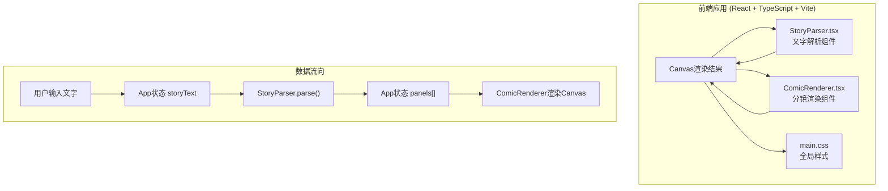

## 1. 架构设计



## 2. 技术栈说明

- **前端框架**：React 18 + TypeScript（严格模式）
- **构建工具**：Vite 5 + @vitejs/plugin-react
- **渲染技术**：Canvas 2D API（所有分镜画面）
- **状态管理**：React Hooks（useState、useEffect、useRef、useCallback）
- **动画方案**：requestAnimationFrame + CSS transition
- **样式方案**：原生CSS（CSS变量 + 响应式媒体查询）

## 3. 文件结构与职责

```
auto33/
├── package.json          # 项目依赖和启动脚本
├── vite.config.js        # Vite构建配置
├── tsconfig.json         # TypeScript严格模式配置
├── index.html            # 入口HTML页面
└── src/
    ├── App.tsx           # 主组件（状态管理、子组件调度）
    ├── main.tsx          # React入口文件
    ├── styles/
    │   └── main.css      # 全局样式（布局、主题、动画）
    └── components/
        ├── StoryParser.tsx    # 文字解析组件
        └── ComicRenderer.tsx  # 分镜渲染组件
```

### 调用关系与数据流向

1. **src/App.tsx**
   - 输入：用户在textarea输入的文字
   - 处理：调用StoryParser的parseStory()方法
   - 输出：将panels数组传递给ComicRenderer
   - 状态：storyText(string)、panels(Panel[])、isPlaying(boolean)、currentPanel(number)

2. **src/components/StoryParser.tsx**
   - 输入：原始文字故事（string）
   - 处理规则：
     - 按句号、感叹号、问号（。！？.!?）分割句子
     - 识别引号内的对话内容并单独成格
     - 合并短句子，拆分长句子，确保3-6格
     - 提取主语（角色名）和动作描述
   - 输出：Panel[]数组（3-6个元素）

3. **src/components/ComicRenderer.tsx**
   - 输入：Panel[]分镜数组、播放状态、当前面板索引
   - 渲染：
     - 6个Canvas元素（3×2网格）
     - 每格：边框、序号、角色简笔画、对话框文字
     - 空镜：斜线交叉标记
   - 动画：
     - 缩放（0.5→1）+ 位移（左移20px），0.6s ease-out
     - 淡出：上一格opacity 1→0，0.4s
     - 光晕：当前格外框闪烁黄色

## 4. 数据模型定义

### 4.1 Panel 分镜数据结构

```typescript
interface Panel {
  id: number;              // 格子序号 (1-6)
  character: string;       // 角色名称
  action: string;          // 动作/文字描述（显示在对话框）
  isDialogue: boolean;     // 是否为对话内容
  speechBubbleType: 'oval' | 'cloud'; // 对话框形状
}
```

### 4.2 App 状态类型

```typescript
interface AppState {
  storyText: string;       // 用户输入原始文字
  panels: Panel[];         // 解析后的分镜数组
  isPlaying: boolean;      // 是否正在播放动画
  currentPanelIndex: number; // 当前播放到的格子索引
  parseError: string;      // 解析错误提示
}
```

## 5. 关键算法说明

### 5.1 故事解析算法

```
1. 预处理：去除多余空白，标准化标点符号
2. 初次分割：按[。！？.!?]+正则分割句子数组
3. 对话提取：遍历每个句子，检测引号内容，标记为对话类型
4. 分组合并：
   - 若句子数 < 3 → 返回错误
   - 若句子数 > 6 → 合并相邻短句，直至≤6
   - 确保最终3-6个分组
5. 角色提取：每个分组的前2-3个字符或引号外的主语作为角色名
6. 生成Panel对象数组
```

### 5.2 Canvas绘制流程

```
每个Panel绘制步骤：
1. 清除画布（白色背景）
2. 绘制黑色边框（2px solid）
3. 绘制左上角序号（12px灰色文字）
4. 绘制角色简笔画（中央区域）：
   - 头：黑色实心圆 (r=25px)
   - 身体：垂直线条 (h=40px)
   - 四肢：左右横线各20px，下斜线各25px
5. 绘制对话框（底部区域）：
   - 椭圆/云朵形路径
   - 黑色边框 + 白色填充
   - 文字居中（自动换行）
6. 空镜：绘制两条交叉斜线（左上→右下，右上→左下）
```

### 5.3 动画引擎

```
播放循环（requestAnimationFrame）：
1. 状态机：IDLE → ENTERING → ACTIVE → EXITING → IDLE
2. 每格动画时序：
   - t=0ms：    上一格开始淡出（0-400ms, opacity 1→0）
   - t=0ms：    当前格开始进入（0-600ms, scale 0.5→1, x -20→0）
   - t=0-∞：    当前格光晕闪烁（opacity 0.3↔0.7, 周期500ms）
   - t=2000ms： 切换到下一格
3. 最后一格→循环回到第一格
```

## 6. 导出PNG实现方案

```
1. 创建离屏Canvas，尺寸计算：
   - cols = Math.min(panels.length, 2)
   - rows = Math.ceil(panels.length / 2)
   - width = cols * 190 + 10
   - height = rows * 190 + 10
2. 白色背景填充
3. 遍历每个panel：
   - 计算x,y坐标（col*190+5, row*190+5）
   - 从对应Canvas获取ImageData
   - drawImage到离屏Canvas对应位置
4. canvas.toDataURL('image/png') 获取base64
5. 创建<a>标签，设置download属性，模拟点击触发下载
```
