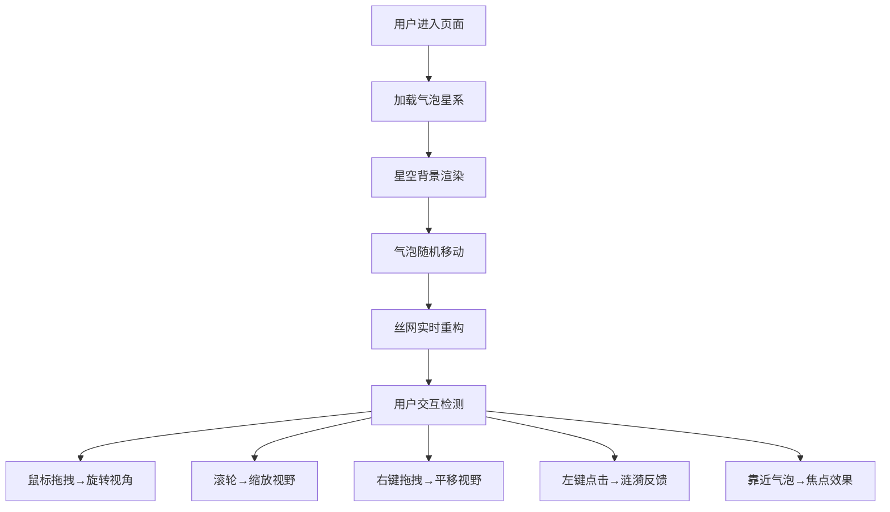

## 1. 产品概述

「气泡星系」是一个沉浸式 3D 可视化体验，用户在深色星空背景中探索由上千个半透明气泡组成的动态星系。每个气泡代表一颗虚构的系外行星，通过鼠标交互、缩放和拖拽，在宇宙中探索这张由气泡和发光丝线编织的动态网络。

- 核心目的：提供沉浸式、治愈系视觉体验，通过微观宇宙探索
- 目标用户：对数据可视化爱好者、艺术装置访客、普通大众
- 市场价值：可作为艺术装置、展览背景、音乐可视化载体、互动艺术

## 2. 核心功能

### 2.1 功能模块

1. **主场景页面**：
   - 星空背景渲染
   - 气泡星系系统（800+气泡）
   - 丝网连接系统
   - 光点流动动画
   - 涟漪反馈动画
   - 视角控制（旋转/缩放/平移）
   - 焦点视觉效果

### 2.3 页面详情

| 页面名称 | 模块名称 | 功能描述 |
|-----------|-------------|---------------------|
| 主场景 | 星空背景 | 深蓝到紫黑径向渐变（中心偏左下），营造宇宙感 |
| 主场景 | 气泡系统 | 800个半透明气泡，球体内随机分布，最小间距8单位，正态分布大小（3-15像素），颜色渐变（小蓝紫→大暖橙），脉动呼吸效果，缓慢随机移动，动态表面纹理 |
| 主场景 | 丝网系统 | 距离<50单位自动连线，线宽0.5，颜色插值，透明度渐变，光点沿丝线流动，超距2秒淡出 |
| 主场景 | 点击交互 | 点击气泡膨胀1.5倍（0.4秒），20环彩色涟漪（0.6秒），波及气泡闪烁（1.3倍亮度，0.2秒） |
| 主场景 | 视角控制 | 拖拽旋转（0.5rad/s），滚轮缩放（0.5-3.0平滑），右键平移（2单位/s） |
| 主场景 | 焦点效果 | 相机距离气泡<20单位时，气泡1.1倍，丝线加粗2px/透明度0.8，其他元素透明度0.2 |

## 3. 核心流程

用户打开页面 → 星系自动加载并渲染 → 鼠标拖拽旋转视角 → 滚轮缩放探索 → 右键平移视野 → 点击气泡触发涟漪 → 靠近气泡触发焦点 → 持续探索动态变化

## 4. 用户界面设计

### 4.1 设计风格

- **主色调**：深蓝 #0a0e27 → 紫黑 #1a0a2e 径向渐变
- **气泡颜色渐变**：小气泡（蓝紫 #6366f1）→ 大气泡（暖橙 #f97316）
- **丝线颜色**：两端气泡颜色线性插值
- **涟漪颜色**：从气泡原色渐变到透明
- **整体风格**：深邃宇宙、半透明质感、动态流动感、科技艺术感

### 4.2 页面设计概述

| 页面名称 | 模块名称 | UI 元素 |
|-----------|-------------|-------------|
| 主场景 | 星空背景 | 径向渐变背景，中心偏左下，营造深邃感 |
| 主场景 | 气泡 | 半透明球体，表面动态噪点纹理，脉动呼吸 |
| 主场景 | 丝网 | 极细发光线条，光点沿路径流动 |
| 主场景 | 涟漪 | 同心圆环，向外扩散渐隐 |
| 主场景 | 交互 | 无额外UI控件，纯沉浸式全屏体验 |

### 4.3 响应性

- 全屏渲染，画布自适应窗口尺寸
- 桌面端优先，鼠标交互优化
- 支持窗口 resize 事件响应

### 4.4 3D 场景设计

- **环境**：纯黑深蓝径向渐变背景，无HDRI
- **光照**：环境光 + 点光源，突出气泡半透明质感
- **相机**：PerspectiveCamera，初始距离足够容纳整个星系
- **构图**：气泡群居中，丝线形成稀疏网络
- **交互**：OrbitControls 扩展，支持旋转/缩放/平移
- **后处理**：可选 Bloom 效果增强发光感
- **性能目标**：60FPS 稳定，10万多边形≥45FPS
