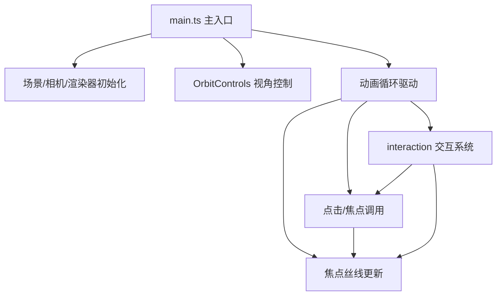

## 1. 架构设计



## 2. 技术描述

- **前端框架**：原生 TypeScript（无 React/Vue）
- **3D 引擎**：Three.js（r160+）
- **构建工具**：Vite 5.x
- **语言**：TypeScript 5.x（严格模式，ES2020）
- **开发服务器**：Vite Dev Server（端口 3000，HMR）
- **Three.js 插件**：OrbitControls（three/addons）

## 3. 文件结构

| 文件路径 | 职责 |
|----------|------|
| package.json | 依赖管理、脚本配置 |
| vite.config.js | Vite 构建配置 |
| tsconfig.json | TypeScript 编译配置 |
| index.html | HTML 入口，挂载 Canvas |
| src/main.ts | 场景初始化、动画循环、控制系统 |
| src/bubbleSystem.ts | 气泡生成、位置更新、脉动、纹理 |
| src/connectionSystem.ts | 丝线生成、光点流动、透明度管理 |
| src/interaction.ts | 事件监听、涟漪、、、逻辑 |

## 4. 核心数据结构

### 4.1 Bubble（气泡）

```typescript
interface Bubble {
  id: number;
  position: THREE.Vector3;        // 球心位置
  baseRadius: number;              // 基础半径
  currentRadius: number;         // 当前半径（含脉动）
  color: THREE.Color;           // 基色
  velocity: THREE.Vector3;       // 移动速度向量
  speed: number;              // 移动速率
  directionChangeTimer: number; // 方向变更计时
  pulsePhase: number;           // 脉动相位
  pulsePeriod: number;            // 脉动周期
  noiseDensity: number;         // 噪点密度
  mesh: THREE.Mesh;              // Three.js Mesh 网格对象
  isFlashing: boolean;        // 是否闪烁中
  flashTimer: number;             // 闪烁计时
  expansionTimer: number;           // 膨胀计时
}
```

### 4.2 Connection（丝线连接）

```typescript
interface Connection {
  id: string;                  // "bubbleA-bubbleB"
  bubbleA: number;
  bubbleB: number;
  distance: number;
  line: THREE.Line;
  opacity: number;             // 当前透明度
  targetOpacity: number;        // 目标透明度
  fadeState: 'active' | 'fadingOut';
  fadeTimer: number;           // 淡出计时
  lightPoints: LightPoint[];      // 流动光点数组
}

interface LightPoint {
  progress: number;          // 在线段上的进度 0-1
  mesh: THREE.Mesh;
}
```

### 4.3 Ripple（涟漪）

```typescript
interface Ripple {
  center: THREE.Vector3;
  color: THREE.Color;
  startTime: number;
  duration: number;
  rings: THREE.Mesh[];        // 20个圆环
  affectedBubbles: Set<number>;  // 已影响气泡
}
```

## 5. 性能优化策略

1. **InstancedMesh**：气泡使用 InstancedMesh 批量渲染（800个实例）
2. **BufferGeometry**：丝线使用 BufferGeometry，顶点数据复用
3. **空间分区**：气泡邻接查询使用网格空间哈希加速距离检测
4. **材质复用**：相同着色器材质共享，减少 draw call
5. **帧率控制**：requestAnimationFrame + deltaTime 时间步长
6. **距离剔除**：超远丝线/气泡动态降低透明度或隐藏
