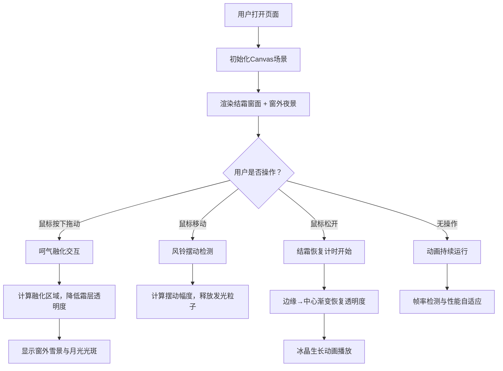

## 1. 产品概述

「窗境雪语」是一款沉浸式冬日窗景互动Web应用，通过Canvas动画模拟冬日玻璃窗上呵气融化霜层、窗外飘雪夜景与摇曳冰晶风铃的诗意场景。用户可通过鼠标长按拖动在结霜窗面上呵出透亮区域，感受冬日夜景的静谧之美。

- 核心价值：提供富有诗意的交互式视觉体验，融合艺术美感与技术创新
- 目标用户：喜爱创意互动、视觉艺术的互联网用户

## 2. 核心特性

### 2.1 用户角色

本产品无需用户注册，所有访问者均可直接体验全部功能。

| 角色 | 注册方式 | 核心权限 |
|------|----------|----------|
| 访客用户 | 无需注册 | 完整体验呵气交互、观赏动画效果 |

### 2.2 功能模块

1. **主场景页面**：结霜窗面渲染、呵气交互、窗外雪景、冰晶风铃、月光光晕

### 2.3 页面详情

| 页面名称 | 模块名称 | 功能描述 |
|-----------|-------------|---------------------|
| 主场景页面 | 结霜窗面渲染 | 半透明白色霜层覆盖，随机细纹与六边形冰晶纹理，50ms动态微调 |
| 主场景页面 | 呵气融化交互 | 鼠标长按拖动生成圆形融化区域（半径20→80px，1.5s），霜层透明度0.9→0.2（0.5s） |
| 主场景页面 | 结霜恢复机制 | 松开后3s内边缘→中心渐变恢复，边缘0.5s/中心2.5s，伴随冰晶生长动画 |
| 主场景页面 | 冰晶风铃系统 | 5个水平均匀分布风铃，鼠标移动触发摆动（最大15°），释放3-5粒子/秒 |
| 主场景页面 | 窗外飘雪效果 | 深蓝→紫色渐变夜景，雪花2-4px圆形，下落速度0.3-1.0px/帧，持续生成5-15片/秒 |
| 主场景页面 | 月光光晕系统 | 右上角淡月（#ffe0b0，半径40px），径向光晕100px，融化区域投影光斑 |
| 主场景页面 | 性能自适应 | 60FPS目标帧率，<30FPS自动暂停雪花与粒子，交互响应<100ms |

## 3. 核心流程

## 4. 用户界面设计

### 4.1 设计风格

- **主色调**：深灰#1a1a2e（背景）、深木色#4a3728（窗框）、白色半透明（霜层）、淡蓝#b0d0ff（冰晶）、暖月黄#ffe0b0（月光）
- **视觉基调**：冷暖对比——冷色调霜雪与暖色调月光形成鲜明对比，营造静谧冬夜氛围
- **质感表现**：窗框木色横纹纹理，霜层蓝白混合调，呵气边缘柔化光晕
- **字体**：系统默认字体，无需额外文字元素（纯视觉体验型应用）

### 4.2 页面设计概览

| 页面名称 | 模块名称 | UI元素 |
|-----------|-------------|----------|
| 主场景页面 | 窗框 | 深木色#4a3728，每50px一道1px细纹#3a2a18，视觉焦点 |
| 主场景页面 | 霜层 | 白色#e0f0ff混合，透明度0.9，六边形冰晶纹理（5-12px，0.2-0.5透明） |
| 主场景页面 | 风铃 | 5个水平分布，冰片3×8px#e0f0ff，丝线1px#b0d0ff |
| 主场景页面 | 雪花 | 2-4px圆形，白→淡蓝渐变，0.6-1.0透明度，自然随机轨迹 |
| 主场景页面 | 月亮 | 右上角#ffe0b0圆形40px，径向光晕100px透明度0.3 |
| 主场景页面 | 光斑 | 融化区域投影，偏移量随月亮位置，透明度0.15，#ffe0b0 |

### 4.3 响应式设计

- 设计优先：桌面端（1200×800画布）
- 自适应策略：画布按16:9比例自动缩放，最大尺寸1200×800
- 交互优化：鼠标交互支持debounce（50ms间隔），触屏可使用触摸事件模拟

### 4.4 动画性能要求

- 目标帧率：60FPS（requestAnimationFrame驱动）
- 降级策略：帧率<30FPS时暂停雪花生成和风铃粒子，保留霜层动画与呵气交互
- 性能预算：Canvas 2D渲染，无WebGL依赖，兼容主流现代浏览器
