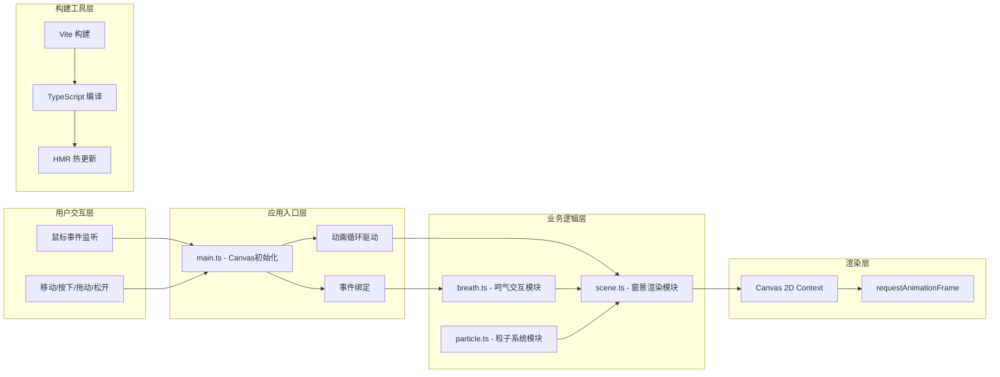

## 1. 架构设计



## 2. 技术说明

- **前端框架**：原生 TypeScript + Canvas 2D API（无额外UI框架依赖）
- **构建工具**：Vite@5（开发服务器端口3000，开启HMR）
- **类型系统**：TypeScript@5（严格模式，ES2020目标，DOM库）
- **后端服务**：无（纯前端静态应用）
- **数据库**：无

## 3. 文件结构定义

| 文件路径 | 用途说明 |
|----------|----------|
| `/package.json` | 项目依赖：vite、typescript、@types/node；脚本：dev/build/preview |
| `/vite.config.js` | Vite配置：开发端口3000，HMR开启 |
| `/tsconfig.json` | TS配置：strict严格模式，target ES2020，DOM/CANVAS类型 |
| `/index.html` | 入口HTML：#app容器，深灰#1a1a2e背景，加载main.ts |
| `/src/main.ts` | 入口：创建Canvas、绑定事件、启动requestAnimationFrame循环 |
| `/src/scene.ts` | 场景渲染：窗框、霜层、窗外雪景、风铃、月亮、光斑的绘制逻辑 |
| `/src/breath.ts` | 呵气交互：鼠标按下检测、融化区域计算、结霜恢复渐变逻辑 |
| `/src/particle.ts` | 粒子系统：风铃粒子管理、雪花管理、生命周期与位置更新 |

## 4. 核心数据结构定义

### 4.1 呵气区域数据类型

```typescript
interface MeltArea {
  id: number;
  x: number;           // 中心X坐标
  y: number;           // 中心Y坐标
  radius: number;      // 当前半径（20-80px）
  targetRadius: number;// 目标半径
  opacity: number;     // 当前霜层透明度（0.2-0.9）
  meltProgress: number;// 融化进度 0-1
  recoverTimer: number;// 恢复计时器（秒）
  isRecovering: boolean;
}
```

### 4.2 雪花粒子数据类型

```typescript
interface Snowflake {
  id: number;
  x: number;
  y: number;
  radius: number;       // 2-4px
  speed: number;        // 0.3-1.0 px/frame
  angle: number;        // 偏转角度 ±15°
  opacity: number;      // 0.6-1.0
  color: string;        // 白→淡蓝渐变
}
```

### 4.3 风铃粒子数据类型

```typescript
interface WindChimeParticle {
  id: number;
  x: number;
  y: number;
  radius: number;       // 1-3px
  vx: number;           // X方向速度
  vy: number;           // Y方向速度
  life: number;         // 剩余寿命（秒）
  maxLife: number;      // 总寿命 1-2秒
  opacity: number;      // 0.5-0.8
  color: string;        // 淡蓝#b0d0ff→淡紫#d0b0ff
}
```

### 4.4 风铃数据类型

```typescript
interface WindChime {
  id: number;
  baseX: number;        // 悬挂点X
  baseY: number;        // 悬挂点Y
  stringLength: number; // 丝线长度
  currentAngle: number; // 当前摆动角度（弧度）
  targetAngle: number;  // 目标角度
  restSpeed: number;    // 恢复速度 0.05 rad/frame
}
```

## 5. 性能优化策略

### 5.1 帧率自适应

```typescript
// 帧率检测实现思路
let lastFrameTime = performance.now();
let frameCount = 0;
let currentFPS = 60;
let lowPerformanceMode = false;

function detectFPS() {
  frameCount++;
  const now = performance.now();
  if (now - lastFrameTime >= 1000) {
    currentFPS = frameCount;
    lowPerformanceMode = currentFPS < 30;
    frameCount = 0;
    lastFrameTime = now;
  }
}
```

### 5.2 交互防抖

```typescript
// 呵气事件50ms防抖
let lastBreathTime = 0;
const BREATH_INTERVAL = 50;

function shouldProcessBreath() {
  const now = performance.now();
  if (now - lastBreathTime >= BREATH_INTERVAL) {
    lastBreathTime = now;
    return true;
  }
  return false;
}
```

### 5.3 渲染优化

- 离屏Canvas预渲染霜层纹理，避免每帧重绘冰晶
- 融化区域使用离屏Canvas + globalCompositeOperation实现高效遮罩
- 粒子池复用机制，减少GC压力
- 雪花区域仅在窗外可视范围生成与更新

## 6. 动画时序控制

| 动画效果 | 持续时间 | 缓动函数 | 触发条件 |
|----------|----------|----------|----------|
| 呵气半径增长 | 1.5秒 | easeOutQuad | 鼠标按下拖动 |
| 霜层透明度融化 | 0.5秒 | linear | 呵气区域生成 |
| 边缘结霜恢复 | 0.5秒 | easeInQuad | 鼠标松开 |
| 中心结霜恢复 | 2.5秒 | easeInQuad | 鼠标松开 |
| 冰晶生长动画 | 0.2秒 | easeOutCubic | 结霜恢复过程 |
| 风铃摆动恢复 | 逐帧0.05rad | 线性阻尼 | 鼠标停止移动 |
| 粒子飘散 | 1-2秒 | linear | 风铃摆动时持续释放 |
