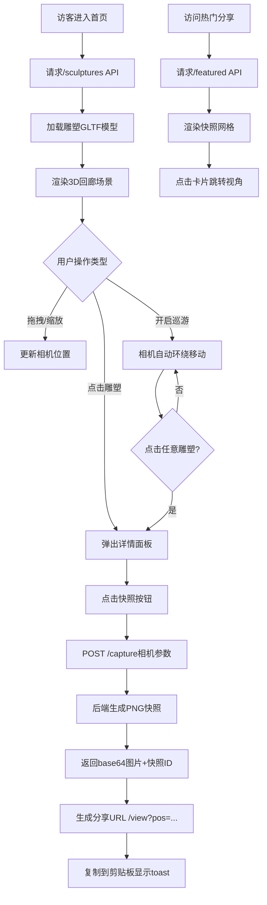

## 1. 产品概述

「艺境回廊」是一个沉浸式的数字雕塑展览馆Web应用，为访客提供3D交互式的艺术欣赏体验。通过Three.js渲染的虚拟展厅，用户可以自由旋转、缩放查看雕塑作品，并分享精彩视角。

- 核心目标：打破物理展览限制，让全球艺术爱好者能以3D形式欣赏雕塑作品
- 目标用户：艺术爱好者、策展人、教育工作者、学生

## 2. 核心功能

### 2.1 用户角色

| 角色 | 注册方式 | 核心权限 |
|------|----------|----------|
| 访客 | 无需注册 | 浏览3D回廊、查看雕塑详情、生成分享快照、浏览热门分享 |

### 2.2 功能模块

1. **3D回廊主页**：虚拟展厅导航栏、雕塑等距排列展示、自动巡游模式、视角控制
2. **雕塑详情面板**：作品信息展示、快照分享按钮、视角参数生成
3. **分享弹窗**：快照预览、分享链接生成、一键复制
4. **热门分享墙**：热门视角网格展示、跳转至对应视角

### 2.3 页面详情

| 页面名称 | 模块名称 | 功能描述 |
|----------|----------|----------|
| 3D回廊主页 | 导航栏 | Logo展示、自动巡游开关、热门分享入口 |
| 3D回廊主页 | 3D场景 | 深灰背景展厅、环境光与点光、6件雕塑等距排列、每雕塑Y轴自转 |
| 3D回廊主页 | 视角控制 | 鼠标拖拽旋转（俯仰-30°~60°）、滚轮缩放（2~12单位） |
| 3D回廊主页 | 自动巡游 | 环绕展厅中心（半径7.5）、30秒一圈、俯仰波动±10° |
| 雕塑详情面板 | 信息展示 | 标题/艺术家/描述渐显面板、底部滑入动画、磨砂背景 |
| 雕塑详情面板 | 快照分享 | 发送相机参数至后端、接收800x600 PNG、生成分享URL |
| 分享弹窗 | 交互反馈 | 快照预览、链接显示、一键复制、toast提示 |
| 热门分享墙 | 网格布局 | 3列卡片、缩略图200x150、点击次数统计、跳转视角 |

## 3. 核心流程

用户进入首页 → 加载雕塑列表并渲染3D场景 → 鼠标拖拽/缩放浏览 → 点击雕塑弹出详情面板 → 点击快照按钮发送相机参数 → 后端生成快照返回 → 前端生成分享URL并复制 → 访问分享链接还原视角

## 4. 用户界面设计

### 4.1 设计风格

- **主色调**：深灰 #1a1a2e（背景）、纯黑 #000000（导航栏）
- **强调色**：暖橙 #ff8c00（按钮悬停、高亮边框）
- **辅助色**：红色 #ff4444（热门点击数）、白 #ffffff、浅灰 #b0b0b0、灰 #888888
- **字体**：标题 24px 白色、艺术家 16px 浅灰、描述 14px 灰色
- **面板效果**：backdrop-filter: blur(10px) 半透明磨砂
- **渐变**：信息面板从 #0a0a2e 到 #00000000 渐变
- **动画**：面板滑入0.3s ease-out、开关过渡0.2s ease、所有交互0.2-0.3s

### 4.2 页面设计概述

| 页面名称 | 模块名称 | UI元素 |
|----------|----------|--------|
| 3D回廊主页 | 导航栏 | 黑色60px高度、1px底部分割线#ffffff20、右侧开关组件 |
| 3D回廊主页 | 3D场景 | 全屏canvas、雕塑间距3单位、柔和阴影投射 |
| 3D回廊主页 | 巡游开关 | 圆形滑块0.2s过渡、开启态暖橙背景 |
| 雕塑详情 | 面板 | 从底部滑入0.3s、渐变背景磨砂、右上角关闭按钮 |
| 雕塑详情 | 快照按钮 | 暖橙边框悬停填充、点击后发送请求 |
| 分享弹窗 | 内容 | 居中模态框、800x600预览图、URL输入框、复制按钮 |
| 分享弹窗 | Toast | 底部居中、2秒自动消失、绿色背景"已复制" |
| 热门分享墙 | 网格 | 3列布局、20px间距、卡片悬停暖橙边框 |
| 热门分享墙 | 卡片 | 200x150缩略图、标题白色、点击数红色14px |

### 4.3 响应式设计

- **桌面端（≥1024px）**：回廊显示6件雕塑，3列热门分享
- **平板端（<1024px）**：回廊显示4件雕塑，2列热门分享
- **手机端（<768px）**：回廊显示2件雕塑，1列热门分享，隐藏自动巡游开关

### 4.4 3D场景指引

- **环境设置**：深灰#1a1a2e纯色背景，雾效增强空间感
- **光照设置**：环境光(0xffffff, 0.5) + 点光(0xffffff, 1.0, 100) + 方向光阴影投射
- **相机设置**：PerspectiveCamera(fov=50)，OrbitControls俯仰限制-30°~60°，缩放范围2~12
- **布局方式**：雕塑以原点为中心等距排列，每件间距3单位，形成环形或网格布局
- **动画系统**：每件雕塑Y轴匀速自转(0.02rad/s)，自动巡游使用requestAnimationFrame插值
- **性能优化**：使用ShadowMap优化、模型实例化复用、帧率监控60FPS
- **资源来源**：GLTF模型占位（使用基础几何体生成示例雕塑）
