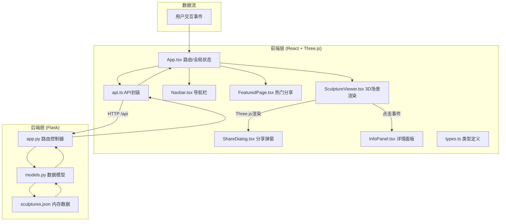
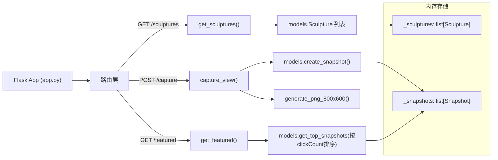
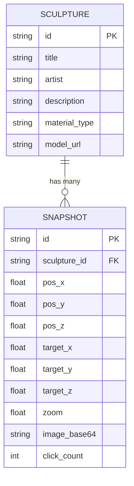

## 1. 架构设计



## 2. 技术说明

- **前端框架**：React@18 + TypeScript@5
- **3D引擎**：Three@0.160 + @react-three/fiber@8 + @react-three/drei@9
- **构建工具**：Vite@5 + HMR热更新
- **状态管理**：React useState/useContext（轻量级场景）
- **路由**：React Router DOM@6
- **后端**：Flask@3 + Flask-CORS + Marshmallow（序列化）
- **数据存储**：内存存储（Python dict/list）
- **快照生成**：Canvas2D离屏渲染 → Base64 PNG

## 3. 路由定义

| 路由 | 用途 | 组件 |
|------|------|------|
| / | 3D回廊主页（雕塑展厅） | GalleryPage |
| /view | 特定视角展示（URL参数还原） | GalleryPage + 视角初始化 |
| /featured | 热门分享墙 | FeaturedPage |

## 4. API定义

### 4.1 获取雕塑列表
```typescript
// GET /api/sculptures
interface Sculpture {
  id: string;
  title: string;
  artist: string;
  description: string;
  materialType: string;
  modelUrl: string;
}

// Response: Sculpture[]
```

### 4.2 生成视角快照
```typescript
// POST /api/capture
interface CaptureRequest {
  sculptureId: string;
  position: { x: number; y: number; z: number };
  target: { x: number; y: number; z: number };
  zoom: number;
}

interface CaptureResponse {
  id: string;
  imageBase64: string;  // 800x600 PNG
  clickCount: number;
}
```

### 4.3 获取热门分享
```typescript
// GET /api/featured
interface FeaturedSnapshot {
  id: string;
  sculptureId: string;
  sculptureTitle: string;
  thumbnailBase64: string;  // 200x150
  position: { x: number; y: number; z: number };
  target: { x: number; y: number; z: number };
  zoom: number;
  clickCount: number;
}

// Response: FeaturedSnapshot[]
```

## 5. 服务器架构



## 6. 数据模型

### 6.1 模型定义



### 6.2 Python dataclass

```python
# backend/models.py
from dataclasses import dataclass, field
from typing import List

@dataclass
class Sculpture:
    id: str
    title: str
    artist: str
    description: str
    material_type: str
    model_url: str

@dataclass
class Snapshot:
    id: str
    sculpture_id: str
    position: dict  # {x, y, z}
    target: dict    # {x, y, z}
    zoom: float
    image_base64: str
    click_count: int = 0
```

### 6.3 初始数据

6件示例雕塑（使用基础几何体+不同材质模拟GLTF加载，因无实际GLTF文件）：
1. "青铜时代" - 罗丹 - 青铜材质
2. "大卫" - 米开朗基罗 - 大理石
3. "思想者" - 罗丹 - 青铜
4. "维纳斯" - 古典雕塑 - 大理石
5. "胜利女神" - 古希腊 - 大理石
6. "永恒之春" - 罗丹 - 青铜

## 7. 调用关系与数据流向

```
用户事件流:
鼠标拖拽 → OrbitControls → 更新相机矩阵 → useFrame钩子 → 渲染循环
点击雕塑 → Raycaster → 触发onSculptureClick → App.setState(selectedId) → InfoPanel滑入
点击快照 → ShareDialog → POST /capture → 后端生成PNG → 返回Base64 → 生成URL → 复制剪贴板
URL带参数 → App.useEffect → 解析pos/target/zoom → OrbitControls.setPosition → 还原视角
```
