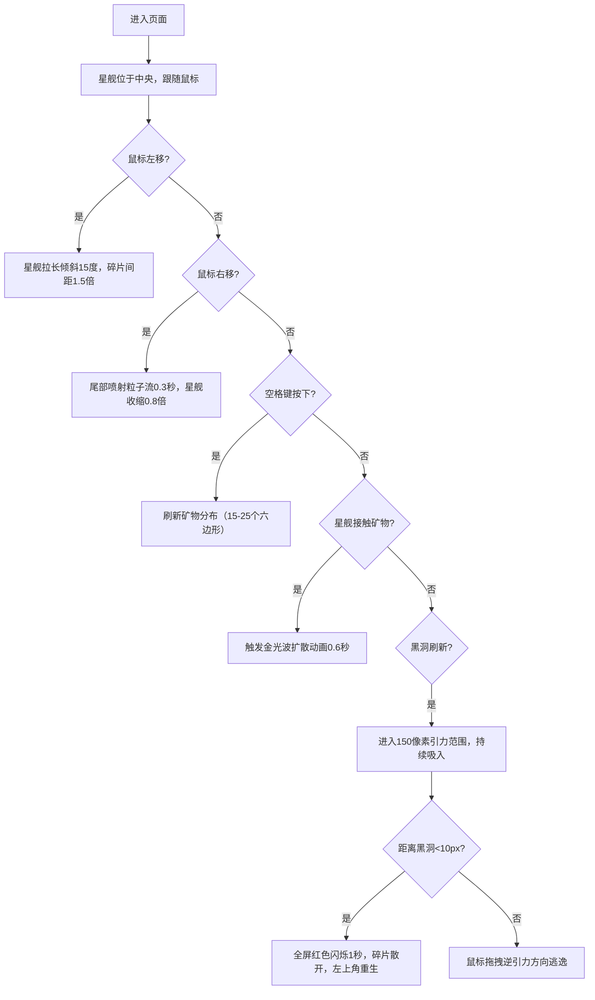

## 1. 产品概述

「星际拓荒」是一款基于原生Canvas API的深空探索交互式视觉体验项目，玩家操控由几何碎片构成的星舰在随机生成的星域中采集矿物、躲避黑洞引力，并点亮星云。项目以低多边形科幻风为视觉基调，通过粒子系统与物理模拟打造沉浸式太空冒险体验。

- 核心目标：提供视觉惊艳、交互流畅的太空探索体验，玩家通过鼠标操控星舰完成矿物采集与黑洞逃逸
- 目标用户：喜欢科幻视觉艺术与交互体验的用户、游戏爱好者

## 2. 核心功能

### 2.1 功能模块

1. **星舰系统**：由正方形、三角形、圆形彩色碎片拼合，支持鼠标驱动的拉伸变形、倾斜、粒子喷射效果
2. **星空背景**：深紫到深蓝径向渐变，800颗静态星光粒子，营造深空氛围
3. **矿物采集**：六边形金色晶体分布，空格键刷新矿物，采集触发金光波扩散动画
4. **黑洞系统**：每30秒随机刷新旋转黑洞，150像素引力范围，距离反比吸入，碰撞触发红色闪烁与重生

### 2.2 页面详情

| 页面名称 | 模块名称 | 功能描述 |
|---------|---------|---------|
| 主画布 | 星舰控制 | 鼠标移动控制星舰位置与变形，左键拖拽逃逸黑洞引力 |
| 主画布 | 星空背景 | 径向渐变深空底色，800颗静态星光，自适应16:9画布 |
| 主画布 | 矿物系统 | 空格键刷新15-25个六边形矿物，环形分布，采集后金光波扩散0.6秒 |
| 主画布 | 黑洞系统 | 每30秒刷新旋转漩涡（120度/秒），引力范围150像素，碰撞后红色闪烁1秒重生 |

## 3. 核心流程

玩家进入页面后，星舰位于画布中央跟随鼠标移动：通过左移鼠标使星舰拉长倾斜采集矿物，右移触发尾部喷射快速移动，空格键刷新矿物分布。黑洞每30秒随机出现，玩家需拖拽星舰逆引力方向逃逸，若被吸入则触发红色闪烁后于左上角重生。矿物被采集时原地释放金光波扩散动画，持续点亮深空。

## 4. 用户界面设计

### 4.1 设计风格
- **主色调**：深紫 `#0b0b2e` → 深蓝 `#1a1a3e` 径向渐变背景，金色描边与矿物，暗红 `#660000` 黑洞危险色
- **视觉风格**：低多边形科幻风，几何碎片拼合星舰，半透明金色描边，粒子尾迹与扩散波
- **动画特性**：星舰碎片弹性变形、粒子透明度渐变、金光波扩散、黑洞漩涡旋转、全屏红闪

### 4.2 页面设计概要

| 页面名称 | 模块名称 | UI元素 |
|---------|---------|-------|
| 主画布 | 星舰 | 正方形/三角形/圆形彩色碎片（4-20px），半透明金色描边，鼠标驱动变形 |
| 主画布 | 星光粒子 | 800颗1-3px白色微黄光点，静态散布 |
| 主画布 | 矿物 | 六边形金色晶体，边长8-12px，环形分布 |
| 主画布 | 黑洞 | 深灰渐变旋转漩涡，半径60px，150px引力场 |

### 4.3 响应式
- 画布自适应窗口大小，保持16:9比例
- Desktop-first，鼠标/键盘交互为主
- 画布居中显示，自动计算缩放比例

### 4.4 性能要求
- 60FPS流畅运行，粒子系统与引力计算优化
- 每帧仅计算必要的碰撞检测与物理更新
- 16:9画布，避免不必要的离屏渲染
