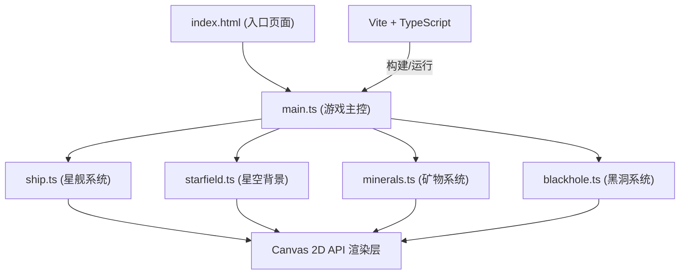

## 1. 架构设计

本项目采用纯前端单页应用架构，基于原生Canvas 2D API实现图形渲染，通过模块化TypeScript文件分离各游戏系统逻辑，由Vite提供开发服务器与构建能力。无后端服务与外部数据依赖。



## 2. 技术描述

- **前端**：TypeScript (严格模式) + 原生Canvas 2D API（无第三方渲染框架）
- **构建工具**：Vite@5（开发服务器端口3000，开启HMR）
- **初始化方式**：手动配置文件（非脚手架生成）
- **后端**：无
- **数据库**：无，所有数据为运行时内存状态
- **依赖清单**：
  - `vite` — 开发服务器与构建
  - `typescript` — 类型检查
  - `@types/node` — Node类型支持

## 3. 项目文件结构

| 文件路径 | 用途 |
|---------|------|
| `/package.json` | 项目元数据、依赖、启动脚本 |
| `/vite.config.js` | Vite开发/构建配置 |
| `/tsconfig.json` | TypeScript编译配置 |
| `/index.html` | 全屏Canvas容器页面 |
| `/src/main.ts` | 游戏入口：画布初始化、主循环、事件绑定、状态调度 |
| `/src/starfield.ts` | 星空模块：渐变背景、800颗静态粒子生成与渲染 |
| `/src/ship.ts` | 星舰模块：碎片定义、组合拼合、鼠标驱动变形、尾部粒子喷射、重生逻辑 |
| `/src/minerals.ts` | 矿物模块：六边形分布、碰撞检测、金光波扩散动画 |
| `/src/blackhole.ts` | 黑洞模块：随机位置刷新、漩涡旋转渲染、引力场计算、碰撞触发红闪 |

## 4. 核心模块接口定义

```typescript
// 通用向量类型
interface Vec2 { x: number; y: number; }

// 星舰碎片
interface ShipFragment {
  type: 'square' | 'triangle' | 'circle';
  size: number;           // 4-20px
  offset: Vec2;           // 相对星舰中心的偏移
  color: string;
  strokeColor: string;    // 半透明金色
}

// 矿物
interface Mineral {
  pos: Vec2;
  side: number;           // 8-12px
  collected: boolean;
  waveTimer?: number;     // 金光波计时
}

// 喷射粒子
interface JetParticle {
  pos: Vec2;
  vel: Vec2;
  life: number;           // 0→1
  size: number;
}

// 黑洞
interface BlackHole {
  pos: Vec2;
  radius: number;         // 60px
  influence: number;      // 150px
  rotation: number;       // 当前角度
  spawnTimer: number;     // 距下次刷新秒数
}

// 游戏主状态（main.ts内部）
interface GameState {
  canvas: HTMLCanvasElement;
  ctx: CanvasRenderingContext2D;
  logicalW: number;       // 16:9逻辑宽度
  logicalH: number;
  shipCenter: Vec2;
  mousePos: Vec2;
  mouseDelta: Vec2;       // 每帧鼠标增量
  redFlashTimer: number;  // 红闪剩余秒数
}
```

## 5. 渲染与游戏循环

- **主循环**：`requestAnimationFrame` 驱动，每帧执行更新（dt秒）→ 渲染
- **画布缩放**：逻辑分辨率固定16:9比例，实际Canvas按窗口大小缩放，`ctx.setTransform` 统一处理缩放与居中偏移
- **渲染顺序**（从底到顶）：
  1. 径向渐变背景填充
  2. 800颗星光粒子（一次遍历绘制）
  3. 矿物金光波扩散环（半透明）
  4. 六边形矿物晶体
  5. 黑洞漩涡 + 引力场提示圈（可选）
  6. 星舰碎片（从后到前排序）
  7. 星舰尾部喷射粒子流
  8. 全屏红色闪烁叠加层（碰撞时）

## 6. 关键算法与物理规则

| 系统 | 算法/规则 |
|------|----------|
| 星舰跟随鼠标 | 每帧 `shipCenter += (mousePos - shipCenter) * 0.12`（平滑跟随） |
| 左移变形 | `mouseDelta.x < 0` 时：X轴缩放1.3×、倾斜-15°、碎片间距×1.5 |
| 右移喷射 | `mouseDelta.x > 0` 时：整体缩放0.8×、0.3秒内持续生成尾部粒子（life 1→0，alpha同步衰减） |
| 矿物刷新 | 空格键触发：极坐标 r∈[120,300]，θ∈[0,2π]，转换为画布坐标 |
| 矿物碰撞 | 星舰中心与矿物中心距离 < 矿物外接圆半径 + 星舰碎片半径时触发采集 |
| 黑洞生成 | 每30秒刷新，位置与当前星舰、所有矿物距离 ≥ 150px |
| 引力计算 | 星舰在150px范围内：每帧位移 = `(bhPos - shipPos) * 0.05`（剩余距离的5%），越近等效速度越快 |
| 碎片颜色变化 | 进入引力场后，碎片颜色线性插值至 `#660000`，插值比例 = `1 - (distance/150)` |
| 黑洞碰撞 | `distance < 10px` → 红闪1秒、碎片沿法线炸开、星舰重置至画布左上1/4处 |

## 7. 性能优化策略

1. **粒子复用池**：喷射粒子采用对象池，避免频繁GC
2. **批量绘制**：800颗星光一次性 `beginPath` + 多个 `arc`，单次 `fill`
3. **离屏预渲染**：深空径向渐变使用1024×576离屏Canvas缓存，主循环直接 `drawImage`
4. **碰撞检测**：矿物与星舰每帧最多检测25次，为O(n)线性扫描，黑洞单例检测
5. **状态节流**：鼠标位移使用每帧累加增量，避免多事件重复计算
