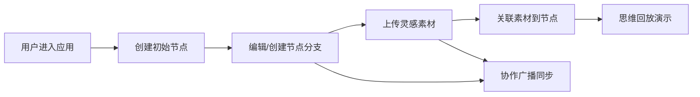

# 创思溪流 - 产品需求文档 (PRD)

## 1. 产品概述

「创思溪流」是一个在线协作创意社区平台，通过可视化思维流的方式帮助用户将初始创意逐步扩展为完整的故事板。解决现有创意工具缺乏直观、动态"思维流"可视化的痛点。

- 核心目标：提供思维节点可视化编辑、灵感素材关联、多人协作同步、思维演化回放四大核心能力
- 目标用户：创意工作者、故事创作者、设计师、协作团队

---

## 2. 核心功能

### 2.1 用户角色

| 角色 | 注册方式 | 核心权限 |
|------|----------|----------|
| 普通用户 | 无需注册，直接使用 | 创建/编辑思维节点、上传/关联灵感素材、使用回放功能 |

### 2.2 功能模块

1. **思维流编辑区**：可视化节点图，节点拖拽、连线、创建分支、双击编辑
2. **灵感展示板**：瀑布流网格展示图片/音频/文本素材，支持上传与关联
3. **灵感收集器**：悬浮按钮，快捷上传/粘贴素材
4. **思维回放控制器**：按时间顺序高亮回放思维演化过程
5. **协作同步模块**：基于BroadcastChannel实时多端同步

### 2.3 页面详情

| 页面名称 | 模块名称 | 功能描述 |
|-----------|-------------|---------------------|
| 主页 | 思维流编辑区 | 创建起始节点"创意种子"，双击编辑标题/正文，回车确认；节点右上角"+"按钮延伸分支；贝塞尔曲线自动连线；拖拽重排带实时动画 |
| 主页 | 灵感展示板 | 瀑布流布局展示灵感卡片；点击空白上传图片（jpg/png ≤5MB）；拖拽卡片关联至思维节点；节点右下角缩略图预览；图片懒加载、音频播放控制 |
| 主页 | 灵感收集器 | 右下角悬浮按钮（#FF6B35脉冲发光），点击弹出面板，支持拖拽图片/粘贴URL，存储后自动刷新灵感板 |
| 主页 | 思维回放控制器 | 播放/暂停按钮，按创建顺序逐一高亮节点（每0.8秒切换），连线变金色#FFD700持续0.3秒 |
| 主页 | 协作同步 | BroadcastChannel监听，1.5秒内自动同步其他用户的变更 |

---

## 3. 核心流程

### 主要用户流程：

1. 用户进入应用 → 自动创建初始"创意种子"节点
2. 用户双击节点编辑内容 → 回车确认保存
3. 点击节点右上角"+" → 创建分支节点并自动连线
4. 点击灵感收集器或灵感板空白区 → 上传/粘贴灵感素材
5. 拖拽灵感卡片至思维节点 → 建立关联关系
6. 点击回放按钮 → 按时间顺序演示思维演化过程
7. 多用户同时使用 → BroadcastChannel广播变更 → 其他终端1.5秒内自动更新

---

## 4. 用户界面设计

### 4.1 设计风格

- **主色调**：午夜蓝背景 #0F0F23，节点填充 #1C1C3A，发光边框 #4A90D9，选中边框 #FF6B35，回放高亮金 #FFD700
- **按钮风格**：圆角12px，带发光渐变边框，hover时box-shadow过渡
- **字体**：使用现代无衬线字体，节点标题加粗，正文常规
- **布局风格**：左右分栏（思维流60% / 灵感板40%），移动端上下堆叠
- **动效**：所有交互元素0.2秒过渡动画，悬浮按钮脉冲发光，拖拽用CSS transform启用GPU加速

### 4.2 页面设计概述

| 页面名称 | 模块名称 | UI元素 |
|-----------|-------------|-------------|
| 主页 | 思维流编辑区 | 节点（宽200px高80px圆角12px）、贝塞尔曲线连线、拖拽手柄、"+"分支按钮、编辑窗口、缩略图徽章 |
| 主页 | 灵感展示板 | 瀑布流网格卡片（180px宽）、图片懒加载占位、音频播放控件、hover放大1.05倍+阴影、拖拽区域提示 |
| 主页 | 灵感收集器 | 圆形悬浮按钮（直径56px）、脉冲发光动画、弹出面板、拖拽上传区域、URL粘贴输入框 |
| 主页 | 回放控制器 | 播放/暂停切换按钮、进度指示、高亮动画（节点边框+连线变金色） |

### 4.3 响应式

- **桌面端**（≥768px）：左右分栏，思维流60% / 灵感板40%
- **移动端**（<768px）：上下堆叠，各占100%宽度，节点宽度自适应为父容器90%
- 触摸设备：拖拽交互优化，触摸目标区域扩大

### 4.4 性能要求

- 节点数>50时帧率≥55fps
- 拖拽动画使用requestAnimationFrame + CSS transform（GPU加速）
- 图片懒加载减少初始带宽
