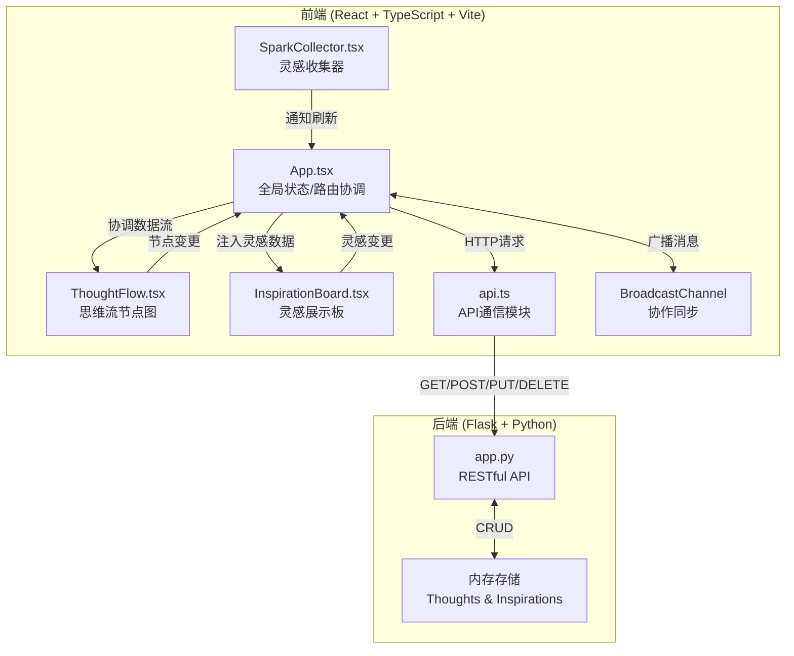
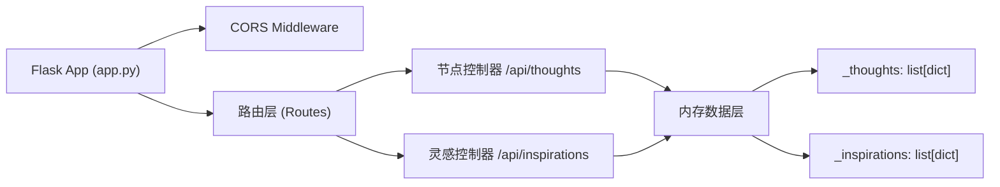
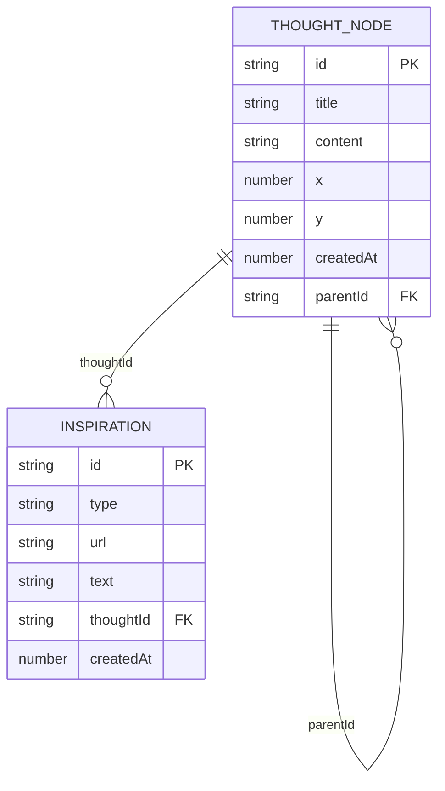

# 创思溪流 - 技术架构文档

## 1. 架构设计



---

## 2. 技术说明

- **前端**: React 18 + TypeScript + Vite 5
- **构建工具**: Vite（开发端口3000，HMR热更新）
- **后端**: Flask 3 + flask-cors（Python 3.9+）
- **状态管理**: React Hooks (useState, useEffect, useRef, useCallback)
- **协作同步**: BroadcastChannel API (localStorage模拟)
- **动画实现**: requestAnimationFrame + CSS transform (GPU加速)
- **数据库**: 内存列表（原型阶段）

---

## 3. 路由定义

| 路由 | 用途 |
|-------|---------|
| / | 主页，包含思维流编辑区、灵感展示板、灵感收集器、回放控制器 |

---

## 4. API 定义

### 4.1 TypeScript 类型定义

```typescript
interface ThoughtNode {
  id: string;
  title: string;
  content: string;
  x: number;
  y: number;
  createdAt: number;
  parentId: string | null;
  inspirations: string[]; // inspiration ids
}

interface Inspiration {
  id: string;
  type: 'image' | 'audio' | 'text';
  url?: string;
  text?: string;
  thoughtId: string | null;
  createdAt: number;
}

interface BroadcastMessage {
  type: 'node_add' | 'node_update' | 'node_delete' | 
        'inspiration_add' | 'inspiration_update' | 'inspiration_delete';
  payload: any;
  senderId: string;
  timestamp: number;
}
```

### 4.2 后端API端点

| 方法 | 路径 | 描述 | 请求体 | 响应 |
|------|------|------|--------|------|
| GET | `/api/thoughts` | 获取所有思维节点 | - | `{ thoughts: ThoughtNode[] }` |
| POST | `/api/thoughts` | 创建新思维节点 | `{ title, content, x, y, parentId }` | `{ thought: ThoughtNode }` |
| PUT | `/api/thoughts/:id` | 更新思维节点 | `{ title?, content?, x?, y?, inspirations? }` | `{ thought: ThoughtNode }` |
| DELETE | `/api/thoughts/:id` | 删除思维节点 | - | `{ success: boolean }` |
| GET | `/api/inspirations` | 获取所有灵感素材 | - | `{ inspirations: Inspiration[] }` |
| POST | `/api/inspirations` | 创建灵感素材 | `{ type, url?, text?, thoughtId? }` | `{ inspiration: Inspiration }` |
| PUT | `/api/inspirations/:id` | 更新灵感素材 | `{ type?, url?, text?, thoughtId? }` | `{ inspiration: Inspiration }` |
| DELETE | `/api/inspirations/:id` | 删除灵感素材 | - | `{ success: boolean }` |

---

## 5. 服务器架构图



---

## 6. 数据模型

### 6.1 数据模型定义



### 6.2 文件间调用关系和数据流向

```
App.tsx (全局协调者)
  ├──> ThoughtFlow.tsx
  │     props: nodes[], selectedId, onNodeCreate/Update/Delete/Drag
  │     emits: 节点操作事件 → App → api.ts → Flask
  │
  ├──> InspirationBoard.tsx
  │     props: inspirations[], nodes[], onInspirationUpload/Associate
  │     emits: 灵感操作事件 → App → api.ts → Flask
  │
  └──> SparkCollector.tsx
        props: onCollect
        emits: 素材提交 → App → api.ts → Flask → 刷新state

数据流向:
  用户交互 → 组件事件 → App状态更新 → api.ts HTTP请求 → Flask内存存储
          → 返回数据 → App更新state → 子组件重渲染
          → BroadcastChannel广播 → 其他标签页接收 → 1.5s内同步更新
```

---

## 7. 文件结构

```
auto348/
├── package.json              # 前端依赖 + 启动脚本
├── vite.config.js            # Vite构建配置 (端口3000, HMR)
├── tsconfig.json             # TS严格模式, JSX react-jsx, ES2020
├── index.html                # 入口HTML, React根节点
├── src/
│   ├── App.tsx               # 主应用组件, 全局状态与协调
│   ├── api.ts                # Flask API封装 (Promise返回)
│   └── components/
│       ├── ThoughtFlow.tsx   # 思维流节点图 (拖拽/连线/编辑)
│       ├── InspirationBoard.tsx  # 灵感瀑布流展示板
│       └── SparkCollector.tsx    # 悬浮灵感收集器
└── backend/
    ├── app.py                # Flask RESTful API
    └── requirements.txt      # flask, flask-cors
```
