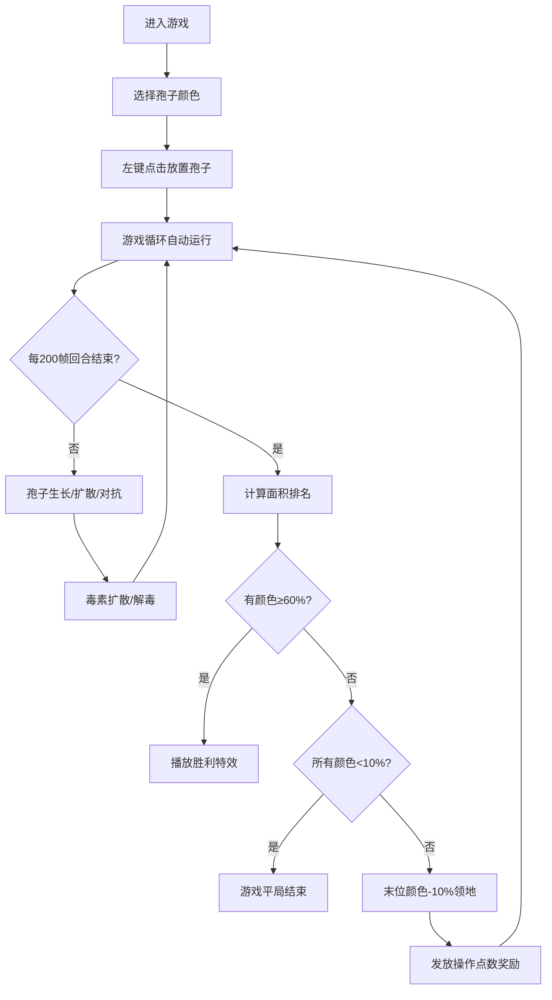

## 1. 产品概述
孢子蔓延是一款在浏览器中运行的2D生态扩散策略游戏，玩家通过放置不同颜色的孢子在网格化培养基上进行菌落竞争。解决了传统塔防/策略游戏缺乏有机生命成长与随机扩散沉浸感的问题。
- 主要用途：休闲策略游戏，模拟微生物生态竞争
- 目标用户：策略游戏爱好者、模拟类游戏玩家
- 产品价值：通过差异化的孢子特性、动态养分毒素体系、回合制竞争机制，提供沉浸式的微观生态模拟体验

## 2. 核心功能

### 2.1 用户角色
| 角色 | 注册方式 | 核心权限 |
|------|----------|----------|
| 玩家 | 无需注册，直接游戏 | 放置孢子、注入毒素、查看游戏信息 |

### 2.2 功能模块
1. **游戏主界面**：信息面板、游戏画布、操作提示
2. **孢子放置系统**：5种颜色孢子的选择与放置、放置涟漪动画
3. **生长扩散算法**：邻域繁殖、养分消耗、活力衰减、对抗吞噬
4. **动态养分与毒素体系**：养分消耗与恢复、毒素注入与扩散、绿色孢子解毒
5. **回合系统与胜负判定**：200帧大回合、面积排名、领地惩罚、胜利/平局条件
6. **实时信息面板**：回合数、面积百分比、操作点数、活力值走势图

### 2.3 页面详情
| 页面名称 | 模块名称 | 功能描述 |
|----------|----------|----------|
| 游戏主页面 | 信息面板 | 半透明顶栏，显示回合数、各颜色面积占比色块、操作点数、10回合活力值折线图 |
| 游戏主页面 | 游戏画布 | 600x600px Canvas，20x20网格，渲染孢子、毒素、动画特效 |
| 游戏主页面 | 操作提示 | 底部文字说明左键放置、右键注入毒素 |
| 游戏主页面 | 孢子选择 | 选择要放置的孢子颜色（红/蓝/绿/紫/橙） |

## 3. 核心流程
玩家进入游戏后，首先选择孢子颜色，左键点击空格子放置初始孢子。孢子按照生长规则自动扩散，消耗养分并与其他孢子竞争。玩家可右键注入毒素干预局面。每200帧为一个大回合，计算面积排名，最末颜色失去10%领地，各颜色获得操作点数奖励。当某颜色占据60%以上格子时获胜，播放粒子飘散特效；所有颜色低于10%则平局。

## 4. 用户界面设计

### 4.1 设计风格
- **主色调**：深色主题 #0D1117，5种孢子色（红#E74C3C/蓝#3498DB/绿#2ECC71/紫#9B59B6/橙#E67E22）
- **按钮样式**：圆角8px，hover时轻微放大，选中时有高亮边框
- **字体**：系统无衬线字体，信息面板12-14px，走势图标注10px
- **布局风格**：居中布局，顶部信息面板，中央画布，底部提示文字
- **动效**：放置涟漪、对抗闪烁、毒素裂纹、胜利粒子飘散

### 4.2 页面设计概述
| 页面名称 | 模块名称 | UI元素 |
|----------|----------|--------|
| 游戏主页面 | 信息面板 | 半透明背景rgba(0,0,0,0.7)，150px高度，色块面积条，折线图用柔和渐变 |
| 游戏主页面 | 游戏画布 | 网格线rgba(255,255,255,0.15)，孢子带内阴影立体感，毒素暗紫色multiply混合 |
| 游戏主页面 | 操作提示 | #8B949E颜色，11px字体 |
| 游戏主页面 | 颜色选择器 | 5个圆形色块按钮，选中状态有外圈光环 |

### 4.3 响应式
- Desktop-first设计
- 浏览器宽度<700px时：画布缩小为400x400px，信息面板高度100px，字体12px
- 触摸设备优化：点击放置、长按注入毒素

### 4.4 3D场景指导
不适用，本游戏为纯2D Canvas渲染。
