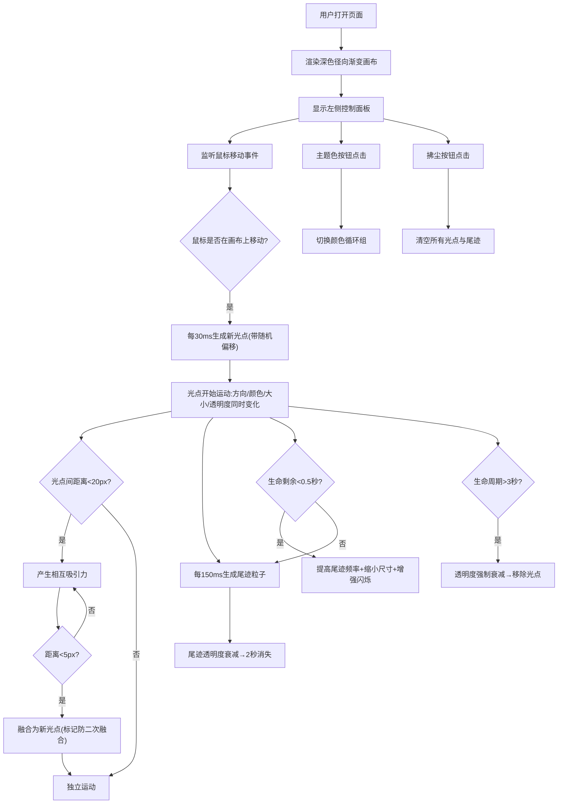

## 1. 产品概述

「浮光掠影」是一款基于浏览器的交互式光影涂鸦板，用户通过鼠标在深色画布上"绘画"，生成由数百个微小编流动光点组成的光带。产品主打沉浸式视觉体验，将普通的绘画行为转化为如梦似幻的光影艺术创作，适合创意工作者、设计师以及所有喜欢视觉艺术的用户使用。

## 2. 核心功能

### 2.1 用户角色

| 角色 | 注册方式 | 核心权限 |
|------|----------|----------|
| 普通用户 | 无需注册，打开即用 | 使用全部绘画功能、切换主题色、清空画布 |

### 2.2 功能模块

1. **光影绘画模块**：鼠标轨迹生成光点粒子流、光点颜色渐变、大小正弦波动、透明度呼吸效果
2. **粒子交互模块**：光点间吸引力、距离融合机制、融合后独立运动
3. **尾迹特效模块**：尾迹粒子生成、透明度衰减、生命末期高频闪烁
4. **控制面板模块**：5种主题色切换、清空画布按钮、磁吸滑动动画

### 2.3 页面详情

| 页面名称 | 模块名称 | 功能描述 |
|-----------|-------------|---------------------|
| 主画布页 | 光影绘画 | 鼠标移动每30ms生成光点，随机偏移±5px，大小4-8px，颜色循环选取，透明度0.8初始，速度60px/s沿鼠标方向移动 |
| 主画布页 | 粒子交互 | 距离<20px产生吸引力(加速度0.05)，距离<5px融合(中点位置、1.3倍大半径、RGB平均色、0.9倍平均透明度)，融合后标记避免二次融合 |
| 主画布页 | 尾迹特效 | 每150ms生成尾迹(1-3px随机，透明度0.3-0.6×0.5)，每帧衰减0.02，2秒消失；生命最后0.5秒每50ms生成(0.5-1.5px，0.1-0.3透明度) |
| 主画布页 | 控制面板 | 左侧半透明面板(rgba(255,255,255,0.08)，圆角12px，模糊8px)，5个颜色圆点(20px直径，发光外框激活态)，清空按钮"拂尘"(悬停背景变rgba(255,255,255,0.15)并放大5%)，磁吸20px范围 |

## 3. 核心流程

用户打开页面 → 显示深色渐变画布 + 左侧控制面板 → 鼠标进入画布开始移动 → 每30ms生成新光点 → 光点沿鼠标方向匀速移动并产生呼吸/渐变/波动效果 → 光点间接近时吸引、触碰时融合 → 光点持续产生尾迹粒子 → 3秒后光点消散 → 可切换主题色改变光带色调 → 点击"拂尘"清空所有粒子

## 4. 用户界面设计

### 4.1 设计风格

- **设计基调**：深邃宇宙 / 梦幻光影 / 极简沉浸
- **主色调**：深色星空背景 `#0a0a2e` → `#1a1a3e` 径向渐变
- **主题色系**：
  - 默认主题：`#00D2FF`(青蓝)、`#3A7BD5`(深蓝)、`#FF6B6B`(暖红)、`#F7DC6F`(暖黄)、`#BB8FCE`(淡紫)
- **按钮风格**：圆形圆点，激活态带发光外框(box-shadow: 0 0 12px 当前色)
- **字体**：使用系统等宽字体 + 'Segoe UI'，中文微软雅黑
- **布局风格**：全屏画布 + 左上角浮动半透明面板，磁吸收缩设计
- **图标/emoji**：无额外图标，使用颜色圆点作为视觉标识

### 4.2 页面设计概述

| 页面名称 | 模块名称 | UI元素 |
|-----------|-------------|-------------|
| 主画布页 | 画布区域 | 径向渐变背景(#0a0a2e中心→#1a1a3e边缘)，中央略亮，全屏铺满 |
| 主画布页 | 控制面板 | 背景rgba(255,255,255,0.08)，圆角12px，backdrop-filter:blur(8px)，padding:20px |
| 主画布页 | 颜色按钮 | 5个20px直径圆点，横向排列间距12px，激活态发光外框(0 0 12px + color)，cursor:pointer |
| 主画布页 | 清空按钮 | 文字"拂尘"，14px，颜色rgba(255,255,255,0.7)，padding:8px 16px，圆角6px，transition:all 0.2s，悬停背景rgba(255,255,255,0.15)+scale(1.05) |
| 主画布页 | 光点渲染 | 径向渐变圆形(中心alpha高→边缘alpha低)，多层叠加产生发光效果 |

### 4.3 响应式设计

- **桌面优先**：主画布全屏铺满，控制面板固定左上角
- **触控优化**：支持触屏绘画，touch事件映射到鼠标事件
- **窗口自适应**：Canvas尺寸随window resize实时更新

### 4.4 性能策略

- **帧率目标**：60FPS稳定运行
- **阈值调节**：粒子总数(光点+尾迹)超过800时：
  - 尾迹生成间隔：150ms → 300ms
  - 光点生成间隔：30ms → 40ms
- **渲染优化**：Canvas API原生绘制，避免DOM操作，使用requestAnimationFrame
- **内存管理**：生命周期结束立即从数组中移除，尾迹粒子独立管理
