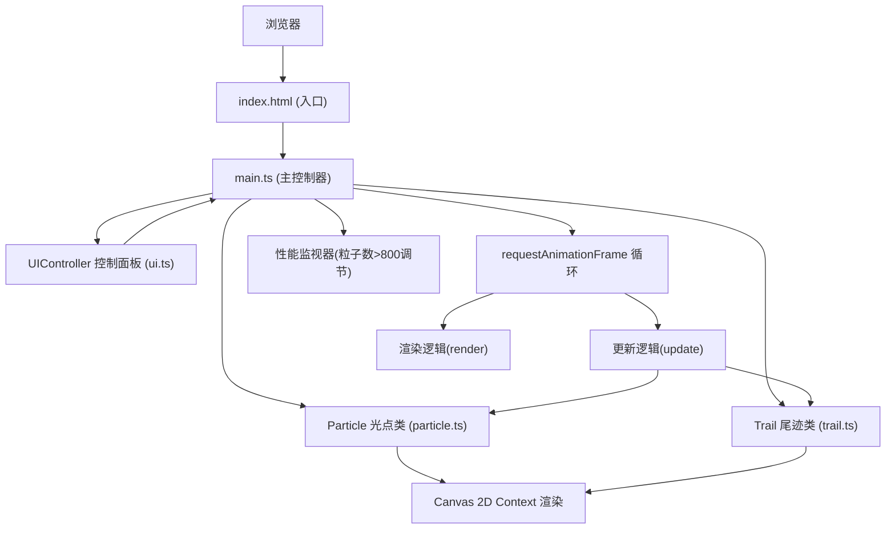

## 1. 架构设计

本项目采用纯前端Canvas渲染架构，无后端依赖，通过模块化类设计管理粒子系统与UI交互。



## 2. 技术说明

- **前端框架**：原生 TypeScript 类 + Canvas 2D API（无需React/Vue，追求极致渲染性能）
- **构建工具**：Vite@5.x（HMR热更新，开发服务器端口3000）
- **类型系统**：TypeScript@5.x，严格模式(strict:true)，ES2020目标
- **样式方案**：内联CSS via style标签，backdrop-filter实现玻璃拟态
- **无后端/无数据库**：纯客户端运行，所有状态内存管理

## 3. 项目结构

| 文件路径 | 职责说明 |
|----------|----------|
| `/package.json` | 依赖声明(vite, typescript, @types/node)，脚本配置(npm run dev) |
| `/vite.config.js` | Vite配置：开发服务器端口3000，开启HMR |
| `/tsconfig.json` | TS编译配置：严格模式，ES2020，DOM lib，esModuleInterop |
| `/index.html` | HTML入口：meta viewport，全屏canvas，挂载#app |
| `/src/main.ts` | 主入口：初始化Canvas，绑定鼠标/触控事件，管理全局状态，驱动RAF循环 |
| `/src/particle.ts` | Particle光点类：位置/速度/颜色/大小/透明度/生命周期管理，吸引融合逻辑，update/render方法 |
| `/src/trail.ts` | Trail尾迹类：独立生命周期，透明度衰减，不参与融合，update/render方法 |
| `/src/ui.ts` | UIController类：DOM创建(5色按钮+拂尘按钮)，磁吸滑动，事件绑定，动画过渡 |

## 4. 核心类型定义

```typescript
// ========== 类型定义 ==========

interface RGB {
  r: number;
  g: number;
  b: number;
}

interface Vector2 {
  x: number;
  y: number;
}

// ========== Particle 类接口 ==========
class Particle {
  position: Vector2;
  velocity: Vector2;
  size: number;
  baseSize: number;
  color: RGB;
  colorIndex: number;
  colorProgress: number;
  alpha: number;
  life: number;           // 剩余生命(秒)
  maxLife: number;        // 总生命周期=3秒
  merged: boolean;        // 融合标记
  trailTimer: number;     // 尾迹计时
  sinePhase: number;      // 正弦波动相位
  alphaDirection: number; // 透明度呼吸方向(+1/-1)

  constructor(x, y, vx, vy, size, colorIndex, colorPalette);
  update(dt, allParticles, trails, palette, trailInterval);
  render(ctx);
}

// ========== Trail 类接口 ==========
class Trail {
  position: Vector2;
  size: number;
  color: RGB;
  alpha: number;
  life: number;           // 剩余生命
  flickerTimer: number;   // 闪烁计时
  baseAlpha: number;

  constructor(x, y, size, color, alpha);
  update(dt);
  render(ctx);
}

// ========== UIController 类接口 ==========
class UIController {
  container: HTMLElement;
  panel: HTMLElement;
  colorButtons: HTMLElement[];
  clearButton: HTMLElement;
  activePalette: number;
  mouseX: number;
  isMagnetActive: boolean;

  constructor(palettes, onPaletteChange, onClear);
  update(mouseX, mouseY);
  setActivePalette(index);
}
```

## 5. 核心算法说明

### 5.1 颜色渐变算法
- 维护`colorIndex`(当前色在数组中的位置) + `colorProgress`(0~1渐变进度)
- 每帧 `colorProgress += 0.02`，超过1时 `colorIndex = (colorIndex+1) % palette.length`
- 实际颜色 = 线性插值: `lerp(palette[colorIndex], palette[nextIndex], colorProgress)`

### 5.2 吸引力与融合算法
- **距离检测**：双重循环两两计算距离，O(n²)，n一般<200可接受
- **吸引力**：距离<20px时，双向施加速度分量 `velocity += normalize(delta) * 0.05`
- **融合**：距离<5px且两者均未merged时：
  - 创建新Particle，位置取中点，size = max(a.size, b.size) * 1.3
  - color = RGB平均值，alpha = (a.alpha + b.alpha) / 2 * 0.9
  - merged = true，标记防止二次融合
  - 从数组中移除a、b，加入新粒子

### 5.3 透明度呼吸算法
```typescript
if (alphaDirection > 0) {
  alpha += 0.005;
  if (alpha >= 0.6) alphaDirection = -1;
} else {
  alpha -= 0.003;
  if (alpha <= 0.2) alphaDirection = 1;
}
// 生命最后强制衰减: if (life < 0) alpha *= 0.9;
```

### 5.4 磁吸动画算法
- 每帧检查鼠标X坐标与面板边缘距离
- 距离<20px → 目标偏移 = (面板宽度 - 10px)
- 使用CSS `transform: translateX(offset)` + `transition: transform 0.3s ease-out`
- 实际偏移 = lerp(当前偏移, 目标偏移, 0.1) 实现平滑过渡

### 5.5 性能自适应
- 每帧计算 `particles.length + trails.length`
- >800 阈值：
  - `trailInterval = 300ms` (正常150ms)
  - `particleInterval = 40ms` (正常30ms)
- 使用 `performance.now()` 计算实际帧间隔dt，所有动画基于dt而非固定帧数

## 6. 性能预算指标

| 指标 | 目标值 | 说明 |
|------|--------|------|
| FPS | ≥55 平均 | Chrome DevTools Performance面板检测 |
| 最大粒子数 | ≤1500 (光点+尾迹) | 超过自动降频 |
| 内存占用 | ≤80MB | Chrome任务管理器 |
| 首屏加载 | ≤1.5s | Vite dev模式冷启动 |
| 单次RAF耗时 | ≤12ms | 保证60FPS (16.67ms/帧) |
