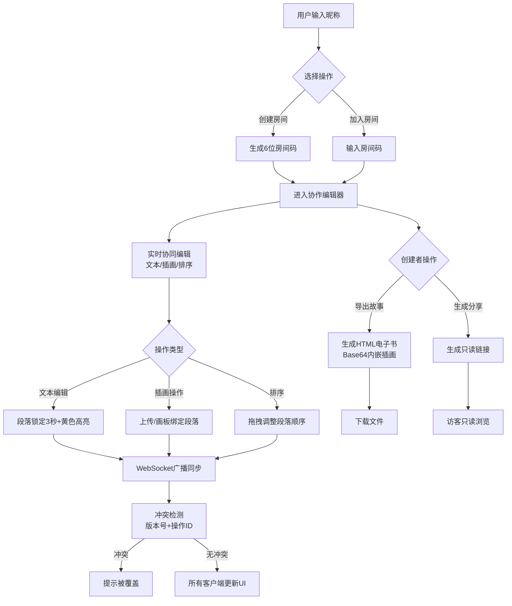

## 1. 产品概述
故事拼图·多人协作是一款面向异地创作团队的实时协同故事编写工具，支持多人同时编辑故事文本段落并嵌入个性化插画，最终可导出为电子书分享。
- 核心价值：解决多人异地协作编写图文故事时的实时同步、版本冲突、插画嵌入等痛点
- 目标用户：作者团队、教育工作者、创意爱好者、亲子家庭

## 2. 核心功能

### 2.1 用户角色
| 角色 | 加入方式 | 核心权限 |
|------|---------|---------|
| 房间创建者 | 输入昵称→创建房间 | 生成房间码、管理协作者、导出故事、生成分享链接、所有编辑权限 |
| 协作者 | 输入房间码/打开分享链接（编辑模式） | 编辑文本段落、上传/绘制插画、段落排序、实时聊天 |
| 访客 | 打开只读分享链接 | 浏览完整故事内容、下载HTML电子书（只读） |

### 2.2 功能模块
1. **房间管理页**：昵称输入、创建房间、加入房间、房间码分享
2. **协作编辑页**：段落实时编辑、插画上传/绘制、段落拖拽排序、聊天侧边栏、在线用户列表
3. **故事分享页**：只读故事浏览、HTML下载

### 2.3 页面详情
| 页面名称 | 模块名称 | 功能描述 |
|---------|---------|---------|
| 房间管理页 | 登录/加入表单 | 昵称输入框（必填，2-12字符）、创建房间按钮、加入房间输入框+按钮 |
| 房间管理页 | 房间信息显示 | 6位房间码复制、分享链接复制、房间容量提示（5人上限） |
| 协作编辑页 | 顶部导航栏 | 房间码显示、在线用户头像环、导出故事按钮、退出房间按钮 |
| 协作编辑页 | 故事编辑器 | 段落列表（文本+插画）、段落添加/删除、段落拖拽排序、段落编辑锁定提示 |
| 协作编辑页 | 插画面板 | 上传本地图片（jpg/png≤2MB）、内嵌画板（颜色/粗细/橡皮擦）、预览与确认 |
| 协作编辑页 | 聊天侧边栏 | 系统通知（加入/离开）、用户消息、可折叠可拖拽宽度 |
| 协作编辑页 | 冲突提示 | "你的上一次编辑已被覆盖"弹窗提示（3秒自动消失） |
| 故事分享页 | 故事正文 | 只读模式渲染所有段落和插画 |
| 故事分享页 | 下载区域 | HTML电子书下载按钮 |

## 3. 核心流程
用户在首页输入昵称创建房间，系统生成6位房间码并跳转至编辑器。创建者将房间码或链接分享给协作者，协作者通过链接或输入房间码加入（同样需输入昵称）。房间内所有用户可编辑段落、上传/绘制插画、调整段落顺序，所有操作通过WebSocket实时广播。编辑完成后，房间创建者点击"导出故事"生成HTML电子书下载，并生成只读分享链接。

## 4. 用户界面设计

### 4.1 设计风格
- **主色调**：浅米色 #FFF8E7（复古纸张感），纯白 #FFFFFF（编辑区）
- **辅助色**：浅棕色边框 #D2B48C，浅灰分隔线 #E0E0E0，绿色在线环 #4CAF50
- **强调色**：半透明黄色高亮 rgba(255,235,59,0.3)（编辑中段落）
- **按钮风格**：圆角4px，浅棕色边框，悬停背景色加深，0.2s ease-out过渡
- **字体**：段落使用 Georgia / "Noto Serif SC" 衬线字体，16px，行高1.8；UI文本使用系统无衬线字体
- **布局风格**：左侧编辑器（70%宽度）+ 右侧聊天侧边栏（默认250px，可拖拽至300px），毛玻璃效果 backdrop-filter: blur(8px)
- **图标风格**：使用lucide-react线性图标，统一尺寸18px

### 4.2 页面设计概览
| 页面名称 | 模块名称 | UI元素 |
|---------|---------|---------|
| 房间管理页 | 登录表单 | 米色渐变背景、居中卡片（白色+浅棕边框+投影）、大标题衬线字体、输入框焦点动画、按钮悬停上浮效果 |
| 协作编辑页 | 顶部导航 | 高48px固定顶栏、左侧房间码（等宽字体+复制按钮）、右侧用户头像环（圆形30px+4px绿环+hover昵称）、操作按钮组 |
| 协作编辑页 | 编辑器区域 | 纯白背景、段落卡片（浅灰底部分隔线、hover上浮、编辑中黄色渐变渐隐动画3s）、插画区（2px棕框+投影+max-width300px） |
| 协作编辑页 | 聊天侧边栏 | 毛玻璃半透明白底、可拖拽右边缘调整宽度、折叠按钮、系统消息蓝色小字、用户消息气泡样式 |
| 协作编辑页 | 画板面页 | 模态弹窗、Canvas画布、颜色选择器（预设色板+自定义）、粗细滑块、橡皮擦切换、清空/确认按钮 |
| 故事分享页 | 只读视图 | 米色背景、最大宽度800px居中、段落间距加大、优雅的翻页过渡动画 |

### 4.3 响应式设计
- **设计原则**：桌面优先（Desktop-first），移动端自适应
- **断点 768px以下（平板/手机）**：
  - 编辑器占满100%宽度
  - 聊天侧边栏转为底部弹出工具栏（默认收起，点击展开为全屏覆盖的聊天面板）
  - 插画在段落下方垂直排列，宽度100%（非300px右侧）
  - 顶部导航栏改为汉堡菜单收纳用户列表和操作按钮
  - 段落排序改为上下移动按钮（非拖拽）
- **触控优化**：按钮最小触摸区域44×44px，画板支持触控笔绘制

### 4.4 动效规范
| 动效类型 | 持续时间 | 缓动函数 | 应用场景 |
|---------|---------|---------|---------|
| 段落高亮渐隐 | 3s | ease-out | 他人编辑中的段落黄色高亮 |
| UI过渡动画 | 0.2-0.3s | ease-out | 按钮hover、侧边栏折叠、模态弹窗、段落重排 |
| 消息滑入 | 0.3s | ease-out | 聊天消息从底部滑入 |
| 冲突提示 | 0.3s进入 + 2.7s停留 + 0.3s退出 | ease-in-out | 顶部Toast通知 |
| 用户头像呼吸 | 2s循环 | ease-in-out | 在线状态绿色环轻微脉动 |
