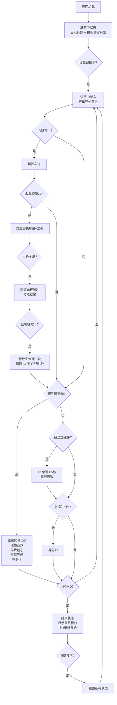

## 1. 产品概述

「极速彩虹」是一款基于浏览器的2D赛车竞技游戏，玩家操控由粒子光带构成的彩虹赛车，在无限循环赛道上飞驰，通过收集彩色能量释放彩虹冲击波清除障碍，追求最高分数。

- 核心玩法：三车道切换赛车，躲避障碍物、收集能量块、释放技能清屏
- 目标用户：独立游戏爱好者、休闲玩家
- 产品价值：轻量级即开即玩，视觉效果绚丽，操作简单但富有挑战性

## 2. 核心功能

### 2.1 用户角色
| 角色 | 注册方式 | 核心权限 |
|------|----------|----------|
| 玩家 | 无需注册，直接访问 | 完整游戏体验 |

### 2.2 功能模块
1. **游戏主场景**：无限循环赛道、赛车、障碍物、能量块、加速带、粒子特效
2. **赛车控制系统**：三车道切换（↑/↓键）、速度控制、彩虹粒子拖尾
3. **能量系统**：六色能量条（红橙黄绿蓝紫）、收集能量块、能量满自动准备技能
4. **障碍物系统**：随机生成障碍物（方块/三角锥/移动栅栏）、碰撞检测、减速惩罚
5. **加速带系统**：蓝色光条加速带、1.5倍速度增益
6. **彩虹冲击波技能**：空格键释放、半圆扩散特效、清除障碍物、速度提升、3秒冷却
7. **计分系统**：每前进100px+1分、撞障碍-5分、分数<0游戏结束
8. **游戏状态管理**：准备中/进行中/结束三种状态、重玩机制
9. **音效系统**：加速、碰撞、能量满、技能释放音效（Web Audio API）
10. **UI显示**：右上角得分、六色能量条、开始/结束提示文字

### 2.3 页面详情
| 页面名称 | 模块名称 | 功能描述 |
|----------|----------|----------|
| 游戏主页面 | 游戏画布 | 800x400px Canvas，渲染全部游戏元素 |
| 游戏主页面 | HUD界面 | 右上角显示得分与能量条，状态切换时显示提示文字 |
| 游戏主页面 | 状态提示层 | "准备中"显示标题和开始提示，"结束"显示最终得分和重玩提示 |

## 3. 核心流程

### 3.1 主流程描述
1. 玩家打开页面，游戏进入"准备中"状态，显示游戏标题和"按任意键开始"
2. 玩家按下任意键，游戏切换到"进行中"状态，赛车开始前进
3. 玩家通过↑/↓键在三车道间切换赛车位置，躲避障碍物（方块/三角锥/栅栏）
4. 赛车经过彩色能量块（红橙黄绿蓝紫）时，对应颜色能量+20%
5. 六色能量全部满100%时，赛车周围出现彩虹光环脉冲，提示技能就绪
6. 玩家按下空格键释放彩虹冲击波：
   - 从赛车位置向两侧扩展半透明彩虹半圆（半径0→300px，持续0.8秒）
   - 扫过的障碍物被击碎为彩色粒子并消失
   - 赛车速度×1.3持续2秒
   - 能量条归零，进入3秒冷却
7. 赛车撞到障碍物：
   - 速度×0.5持续1秒
   - 播放200Hz方波碰撞音效
   - 生成棕色碎片粒子
   - 屏幕红色闪烁0.1秒
   - 得分-5分
8. 赛车经过蓝色加速带：
   - 速度×1.5持续1.5秒
   - 播放800Hz正弦波音效
9. 每前进100px得分+1，得分<0时游戏结束
10. 游戏进入"结束"状态，显示最终得分和"按R重新开始"
11. 玩家按R键，重置所有状态，回到"进行中"状态

### 3.2 核心流程图

## 4. 用户界面设计

### 4.1 设计风格
- **主色调**：深蓝到黑色径向渐变背景（中心#1a1a2e → 边缘#0f0f23）
- **赛道色**：红橙黄绿蓝紫循环横条（每条高15px，宽100px），向左滚动
- **赛车色**：发光三角形，填充从当前能量色相渐变到白色，2px发光边框
- **强调色**：
  - 能量块：红#FF4444、橙#FF8C00、黄#FFD700、绿#00FF00、蓝#0088FF、紫#9932CC
  - 障碍物：深灰#444
  - 加速带：半透明蓝#00BFFF
  - 冲击波：半透明彩虹色（HSL循环）
- **字体**：无衬线粗体（Canvas原生font）
- **布局**：Canvas居中显示（800×400px），固定尺寸
- **动画风格**：
  - 赛车拖尾：粒子逐渐淡出（alpha 0.1→0.3→0）
  - 能量满时：赛车周围彩虹光环脉冲
  - 碰撞时：屏幕红色叠加闪烁0.1秒
  - 冲击波：半圆半径从0扩展到300px持续0.8秒

### 4.2 页面设计概述
| 页面名称 | 模块名称 | UI元素 |
|----------|----------|--------|
| 游戏主页面 | 背景层 | 深蓝径向渐变，从中心亮蓝到边缘黑 |
| 游戏主页面 | 赛道层 | 彩色横条（红橙黄绿蓝紫循环，每条15px高），向左无限滚动 |
| 游戏主页面 | 赛车道 | 三条水平车道，赛车在车道间垂直移动 |
| 游戏主页面 | 赛车 | 发光三角形（边长25px），渐变填充+2px发光描边 |
| 游戏主页面 | 粒子拖尾 | 赛车后方半透明圆形粒子（3-6px，alpha 0.1-0.3），随当前色相变化 |
| 游戏主页面 | 能量块 | 六色方块，随机分布在赛道上 |
| 游戏主页面 | 障碍物 | 深灰方块/三角锥/移动栅栏，随机生成 |
| 游戏主页面 | 加速带 | 半透明蓝色横向光条 |
| 游戏主页面 | 冲击波 | 从赛车向两侧扩展的半透明彩虹半圆 |
| 游戏主页面 | HUD-得分 | 右上角白色粗体文字显示当前分数 |
| 游戏主页面 | HUD-能量条 | 右上角得分下方，六色分段条（每格16.67%），满格闪烁 |
| 游戏主页面 | 状态文字-准备中 | 屏幕中央显示游戏标题 + "按任意键开始" |
| 游戏主页面 | 状态文字-结束 | 屏幕中央显示"游戏结束" + 最终得分 + "按R重新开始" |
| 游戏主页面 | 碰撞特效 | 全屏半透红叠加层，0.1秒闪烁 |
| 游戏主页面 | 能量满特效 | 赛车周围彩虹光环脉冲动画 |

### 4.3 响应式
- 固定800×400px Canvas尺寸，桌面优先
- Canvas在页面中水平居中显示
- 无触摸优化（键盘操作）

### 4.4 性能约束
- 帧率：稳定60FPS，使用requestAnimationFrame驱动
- 粒子池：最大200个粒子，超出时循环覆盖
- 渲染：全部使用Canvas 2D API，无DOM元素参与游戏渲染
- 音频：Web Audio API程序化生成，不加载外部音频文件
