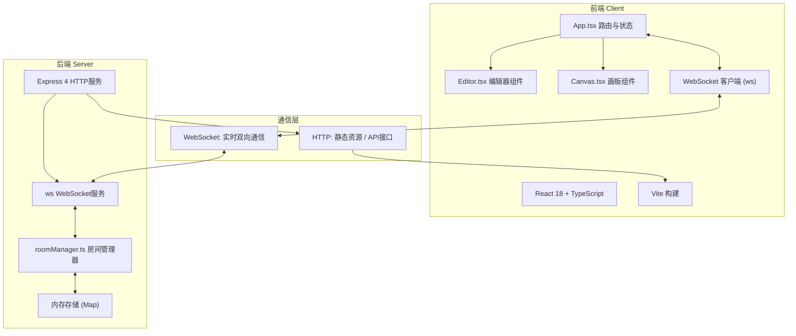
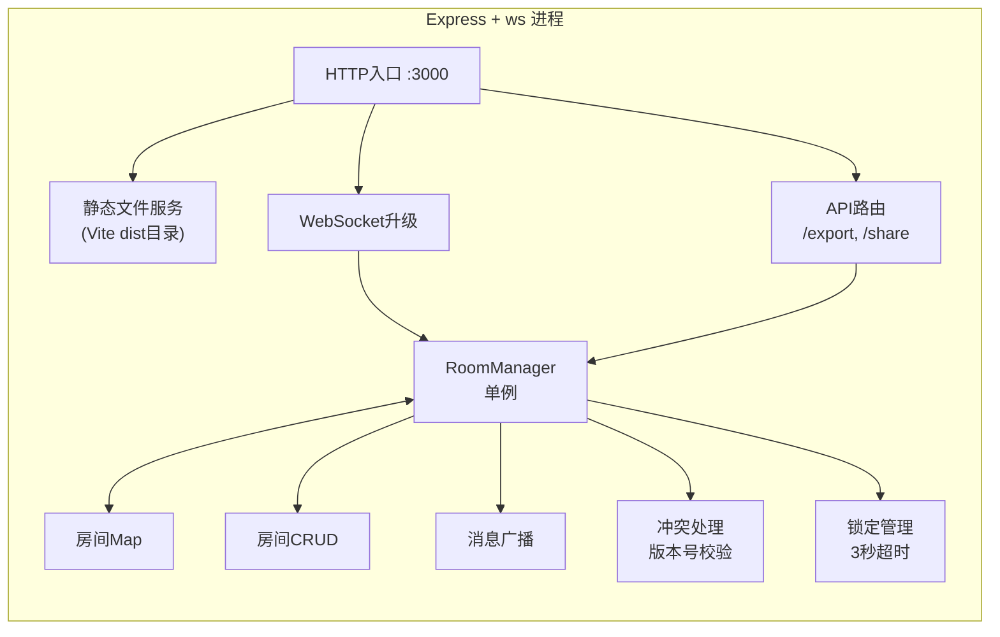
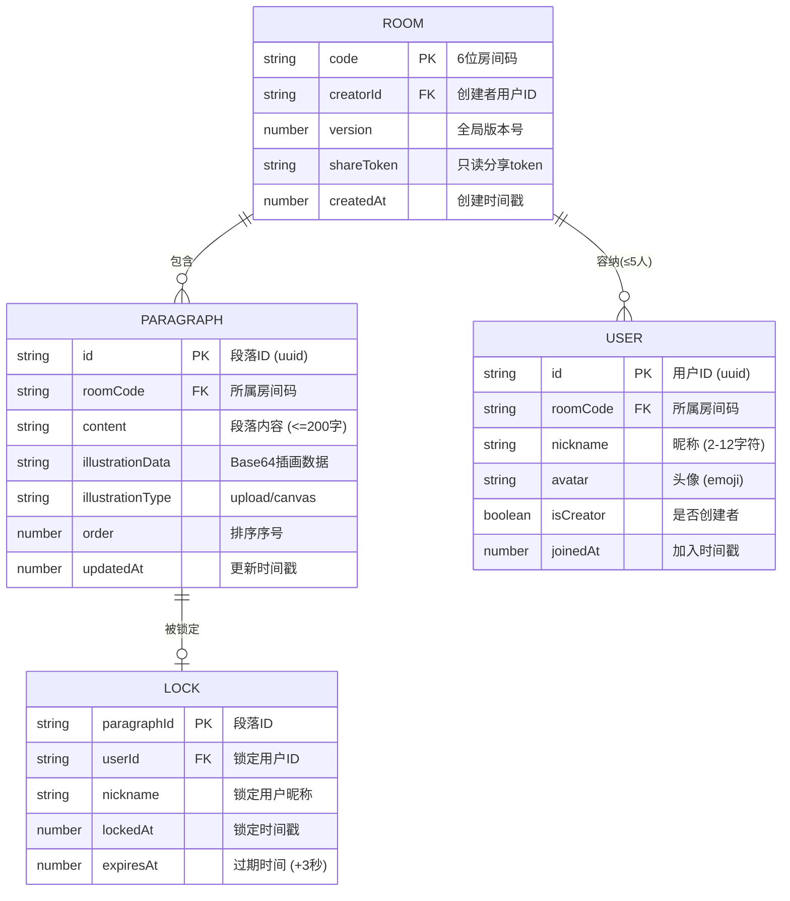

## 1. 架构设计



## 2. 技术描述

- **前端框架**：React@18 + TypeScript@5
- **构建工具**：Vite@5 + @vitejs/plugin-react
- **后端框架**：Express@4
- **WebSocket**：ws@8（原生WebSocket库，非Socket.IO）
- **工具库**：uuid（生成唯一ID）
- **状态管理**：React useState + useReducer（轻量场景，无需引入zustand）
- **样式方案**：原生CSS + CSS变量（不使用Tailwind，因项目有特殊复古纸质感设计需求）
- **数据存储**：服务端内存（Map结构），无需数据库
- **启动方式**：npm run dev（同时启动Vite开发服务器 + Express WebSocket服务器）

## 3. 路由定义

| 路由 | 用途 |
|-----|-----|
| `/` | 首页：创建/加入房间表单 |
| `/room/:roomCode` | 协作编辑页：带房间码参数进入编辑模式 |
| `/share/:roomCode` | 只读分享页：访客浏览故事，不可编辑 |
| `/api/export/:roomCode` [GET] | 导出故事HTML文件（仅创建者可调用） |
| `/api/share/:roomCode` [POST] | 生成只读分享链接 |

## 4. API 与 WebSocket 消息定义

### 4.1 WebSocket 消息协议（JSON格式）

**客户端发送消息类型：**

```typescript
// 1. 加入房间
type JoinMessage = {
  type: 'join';
  roomCode: string;
  userId: string;
  nickname: string;
  avatar: string; // Base64或emoji
};

// 2. 离开房间
type LeaveMessage = {
  type: 'leave';
  roomCode: string;
  userId: string;
};

// 3. 编辑段落文本
type EditParagraphMessage = {
  type: 'edit_paragraph';
  roomCode: string;
  userId: string;
  operationId: string;
  paragraphId: string;
  content: string;
  version: number;
};

// 4. 添加段落
type AddParagraphMessage = {
  type: 'add_paragraph';
  roomCode: string;
  userId: string;
  operationId: string;
  afterId: string | null; // 插入位置，null表示末尾
  version: number;
};

// 5. 删除段落
type DeleteParagraphMessage = {
  type: 'delete_paragraph';
  roomCode: string;
  userId: string;
  operationId: string;
  paragraphId: string;
  version: number;
};

// 6. 段落排序（拖拽）
type ReorderParagraphMessage = {
  type: 'reorder_paragraph';
  roomCode: string;
  userId: string;
  operationId: string;
  paragraphId: string;
  newIndex: number;
  version: number;
};

// 7. 设置/更新插画
type SetIllustrationMessage = {
  type: 'set_illustration';
  roomCode: string;
  userId: string;
  operationId: string;
  paragraphId: string;
  illustration: {
    data: string; // Base64图片数据
    type: 'upload' | 'canvas';
  } | null; // null表示删除插画
  version: number;
};

// 8. 锁定段落（开始编辑）
type LockParagraphMessage = {
  type: 'lock_paragraph';
  roomCode: string;
  userId: string;
  paragraphId: string;
};

// 9. 解锁段落（编辑结束/超时）
type UnlockParagraphMessage = {
  type: 'unlock_paragraph';
  roomCode: string;
  userId: string;
  paragraphId: string;
};

// 10. 聊天消息
type ChatMessage = {
  type: 'chat';
  roomCode: string;
  userId: string;
  nickname: string;
  content: string;
  timestamp: number;
};
```

**服务端广播消息类型：**

```typescript
// 1. 用户加入房间广播
type UserJoinedBroadcast = {
  type: 'user_joined';
  userId: string;
  nickname: string;
  avatar: string;
  users: Array<{userId: string; nickname: string; avatar: string}>;
  timestamp: number;
};

// 2. 用户离开房间广播
type UserLeftBroadcast = {
  type: 'user_left';
  userId: string;
  nickname: string;
  users: Array<{userId: string; nickname: string; avatar: string}>;
  timestamp: number;
};

// 3. 加入成功（点对点）
type JoinSuccessMessage = {
  type: 'join_success';
  roomCode: string;
  userId: string;
  state: RoomState; // 完整房间状态快照
};

// 4. 房间已满（点对点）
type RoomFullMessage = {
  type: 'room_full';
  message: string;
};

// 5. 操作确认（点对点，包含冲突检测结果）
type OperationAckMessage = {
  type: 'operation_ack';
  operationId: string;
  success: boolean;
  conflict: boolean;
  overridden: boolean; // 自己的操作是否被覆盖
  latestVersion: number;
};

// 6. 段落更新广播
type ParagraphUpdateBroadcast = {
  type: 'paragraph_updated';
  operationId: string;
  editType: 'edit' | 'add' | 'delete' | 'reorder' | 'illustration';
  paragraphId: string;
  data: any; // 更新数据
  userId: string;
  version: number;
  timestamp: number;
};

// 7. 段落锁定广播
type ParagraphLockedBroadcast = {
  type: 'paragraph_locked';
  paragraphId: string;
  userId: string;
  nickname: string;
};

// 8. 段落解锁广播
type ParagraphUnlockedBroadcast = {
  type: 'paragraph_unlocked';
  paragraphId: string;
  userId: string;
};

// 9. 聊天消息广播
type ChatBroadcast = {
  type: 'chat_broadcast';
  userId: string;
  nickname: string;
  content: string;
  timestamp: number;
  isSystem: boolean;
};

// 10. 房间状态全量同步（新成员加入时）
type FullStateSyncMessage = {
  type: 'full_state';
  state: RoomState;
};
```

### 4.2 核心数据类型

```typescript
// 段落类型
interface Paragraph {
  id: string;
  content: string; // 最多200字
  illustration: {
    data: string; // Base64
    type: 'upload' | 'canvas';
  } | null;
  order: number; // 排序序号
  createdAt: number;
  updatedAt: number;
}

// 用户类型
interface User {
  id: string;
  nickname: string;
  avatar: string;
  ws: WebSocket; // WebSocket连接引用
  joinedAt: number;
  isCreator: boolean;
}

// 锁定状态
interface LockState {
  paragraphId: string;
  userId: string;
  nickname: string;
  lockedAt: number;
  timeout: NodeJS.Timeout; // 3秒自动解锁定时器
}

// 房间状态
interface RoomState {
  code: string;
  creatorId: string;
  paragraphs: Paragraph[];
  version: number; // 全局版本号，每次操作+1
  createdAt: number;
  shareToken: string | null; // 只读分享token
}

// 运行时房间（包含内存态）
interface Room {
  state: RoomState;
  users: Map<string, User>; // userId -> User
  locks: Map<string, LockState>; // paragraphId -> LockState
  chatHistory: Array<{...}>;
}
```

## 5. 服务器架构图



**后端模块职责划分：**
- `server/index.ts`：Express服务器启动，挂载静态文件服务，处理WebSocket升级请求，调用RoomManager
- `server/roomManager.ts`：核心业务逻辑单例，包含房间CRUD、用户管理、消息处理、版本冲突检测、锁定机制、广播分发

## 6. 数据模型（内存存储）

### 6.1 数据结构



### 6.2 内存Map索引

- `rooms: Map<string, Room>` → key: 房间码，所有房间的主索引
- 索引结构嵌套于Room内：`room.users` (Map)、`room.locks` (Map)、`room.state.paragraphs` (Array)

## 7. 冲突处理与同步机制

### 7.1 版本号乐观锁
- 每个房间维护全局 `version`，任何成功的写操作使其 +1
- 客户端发送写操作时携带当前本地 `version`
- 服务端校验：请求 version === 服务端 version - 1 ? 成功 : 冲突
- 冲突处理：
  - 后到达的请求（version不匹配）返回 `overridden: true`
  - 被覆盖方前端弹Toast："你的上一次编辑已被覆盖"
  - 广播以服务端版本为准的最终状态

### 7.2 段落锁定（编辑互斥）
- 用户 focus/开始输入段落时发送 `lock_paragraph`
- 服务端设置3秒锁（`LockState` + setTimeout）
- 锁定期间其他用户对该段落的编辑请求在UI层阻止（只读态+提示"xx正在编辑..."）
- 3秒后服务端自动发送 `unlock_paragraph` 广播
- 用户继续输入会刷新锁（重新发送lock_paragraph续期）

### 7.3 性能目标（5人并发）
- 操作频率：30次/分钟 → 0.5次/秒
- 端到端延迟目标：< 500ms
- 实现要点：
  - 消息最小化：增量广播而非全量
  - 合并频繁编辑：文本输入防抖200ms后才广播最终值
  - Base64插画分块：超过64KB时分帧发送
  - 内存零拷贝：引用传递避免序列化开销
