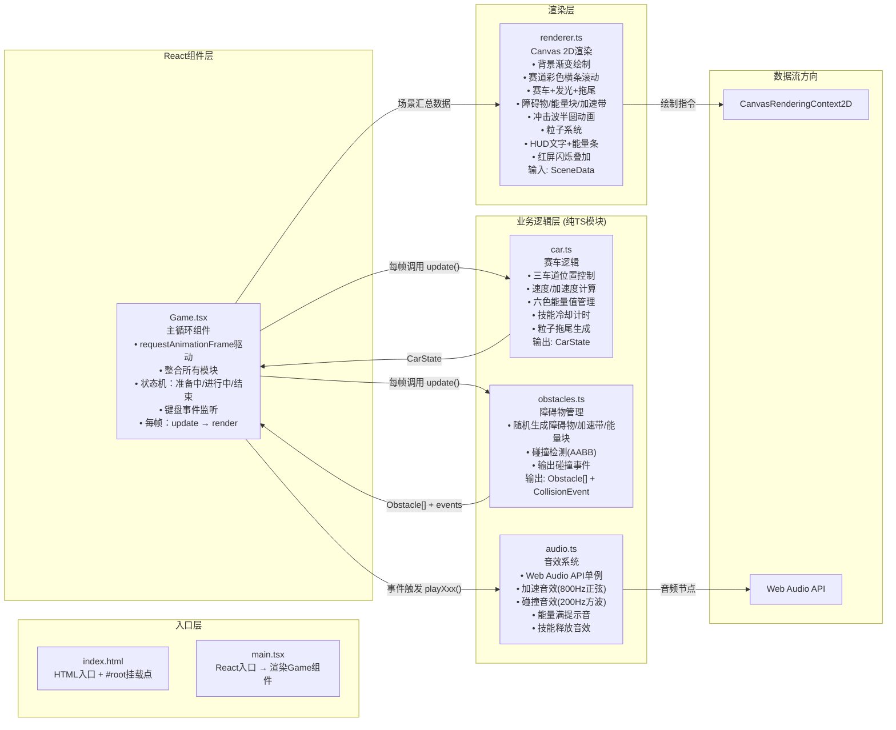

## 1. 架构设计



## 2. 技术描述

- **前端框架**：React@18 + React-DOM@18
- **构建工具**：Vite@5 + @vitejs/plugin-react@4
- **编程语言**：TypeScript@5（严格模式 strict: true）
- **渲染引擎**：Canvas 2D API（原生）
- **音频引擎**：Web Audio API（原生，程序化合成音效）
- **状态管理**：React useState/useRef + 纯TS模块内部状态（无zustand/redux，单组件简单场景）
- **初始化方式**：手动创建文件结构（严格遵循用户指定文件列表，不使用模板）

### 2.1 文件结构与职责

```
项目根目录/
├── package.json              # 依赖: react, react-dom, typescript, vite, @vitejs/plugin-react
├── vite.config.js            # Vite构建配置 (react插件)
├── tsconfig.json             # TS严格模式配置
├── index.html                # 入口HTML, 包含#root和800x400 canvas容器
└── src/
    ├── main.tsx              # React DOM渲染入口
    ├── Game.tsx              # 游戏主循环组件 (核心调度器)
    ├── types.ts              # 共享类型定义 (可选, 方便跨模块引用)
    ├── car.ts                # 赛车逻辑模块
    ├── obstacles.ts          # 障碍物/能量块/加速带管理模块
    ├── renderer.ts           # Canvas 2D渲染模块
    └── audio.ts              # Web Audio音效模块
```

### 2.2 模块间调用关系与数据流向

| 调用方 | 被调用方 | 调用时机 | 数据传递 |
|--------|----------|----------|----------|
| `main.tsx` | `Game.tsx` | 应用启动 | 无（React挂载） |
| `Game.tsx` | `car.ts` (update) | 每帧(60fps) | dt(秒), 键盘输入, 碰撞事件 → 返回更新后的CarState |
| `Game.tsx` | `obstacles.ts` (update) | 每帧(60fps) | dt, 赛车位置 → 返回Obstacle[] + CollisionEvent[] |
| `Game.tsx` | `renderer.ts` (render) | 每帧(60fps) | 完整SceneData(含car, obstacles, particles, score, state, effects) → 无返回(绘制到canvas) |
| `Game.tsx` | `audio.ts` (playXxx) | 事件触发时 | 无参数或强度参数 → 无返回(播放音效) |
| `car.ts` | - | - | 纯逻辑模块，无外部依赖 |
| `obstacles.ts` | - | - | 纯逻辑模块，无外部依赖 |
| `renderer.ts` | - | - | 纯渲染模块，接收数据→绘制 |
| `audio.ts` | - | - | 单例模块，内部管理AudioContext |

## 3. 核心数据结构 (TypeScript类型)

```typescript
// ========== 共享类型 (types.ts) ==========

// 车道索引: 0=上, 1=中, 2=下
type LaneIndex = 0 | 1 | 2;

// 六色能量类型
type EnergyColor = 'red' | 'orange' | 'yellow' | 'green' | 'blue' | 'purple';

// 游戏状态
type GameState = 'ready' | 'playing' | 'ended';

// 赛车状态
interface CarState {
  x: number;              // 赛车X坐标 (固定，如120)
  y: number;              // 赛车Y坐标 (车道位置)
  targetLane: LaneIndex;  // 目标车道
  speed: number;          // 当前速度 (像素/秒)
  baseSpeed: number;      // 基础速度
  energy: Record<EnergyColor, number>;  // 六色能量 0-100
  energyFull: boolean;    // 能量是否已满(可释放技能)
  skillCooldown: number;  // 技能剩余冷却秒数
  boostTimer: number;     // 加速剩余时间 (来自加速带/技能)
  boostMultiplier: number; // 当前加速倍率 (1.0, 1.3, 1.5)
  slowTimer: number;      // 减速剩余时间
  slowMultiplier: number; // 当前减速倍率 (1.0 或 0.5)
  currentHue: number;     // 当前能量色相 0-360 (用于赛车颜色和拖尾)
}

// 障碍物类型
type ObstacleType = 'block' | 'cone' | 'fence';

// 单个障碍物
interface Obstacle {
  id: number;
  type: ObstacleType;
  x: number;              // X坐标 (从右向左移动)
  lane: LaneIndex;        // 所在车道
  width: number;
  height: number;
  moveOffset?: number;    // 移动栅栏的偏移
  moveSpeed?: number;     // 移动速度
}

// 能量块
interface EnergyBlock {
  id: number;
  color: EnergyColor;
  x: number;
  lane: LaneIndex;
  collected: boolean;
}

// 加速带
interface BoostPad {
  id: number;
  x: number;
  width: number;
  activated: boolean;
}

// 粒子类型
type ParticleType = 'trail' | 'debris' | 'explosion';

interface Particle {
  x: number;
  y: number;
  vx: number;
  vy: number;
  size: number;
  color: string;
  alpha: number;
  life: number;           // 剩余生命秒数
  maxLife: number;
  type: ParticleType;
}

// 冲击波状态
interface Shockwave {
  active: boolean;
  x: number;
  y: number;
  radius: number;         // 当前半径
  maxRadius: number;      // 最大半径 300
  progress: number;       // 0-1
}

// 碰撞事件
interface CollisionEvent {
  type: 'obstacle' | 'energy' | 'boost';
  obstacleId?: number;
  energyColor?: EnergyColor;
  padId?: number;
}

// 传递给Renderer的完整场景数据
interface SceneData {
  gameState: GameState;
  car: CarState;
  obstacles: Obstacle[];
  energyBlocks: EnergyBlock[];
  boostPads: BoostPad[];
  particles: Particle[];
  shockwave: Shockwave;
  score: number;
  distance: number;       // 总前进距离 (像素)
  redFlashTimer: number;  // 红屏剩余时间
  skillReadyPulse: number; // 技能就绪光环脉冲相位
}
```

## 4. 模块设计说明

### 4.1 car.ts - 赛车逻辑
- **类/导出**：`export class CarController`
- **构造参数**：车道Y坐标数组 (3个值)
- **核心方法**：
  - `switchLane(direction: 'up' | 'down')`: 切换车道 (边界检查)
  - `collectEnergy(color: EnergyColor)`: 增加对应颜色能量20%
  - `applySlowdown()`: 触发减速 (×0.5, 1秒)
  - `applyBoost(multiplier: number, duration: number)`: 触发加速 (×1.3/1.5)
  - `tryActivateSkill(): boolean`: 尝试释放技能 (检查能量满+冷却)
  - `update(dt: number, input: InputState, collisions: CollisionEvent[]): CarState`
- **内部状态**：能量、速度、计时、冷却
- **生成拖尾粒子**：每帧生成1-2个trail粒子返回给Game

### 4.2 obstacles.ts - 障碍物管理
- **类/导出**：`export class ObstacleManager`
- **核心方法**：
  - `update(dt: number, carX: number, carY: number, carW: number, carH: number): { obstacles, energyBlocks, boostPads, collisions }`
  - `destroyObstacle(id: number): Particle[]` (返回爆炸粒子)
  - `getLaneY(lane: LaneIndex): number`
- **生成逻辑**：
  - 障碍物：每2-3秒随机生成 (type随机: block/cone/fence)
  - 能量块：随机间隔，color随机选六色之一
  - 加速带：随机间隔 (比障碍物少)
- **碰撞检测**：AABB矩形相交
- **回收**：x < -50时移除对象

### 4.3 renderer.ts - Canvas渲染
- **类/导出**：`export class Renderer`
- **构造参数**：`canvas: HTMLCanvasElement`
- **核心方法**：`render(scene: SceneData)`
- **渲染顺序**（从下到上）：
  1. 背景径向渐变
  2. 赛道彩色横条（滚动）
  3. 加速带
  4. 能量块
  5. 障碍物
  6. 粒子（trail在赛车下，其他在赛车上）
  7. 赛车（三角形+渐变+发光）
  8. 赛车彩虹光环（能量满时）
  9. 冲击波半圆
  10. HUD: 得分 + 能量条
  11. 红屏闪烁叠加层
  12. 状态文字（准备中/结束）

### 4.4 audio.ts - 音效
- **单例模式**：`export const audioManager = new AudioManager()`
- **延迟初始化**：首次用户交互时创建AudioContext（浏览器策略）
- **核心方法**：
  - `init()`: 创建AudioContext
  - `playCollision()`: 200Hz方波，0.2秒，快速衰减
  - `playBoost()`: 800Hz正弦，0.3秒，ADSR包络
  - `playEnergyFull()`: 升调琶音 (C-E-G-C)
  - `playSkill()`: 下行扫频 + 噪声爆发
  - `playCollect()`: 600Hz短促正弦 (收集能量块)

### 4.5 Game.tsx - 主组件
- **React Hooks**：
  - `useRef`: canvas引用, CarController实例, ObstacleManager实例, Renderer实例, 上一帧时间, 粒子池数组
  - `useState`: score, gameState (触发重渲染仅用于状态切换)
  - `useEffect`: 键盘监听 (keydown), requestAnimationFrame循环启动/清理
- **核心循环** (rAF回调):
  ```
  1. 计算dt = (now - lastTime) / 1000
  2. 如果gameState === 'playing':
     a. car.update(dt, input, pendingCollisions) → CarState + 新拖尾粒子
     b. obstacleManager.update(dt, car.x, car.y, ...) → 障碍物数组 + 碰撞事件
     c. 处理碰撞事件:
        - obstacle碰撞 → car.applySlowdown(), audio.playCollision(), 创建碎片, 扣分, redFlashTimer=0.1
        - energy碰撞 → car.collectEnergy(color), audio.playCollect()
        - boost碰撞 → car.applyBoost(1.5, 1.5), audio.playBoost()
     d. 如果energy全满 → audio.playEnergyFull(), skillReadyPulse启动
     e. distance += effectiveSpeed * dt
     f. 每满100px → score += 1
     g. 如果冲击波激活 → 检查障碍物在冲击波范围内 → destroyObstacle → 爆炸粒子
     h. 更新所有粒子life → 过滤死亡粒子 → 总数限制200
     i. 如果score < 0 → gameState = 'ended'
  3. 组装SceneData
  4. renderer.render(sceneData)
  5. lastTime = now → 请求下一帧
  ```
- **键盘处理**:
  - ArrowUp/ArrowDown: 切换车道 (playing时)
  - Space: 释放技能 (playing + energyFull + cooldown=0)
  - KeyR: 重置游戏 (ended时)
  - 任意键: 开始游戏 (ready时)

## 5. 性能优化策略

1. **粒子池**：使用数组覆盖策略而非频繁push/splice，索引循环写入
2. **对象复用**：障碍物/能量块/加速带对象重用，减少GC压力
3. **离屏渲染**：无（场景简单，直接绘制即可）
4. **dt限制**：最大dt=1/30秒，防止标签切换后跳帧
5. **Canvas状态优化**：尽量减少save/restore调用，批量同风格绘制
6. **状态管理**：游戏数据用useRef而非useState，避免每帧触发React重渲染
