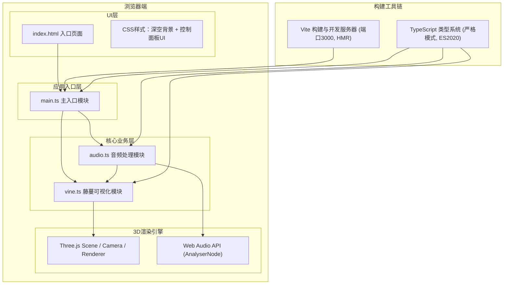

# 幻藤密语 - 技术架构文档

## 1. 架构设计



## 2. 技术说明

- **前端框架**：原生 TypeScript（无UI框架，直接操作DOM + Three.js）
- **3D引擎**：`three@^0.160.0` + `@types/three@^0.160.0`
- **构建工具**：`vite@^5.0.0`，开发端口3000，开启HMR热更新
- **语言规范**：TypeScript严格模式，目标ES2020，模块系统ESNext
- **音频API**：原生 Web Audio API（AudioContext + AnalyserNode + FFT）
- **无后端/无数据库**：纯前端浏览器应用，所有逻辑在客户端执行

### 技术选择理由

1. **原生TypeScript而非React/Vue**：项目核心是3D渲染而非UI组件，使用原生TS更轻量，减少虚拟DOM开销，直接与Three.js对接更高效
2. **Web Audio API**：原生支持FFT频谱分析，无需额外依赖，性能最优
3. **Vite**：原生ESM支持，冷启动快，HMR流畅，开箱即用TypeScript

## 3. 路由定义

本项目为单页面应用，无多路由需求：

| 路径 | 用途 |
|-------|---------|
| `/` | 主场景页面（唯一页面，包含3D画布与控制面板） |

## 4. 文件结构设计

```
auto367/
├── .trae/
│   └── documents/
│       ├── PRD.md          # 产品需求文档
│       └── ARCH.md         # 技术架构文档（本文件）
├── src/
│   ├── main.ts             # 入口模块：Three.js初始化、场景/相机/渲染器、渲染循环、相机控制、UI事件绑定
│   ├── audio.ts            # 音频模块：AudioContext封装、文件加载、麦克风授权、FFT频谱分析、频段能量计算
│   └── vine.ts             # 藤蔓模块：节点管理、光束连接、分叉逻辑、音频响应生长、节点交互、萤火虫粒子系统
├── index.html              # 入口HTML：画布容器、控制面板结构、样式
├── package.json            # 依赖与脚本
├── vite.config.js          # Vite构建配置
└── tsconfig.json           # TypeScript配置
```

## 5. 核心模块接口定义

### 5.1 AudioManager 类 (audio.ts)

```typescript
// 频段能量数据结构
interface SpectrumEnergy {
  total: number;        // 总能量 0-1
  low: number;          // 低频能量 0-1 (20-250Hz)
  mid: number;          // 中频能量 0-1 (250-2000Hz)
  high: number;         // 高频能量 0-1 (2000-20000Hz)
  dominantBand: 'low' | 'mid' | 'high';  // 当前主导频段
  beatDetected: boolean; // 节拍检测标记（瞬时）
  rawBins: Uint8Array;  // 原始64-bin频谱数据（用于柱状图）
}

class AudioManager {
  public energy: SpectrumEnergy;
  public onEnergyUpdate: ((e: SpectrumEnergy) => void) | null;
  
  constructor();
  public async loadFile(file: File): Promise<void>;    // 加载本地音频文件
  public async enableMicrophone(): Promise<void>;      // 启用麦克风
  public stop(): void;                                  // 停止音频源
  public setVolume(v: number): void;                   // 设置音量 0-1
  public update(): void;                               // 每帧调用，更新频谱
}
```

### 5.2 VineSystem 类 (vine.ts)

```typescript
// 藤蔓节点
interface VineNode {
  id: number;
  position: THREE.Vector3;
  baseRadius: number;       // 基础半径 3-6
  currentRadius: number;    // 当前半径（交互变化）
  color: THREE.Color;       // 当前颜色
  baseColor: THREE.Color;   // 初始颜色
  branchId: number;         // 所属分支ID (0=主干)
  createdAt: number;        // 创建时间戳
  pulseIntensity: number;   // 脉冲强度 0-1（交互用）
}

// 交互脉冲
interface PulseWave {
  originId: number;         // 起始节点ID
  currentRadius: number;    // 当前扩散半径
  speed: number;            // 传播速度
  startTime: number;        // 开始时间
  duration: number;         // 持续时间
  affectedNodes: Set<number>; // 已影响节点
}

class VineSystem {
  constructor(scene: THREE.Scene, audioManager: AudioManager);
  
  public update(deltaTime: number): void;        // 每帧更新
  public handleMouseMove(intersects: THREE.Intersection[]): void; // 鼠标悬停
  public handleClick(intersects: THREE.Intersection[]): void;     // （可选）点击
  public resize(): void;                         // 窗口变化
  public dispose(): void;                        // 清理资源
}
```

### 5.3 主入口 (main.ts) 核心流程

```typescript
// 初始化顺序
1. 创建 Three.js 核心对象 (Scene, PerspectiveCamera, WebGLRenderer)
2. 设置相机控制（自定义球面坐标 + 鼠标事件监听）
3. 实例化 AudioManager
4. 实例化 VineSystem（传入scene和audioManager）
5. 构建控制面板UI并绑定事件
6. 启动 requestAnimationFrame 循环：
   - audioManager.update() → 更新频谱
   - vineSystem.update(deltaTime) → 更新藤蔓与粒子
   - 应用相机球面坐标旋转
   - renderer.render()
7. 绑定 window.resize 事件
```

## 6. 关键算法设计

### 6.1 藤蔓生长方向算法

```
新节点方向 = normalize(
  0.7 * 频谱驱动方向向量 + 0.3 * 随机扰动方向向量
)

频谱驱动方向向量计算：
- 基方向：上一节点的螺旋切向方向（保持螺旋曲线趋势）
- 能量调制：
  - 低音频段 → 偏向Y轴向上（纵向生长）
  - 中音频段 → 保持螺旋切向（横向延展）
  - 高音频段 → 向外径向偏移（扩散生长）
- 能量强度 → 新节点距离长度（能量越高，距离越远，范围15-30像素）
```

### 6.2 节点颜色混合算法

```typescript
function mixNodeColor(e: SpectrumEnergy): THREE.Color {
  const c = new THREE.Color();
  // 三色线性插值
  c.r = e.low * 0.0 + e.mid * 0.0 + e.high * 1.0;      // 玫红 #FF1493 的R分量权重
  c.g = e.low * 0.0 + e.mid * 1.0 + e.high * 0.08;     // 翠绿 #00FF7F 的G分量权重  
  c.b = e.low * 0.55 + e.mid * 0.5 + e.high * 0.58;    // 深蓝 #00008B 的B分量权重
  return c;
}
```

### 6.3 节点颜色映射规则

按频段能量比例RGB加权：
- 低频主导：深蓝 `#00008B` → RGB(0, 0, 139)
- 中频主导：翠绿 `#00FF7F` → RGB(0, 255, 127)
- 高频主导：玫红 `#FF1493` → RGB(255, 20, 147)

### 6.4 波浪扭动算法

```typescript
// 沿主干应用正弦偏移
for each node in mainBranch:
  const t = node.sequenceIndex / totalNodes;  // 0-1 沿主干归一化位置
  const wave = sin(t * waveFrequency + time * beatSpeed) * waveAmplitude;
  node.position.applyAxisAngle(tangentDir, wave);
```

### 6.5 脉冲扩散算法（BFS广度优先遍历）

```
当节点被悬停时：
1. 创建 PulseWave，记录起始节点、速度60px/s、时长0.5s
2. 每帧更新：
   - pulseWave.currentRadius += speed * deltaTime
   - 遍历所有节点，若 |node - origin| < currentRadius 且未被标记：
     → 标记节点，设置 pulseIntensity = 1.0
     → 节点半径临时增加至 ~8px，颜色加亮
3. 超过 duration 后移除 PulseWave，所有节点pulseIntensity逐帧衰减至0
```

### 6.6 性能分级策略

```typescript
// 初始化检测：通过10帧平均FPS自动分级
let particleMax = 800;
if (avgFPS < 45) particleMax = 500;   // 中端设备
if (avgFPS < 30) particleMax = 300;   // 低端设备（树莓派）
// 节点上限固定500，超出移除最早节点（环形缓冲队列）
```

## 7. 构建与开发脚本

| 脚本 | 说明 |
|-------|------|
| `npm install` | 安装依赖（three、vite、typescript、@types/three） |
| `npm run dev` | 启动Vite开发服务器，端口3000，HMR热更新 |
| `npm run build` | TypeScript编译 + Vite打包生产版本 |
