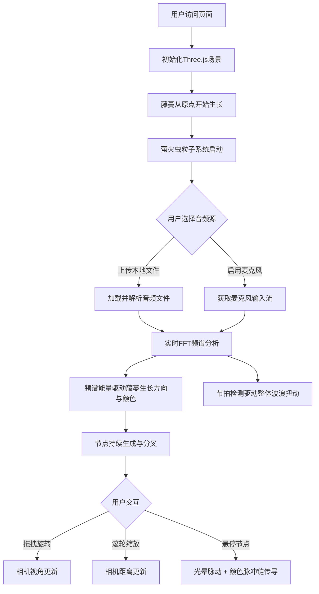

# 幻藤密语 - 产品需求文档 (PRD)

## 1. 产品概述

「幻藤密语」是一款基于浏览器的3D音频可视化艺术装置，通过Three.js在虚拟三维空间中模拟一株由光束构成的智能藤蔓，实时响应用户的本地音乐或麦克风音频输入。

- 核心目标：将抽象的音频频谱转化为具象的、可交互的3D视觉艺术，为用户提供沉浸式的音乐可视化体验
- 目标用户：音乐爱好者、视觉艺术创作者、展览展示场景的观众
- 市场价值：可作为音乐节、艺术展、个人音乐播放器的视觉插件，提供独特的视听联觉体验

## 2. 核心功能

### 2.1 功能模块

1. **3D藤蔓生长系统**：从场景原点自动生长的螺旋形光束藤蔓，包含节点、光束连接、分叉逻辑
2. **音频驱动引擎**：支持本地音频文件上传和麦克风实时输入，频谱分析驱动藤蔓行为
3. **节点交互反馈系统**：鼠标悬停节点触发光晕脉动和颜色脉冲传导链
4. **3D场景控制器**：鼠标拖拽旋转视角、滚轮缩放、窗口自适应布局
5. **萤火虫粒子系统**：数百个细小光点漂浮在藤蔓周围，缓慢聚散运动
6. **控制面板UI**：文件上传、音量调节、实时频谱柱状图展示

### 2.2 页面详情

| 页面名称 | 模块名称 | 功能描述 |
|-----------|-------------|---------------------|
| 主场景页 | 3D藤蔓渲染区 | 全屏Three.js画布，深空渐变背景，藤蔓生长、粒子漂浮、音频驱动动画 |
| 主场景页 | 控制面板（左上角） | 半透明毛玻璃面板，文件上传按钮、音量滑块、实时频谱柱状图 |
| 主场景页 | 场景交互层 | 鼠标拖拽旋转、滚轮缩放、节点悬停交互 |

## 3. 核心流程

### 3.1 主用户流程

1. 用户访问页面 → 自动从原点开始生长初始藤蔓，萤火虫粒子开始漂浮
2. 用户选择音频源：
   - 点击"上传音频"按钮选择本地音乐文件 → 自动播放并驱动藤蔓
   - 点击"启用麦克风"按钮授权 → 实时环境音驱动藤蔓
3. 音频驱动藤蔓行为：
   - 每秒新增3-5个节点，方向由频谱能量（70%）+ 随机扰动（30%）决定
   - 节点颜色根据频段着色：低频深蓝#00008B，中频翠绿#00FF7F，高频玫红#FF1493
   - 每5秒自动分叉一次（角度15-30度，长度60%）
   - 整体随节拍做波浪式扭动
4. 用户交互：
   - 鼠标拖拽旋转3D视角
   - 滚轮缩放场景
   - 鼠标悬停节点 → 节点放大脉动 + 颜色脉冲传导至相邻节点
5. 性能自适应：低端设备（如树莓派）自动将粒子数降至300以下

### 3.2 流程图

## 4. 用户界面设计

### 4.1 设计风格

- **主色调**：深空渐变背景，从中央`#0a0a2e`到边缘`#0f0f0f`的径向渐变
- **藤蔓节点颜色**：低频`#00008B`深蓝、中频`#00FF7F`翠绿、高频`#FF1493`玫红，节点间光束为节点色的渐变过渡
- **强调色**：控件hover时的紫色发光`#4a00e0`
- **面板样式**：深色毛玻璃效果`rgba(10,10,46,0.7)`，12px圆角，1px边框`#3a3a6e`
- **字体**：现代无衬线字体，标题14px加粗，正文12px常规
- **布局风格**：沉浸式全屏3D场景，左上角悬浮控制面板，极简无干扰设计

### 4.2 页面设计概览

| 页面名称 | 模块名称 | UI元素与设计 |
|-----------|-------------|-------------|
| 主场景页 | 3D场景背景 | 径向深空渐变`#0a0a2e → #0f0f0f`，无额外装饰，聚焦藤蔓主体 |
| 主场景页 | 藤蔓主体 | 发光球体节点(3-6px随机) + 渐变色光束连接，螺旋曲线延展，整体波浪扭动 |
| 主场景页 | 萤火虫粒子 | 1-2像素光点，数百个，缓慢聚散漂浮，半透明发光效果 |
| 主场景页 | 控制面板 | 左上角固定，毛玻璃背景，圆角12px，内边距16px，含3个子模块垂直排列 |
| 主场景页 | 文件上传控件 | 圆角按钮，默认态深灰，hover时紫色发光阴影 |
| 主场景页 | 音量滑块 | 自定义样式滑杆，进度条颜色随音量变化 |
| 主场景页 | 频谱柱状图 | 64柱从低频到高频排列，柱色匹配频段颜色规则，实时跳动动画 |

### 4.3 响应式布局

- **桌面端优先**：核心设计针对1080p及以上分辨率
- **窗口自适应**：Three.js画布随窗口resize自动适配，藤蔓居中显示，相机纵横比更新
- **触控支持**：移动端支持单指拖拽旋转、双指捏合缩放
- **性能降级**：根据设备帧率自动调节粒子数量，树莓派等低端设备自动降至300粒子以下

### 4.4 3D场景指导

- **环境与氛围**：纯深空背景，无HDRI，依赖藤蔓与粒子的自发光营造幽深海市蜃楼般的神秘氛围
- **光照设置**：场景无外部光源，所有视觉元素采用MeshBasicMaterial或PointsMaterial的自发光(color + emissive)，确保光束和节点在黑暗背景中清晰可见
- **相机设置**：PerspectiveCamera，fov 60度，初始位置(0, 80, 200)看向原点，拖拽旋转采用球面坐标系统（绕Y轴+X轴，速度0.005弧度/帧），滚轮缩放范围0.5x-3x
- **构图与焦点**：藤蔓生长自场景中心，自然形成视觉焦点，粒子分布在藤蔓半径50像素范围内形成光晕带
- **交互与动画**：
  - 藤蔓生长：每秒3-5节点，光束使用LineSegments + vertexColors实现渐变色
  - 波浪扭动：沿主干长度方向应用正弦函数偏移，频率与节拍同步
  - 节点悬停：使用Raycaster拾取，命中节点半径放大至10px + 外层Sprite光晕20px脉动(alpha 0.4-0.6)
  - 脉冲传导：BFS广度优先遍历，60像素/秒速度，0.5秒持续时间，被触及节点临时放大闪烁
- **后期处理**：可选UnrealBloomPass增强发光效果，低端设备自动关闭
- **性能预算**：最大节点500个（超出移除最早节点），粒子数根据设备300-800动态调整，目标帧率60FPS
