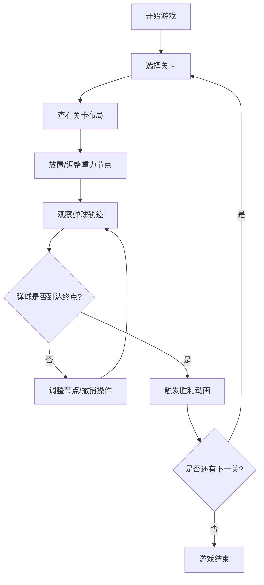

## 1. 产品概述

重力迷宫是一款基于浏览器的2D策略解谜游戏，玩家通过在画布上创建、调整重力场节点来引导弹球从起点滚落到终点，期间需要避开陷阱区域并收集星尘获取积分。游戏融合了物理模拟与空间规划，解决了传统迷宫游戏缺乏动态物理交互和玩家可控规则的问题。

- 核心玩法：拖拽放置重力节点，利用万有引力公式改变弹球运动轨迹
- 目标用户：休闲游戏爱好者、物理模拟爱好者、解谜游戏玩家
- 市场价值：提供创新性的物理交互体验，教育性与娱乐性兼具

## 2. 核心功能

### 2.1 功能模块

1. **游戏主界面**：顶部控制栏 + 中央游戏画布 + 底部状态栏
2. **重力场编辑系统**：节点放置、拖拽移动、删除、吸引力调节
3. **物理引擎**：万有引力计算、弹性碰撞、速度/加速度更新
4. **关卡系统**：3个内置关卡、起点/终点、陷阱区域、星尘收集点
5. **视觉反馈系统**：脉动光晕、发光拖尾、粒子特效、碰撞闪烁
6. **撤销重做系统**：Ctrl+Z撤销、Ctrl+Y重做，最多10步历史记录

### 2.2 页面详情

| 页面名称 | 模块名称 | 功能描述 |
|---------|---------|---------|
| 游戏主界面 | 顶部控制栏 | 关卡选择下拉菜单、网格开关、撤销/重做按钮、汉堡菜单(移动端) |
| 游戏主界面 | 中央画布 | Canvas 2D渲染游戏实体、处理鼠标/触摸事件、显示刻度尺 |
| 游戏主界面 | 底部状态栏 | 实时显示当前积分、弹球速度、已用时间 |
| 节点属性面板 | 力度滑块 | 调节选中节点的吸引力值(范围1-5) |

## 3. 核心流程

### 3.1 游戏主流程

玩家选择关卡 → 查看起点/终点位置与障碍分布 → 点击画布放置重力节点 → 拖拽调整节点位置 → 调节吸引力强度 → 观察弹球运动轨迹 → 微调节点布局 → 弹球到达终点触发胜利 → 进入下一关或重试

### 3.2 物理计算流程

每帧更新 → 计算所有节点对弹球的引力合力 → 更新加速度 → 积分更新速度与位置 → 检测墙壁/障碍物碰撞 → 检测陷阱减速 → 检测星尘收集 → 检测终点到达 → 渲染画面

## 4. 用户界面设计

### 4.1 设计风格

- **背景色系**：深空蓝紫渐变（#0A0A2E → #1A1A4E）
- **节点颜色**：暖橙到冷蓝渐变表示吸引力强弱（力度1: 青色#00FFFF，力度5: 红色#FF4500）
- **弹球颜色**：高亮红色#FF3333，带自发光效果（box-shadow: 0 0 10px #FF3333）
- **按钮风格**：磨砂玻璃效果（背景白色半透明 + backdrop-filter: blur(10px)），悬停时透明度0.2→0.4，过渡0.3s
- **字体选择**：使用 'Segoe UI' + 'PingFang SC' 等系统级无衬线字体，保证跨平台清晰度
- **图标风格**：简洁线条风格，使用 lucide-react 图标库

### 4.2 页面设计概述

| 页面名称 | 模块名称 | UI元素 |
|---------|---------|-------|
| 游戏主界面 | 控制栏 | 磨砂玻璃按钮、下拉菜单、图标按钮、悬停过渡动画 |
| 游戏主界面 | 画布 | 渐变背景、刻度尺(每50px)、网格线(可开关)、弹性布局 |
| 游戏主界面 | 状态栏 | 数据标签、数值动态更新、统一间距排版 |
| 节点效果 | 光晕效果 | 透明度0.2-0.6循环脉动、引力箭头连接线(半透明彩色) |
| 弹球效果 | 拖尾效果 | 青色→洋红渐变、长度50px、透明度1.0→0.0、2秒渐隐 |
| 胜利效果 | 粒子爆发 | 金色粒子从画面四周向中心汇聚 |

### 4.3 响应式设计

- **桌面端优先**：最小画布尺寸800x600，自适应窗口缩放
- **移动端适配**：最小宽度320px，控制栏折叠为汉堡菜单
- **触摸优化**：支持触摸拖拽节点、长按放置节点、滑动手势
- **画布缩放**：根据设备尺寸自动调整Canvas像素比，保证清晰度

## 5. 性能指标

- 目标帧率：60fps稳定运行
- 降级策略：帧率低于30fps时，粒子特效数量降至30%
- 实时监控：左上角FPS计数器，帮助玩家了解性能状态
