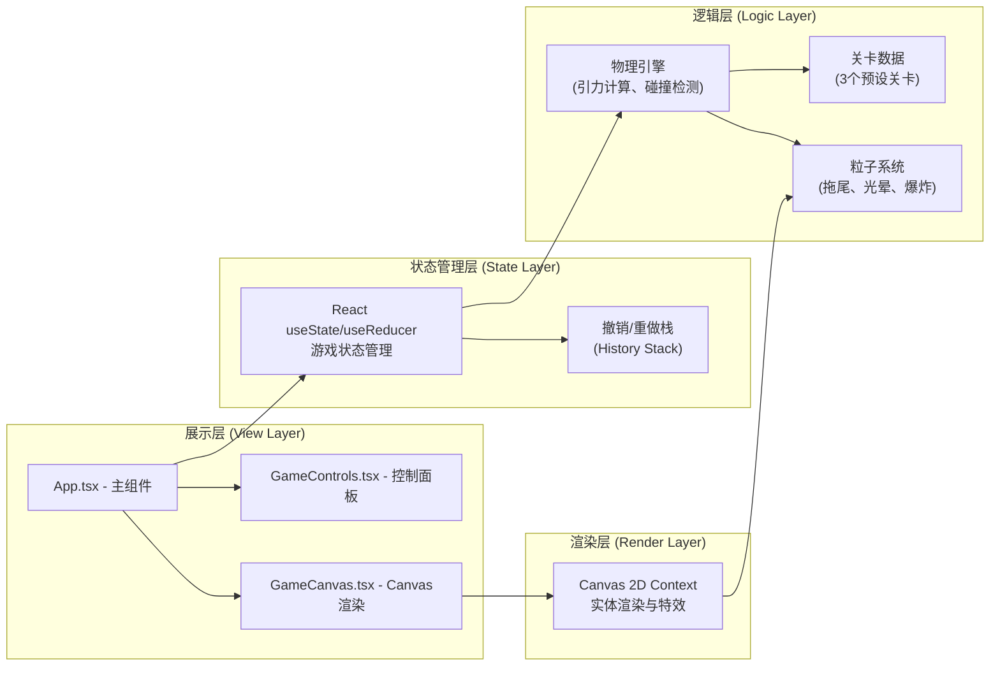

## 1. 架构设计



## 2. 技术栈说明

- **前端框架**：React@18 + TypeScript
- **构建工具**：Vite@5 + @vitejs/plugin-react
- **状态管理**：React useState + useRef（轻量级，无需额外库）
- **渲染引擎**：Canvas 2D API（高性能实体与粒子渲染）
- **样式方案**：CSS Modules + 内联样式（Canvas渲染无需CSS框架）
- **图标库**：lucide-react（简洁矢量图标）

## 3. 文件结构

```
project-root/
├── package.json
├── vite.config.js
├── tsconfig.json
├── index.html
└── src/
    ├── App.tsx              # 主组件：状态管理、物理引擎主循环、撤销重做
    ├── GameCanvas.tsx       # Canvas组件：渲染逻辑、鼠标/触摸事件处理
    ├── GameControls.tsx     # 控制面板：关卡选择、控制按钮、滑块
    └── types.ts             # 类型定义（可内联在App.tsx中）
```

## 4. 核心数据模型

### 4.1 主要类型定义

```typescript
interface GravityNode {
  id: string;
  x: number;
  y: number;
  strength: number; // 1-5
  color: string;
}

interface Ball {
  x: number;
  y: number;
  vx: number;
  vy: number;
  radius: number;
  inSlowZone: boolean;
  flashTimer: number;
}

interface Stardust {
  id: string;
  x: number;
  y: number;
  collected: boolean;
  flashPhase: number;
}

interface Trap {
  x: number;
  y: number;
  width: number;
  height: number;
}

interface Wall {
  x: number;
  y: number;
  width: number;
  height: number;
}

interface Level {
  id: number;
  name: string;
  start: { x: number; y: number };
  end: { x: number; y: number };
  walls: Wall[];
  traps: Trap[];
  stardusts: Omit<Stardust, 'collected' | 'flashPhase'>[];
  initialNodes?: GravityNode[];
}

interface HistorySnapshot {
  nodes: GravityNode[];
  timestamp: number;
}

interface TrailPoint {
  x: number;
  y: number;
  alpha: number;
  life: number;
}

interface Particle {
  x: number;
  y: number;
  vx: number;
  vy: number;
  life: number;
  maxLife: number;
  color: string;
  size: number;
}
```

## 5. 物理引擎核心算法

### 5.1 万有引力计算

```
对每个节点 i:
  dx = node[i].x - ball.x
  dy = node[i].y - ball.y
  distSq = dx² + dy²
  dist = sqrt(distSq)
  force = node[i].strength / max(distSq, minDistSq)  // 防止距离过小
  ax += force * dx / dist
  ay += force * dy / dist
```

### 5.2 弹性碰撞检测

```
AABB碰撞检测（球 vs 矩形墙）:
  closestX = clamp(ball.x, wall.left, wall.right)
  closestY = clamp(ball.y, wall.top, wall.bottom)
  dx = ball.x - closestX
  dy = ball.y - closestY
  if dx² + dy² < ball.radius²:
    计算法向量并反弹:
      normal = normalize(dx, dy)
      dot = ball.vx * normal.x + ball.vy * normal.y
      ball.vx = (ball.vx - 2 * dot * normal.x) * restitution(0.8)
      ball.vy = (ball.vy - 2 * dot * normal.y) * restitution(0.8)
      分离球体避免嵌入
```

## 6. 性能优化策略

### 6.1 渲染优化

- **离屏Canvas**：背景网格、刻度尺等静态元素预渲染到离屏Canvas
- **脏矩形渲染**：仅重绘变化区域（简化方案：全量重绘，现代Canvas足够快）
- **粒子池化**：复用Particle对象避免频繁GC
- **拖尾采样**：每2帧记录1个拖尾点，降低存储开销

### 6.2 计算优化

- **空间分区**：节点数量少时无需优化，超过20个可引入网格分区
- **距离平方比较**：避免开方运算，先比较距离平方
- **FPS自适应降级**：帧率<30fps时，拖尾长度从30→9，粒子数量降至30%

### 6.3 渲染循环

使用 `requestAnimationFrame` 驱动，固定时间步长（dt = 1/60s），使用累加器处理帧率波动：

```
accumulator += deltaTime;
while (accumulator >= fixedDt) {
  updatePhysics(fixedDt);
  accumulator -= fixedDt;
}
render(alpha = accumulator / fixedDt);
```

## 7. 撤销/重做系统设计

使用双栈结构（Undo Stack + Redo Stack），最大历史深度为10：

```typescript
const MAX_HISTORY = 10;
const undoStack: HistorySnapshot[] = [];
const redoStack: HistorySnapshot[] = [];

function pushHistory(nodes: GravityNode[]) {
  undoStack.push({ nodes: deepClone(nodes), timestamp: Date.now() });
  if (undoStack.length > MAX_HISTORY) undoStack.shift();
  redoStack.length = 0; // 清空重做栈
}

function undo(currentNodes) {
  if (undoStack.length === 0) return null;
  redoStack.push({ nodes: deepClone(currentNodes), timestamp: Date.now() });
  return undoStack.pop();
}

function redo(currentNodes) {
  if (redoStack.length === 0) return null;
  undoStack.push({ nodes: deepClone(currentNodes), timestamp: Date.now() });
  return redoStack.pop();
}
```

## 8. 关卡数据

### 3个预设关卡布局

- **关卡1（教学关）**：简单直线通道，少量障碍，2个星尘，引导玩家理解基本操作
- **关卡2（进阶关）**：L形弯道，2个陷阱区域，3个星尘，需要精确控制引力
- **关卡3（挑战关）**：复杂迷宫结构，多个墙壁，3个陷阱，5个星尘，考验空间规划能力

所有关卡画布坐标系：800×600，起点在左侧，终点在右侧。
