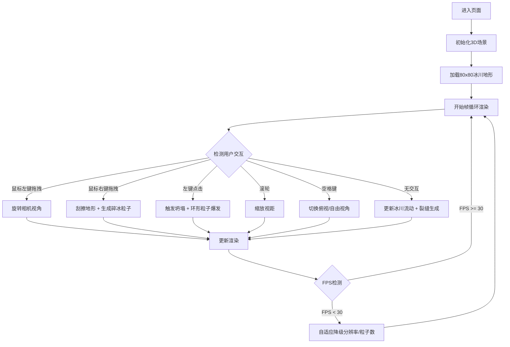

## 1. 产品概述

冰川律动是一个基于WebGL的三维实时地形演化交互可视化应用，通过模拟冰原地形的动态自然过程，为用户提供沉浸式的触感反馈和交互体验。用户可在浏览器中观察由数千个顶点构成的冰原，通过多种交互方式改变地形形态。

- 核心目的：解决静态地形模型缺乏动态自然过程模拟和沉浸式交互反馈的问题
- 目标用户：科研教育工作者、3D可视化爱好者、艺术创作者
- 产品价值：提供低门槛、高性能的Web端三维冰川地形模拟与交互体验

## 2. 核心特性

### 2.1 功能模块

1. **主视口页面**：3D冰川地形渲染区、性能监控面板、交互控制UI

### 2.2 页面详情

| 页面名称 | 模块名称 | 功能描述 |
|---------|---------|---------|
| 主视口 | 地形渲染模块 | 80x80网格地形，Perlin噪声初始化，冰川流动动画，裂缝生成 |
| 主视口 | 刮擦交互模块 | 右键拖拽刮擦地形，产生沟壑凹陷和碎冰粒子 |
| 主视口 | 坍塌交互模块 | 左键点击触发局部坍塌，环形扩散粒子爆发 |
| 主视口 | 光照材质模块 | 半透明冰蓝材质，动态旋转彩色光源，高度渐变着色 |
| 主视口 | 相机控制模块 | 拖拽旋转、滚轮缩放、空格切换俯视视角 |
| 主视口 | 性能监控模块 | FPS实时显示，顶点数统计，自适应降级策略 |
| 主视口 | UI面板模块 | 模拟时间、刮擦深度条、操作提示 |

## 3. 核心流程

用户进入页面后，系统初始化3D场景并开始模拟冰川流动。用户可通过鼠标和键盘进行多种交互：

## 4. 用户界面设计

### 4.1 设计风格

- **主色调**：深色太空背景 `#0D1B2A` → `#1B2838` 径向渐变
- **辅助色**：冰蓝 `#A2D6F9`、雪白 `#FFFFFF`、暖黄 `#FFD54F`、青蓝 `#4DD0E1`、浅蓝 `#B3E5FC`
- **UI文字色**：淡灰 `#E0E0E0`，带10%透明度背景毛玻璃效果（`backdrop-filter: blur(4px)`）
- **字体**：`'Segoe UI', sans-serif` 无衬线字体
- **动画**：所有过渡效果 0.3秒平滑动画
- **质感**：地形半透明带光泽折射，UI半透明毛玻璃悬浮

### 4.2 页面设计概述

| 页面名称 | 模块名称 | UI元素 |
|---------|---------|--------|
| 主视口 | 3D渲染区 | 全屏无边框，深色径向渐变背景，居中显示冰原地形 |
| 主视口 | 左上角信息面板 | 模拟时间显示（秒）、刮擦深度指示条（0%-100%） |
| 主视口 | 左下角性能面板 | 实时FPS数值、顶点数统计 |
| 主视口 | 右下角操作提示 | 鼠标功能说明、键盘快捷键列表 |

### 4.3 响应式设计

- 采用 **Desktop-first** 设计策略
- 宽度 < 768px 时：地形网格降至 50x50，UI控件以半透明圆角矩形悬浮于屏幕边缘
- 触摸设备：支持单指旋转、双指缩放、长按触发刮擦

### 4.4 3D场景指南

- **环境氛围**：深色太空背景，营造冷峻神秘的冰川极地氛围
- **光照设置**：两盏动态旋转彩色点光源（暖黄 #FFD54F、青蓝 #4DD0E1），绕Y轴 0.1 rad/s 旋转，强度 0.5；配合环境光提供基础照明
- **相机设置**：初始位置距离地形中心约 15 单位，俯仰角 45°；俯视模式位于正上方高度 20，正交投影无透视变形
- **构图焦点**：地形居中占主体，四周留出足够空间展示光照效果和粒子飞溅
- **交互动画**：冰川流动每帧正弦波动（周期 10s，幅度 0.05），裂缝每隔 3-5s 生成贝塞尔曲线路径
- **后处理效果**：微弱顶点颜色闪烁（亮度 ±0.02 随机波动），高度渐变着色（<0冰蓝 → >2雪白）
- **性能预算**：顶点数上限 8000，同时活跃粒子上限约 500，目标帧率 30+ FPS

## 5. 技术约束

- 初始化加载时间 ≤ 3 秒
- 主流中端设备（i5-8代+集显）帧率 ≥ 30 FPS
- 顶点数最高不超过 8000 个
- 浏览器兼容：Chrome/Edge/Firefox/Safari 近两年版本
