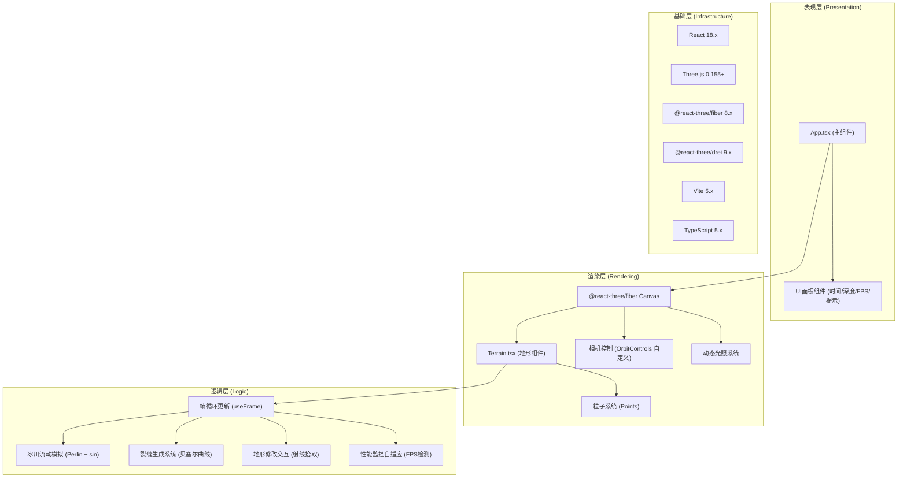

## 1. 架构设计



## 2. 技术栈说明

| 层级 | 技术选型 | 版本要求 | 用途说明 |
|-----|---------|---------|---------|
| 前端框架 | React | 18.x | UI组件化、状态管理、DOM交互 |
| 3D渲染核心 | Three.js | 0.155+ | WebGL底层渲染、几何体、材质、粒子 |
| React-Three桥接 | @react-three/fiber | 8.x | Three.js的React声明式封装 |
| 3D辅助组件 | @react-three/drei | 9.x | OrbitControls、工具函数 |
| 类型系统 | TypeScript | 5.x | 类型安全、ES2020语法支持 |
| 构建工具 | Vite | 5.x | 开发服务器、HMR、构建打包 |
| 状态管理 | React Hooks (useState/useRef) | - | 组件内状态、性能敏感引用 |

**后端**：无（纯前端WebGL应用，无服务端依赖）

## 3. 路由定义

本应用为单页应用（SPA），无多页面路由：

| 路由 | 用途 |
|-----|------|
| `/` | 主视口页面（唯一页面）|

## 4. 文件结构

```
auto38/
├── package.json              # 依赖与脚本定义
├── vite.config.js            # Vite配置（别名、HMR）
├── tsconfig.json             # TypeScript配置（严格模式、ES2020）
├── index.html                # 入口HTML
└── src/
    ├── main.tsx              # React入口
    ├── App.tsx               # 主组件（Canvas + UI面板 + 状态）
    └── components/
        └── Terrain.tsx       # 地形核心组件
```

## 5. 核心数据模型

### 5.1 地形顶点数据

```typescript
interface TerrainVertex {
  x: number;           // X坐标
  z: number;           // Z坐标
  baseY: number;       // Perlin噪声生成的基础高度
  currentY: number;    // 当前高度（含流动+修改）
  scratchDepth: number; // 刮擦累计深度（0~1.5）
}

interface TerrainData {
  resolution: number;          // 网格分辨率 (80/60/50)
  size: number;                // 地形平面尺寸
  vertices: Float32Array;      // 几何体position缓冲
  baseHeights: Float32Array;   // 基础高度备份
  scratchDepths: Float32Array; // 刮擦深度记录
  colors: Float32Array;        // 顶点颜色缓冲
}
```

### 5.2 粒子数据

```typescript
interface Particle {
  x: number; y: number; z: number;     // 位置
  vx: number; vy: number; vz: number;  // 速度
  life: number;       // 当前生命 (0~1)
  maxLife: number;    // 总生命周期(秒)
  size: number;       // 当前大小
  baseSize: number;   // 初始大小
  color: THREE.Color; // 颜色
}

type ParticleType = 'scratch' | 'collapse';
```

### 5.3 相机状态

```typescript
interface CameraState {
  mode: 'free' | 'top';          // 自由视角/俯视视角
  azimuth: number;               // 方位角 0-360°
  polar: number;                 // 极角
  distance: number;              // 距离 5-30
  target: THREE.Vector3;         // 观察中心点
}
```

### 5.4 性能状态

```typescript
interface PerformanceState {
  fps: number;                   // 当前FPS
  frameCount: number;            // 帧计数
  lastFpsUpdate: number;         // 上次FPS更新时间戳
  reducedQuality: boolean;       // 是否已降级
  particleMultiplier: number;    // 粒子生成倍率 (1.0 或 0.7)
}
```

## 6. 核心算法

### 6.1 Perlin噪声地形初始化
- 使用改良Perlin噪声函数，频率0.02，幅度5
- 遍历网格每个顶点计算基础高度 `baseY = perlin(x*0.02, z*0.02) * 5`

### 6.2 冰川流动模拟
- 每帧更新：`currentY = baseY + sin(time*0.628 + x*0.1 + z*0.05) * 0.05`
- 其中 `0.628 = 2π/10` 对应10秒周期

### 6.3 裂缝生成
- 每3-5秒随机触发一次
- 生成3个控制点构成二次贝塞尔曲线
- 沿曲线以宽度1-2网格单位，降低相关顶点Y值0.8

### 6.4 射线拾取（Raycaster）
- 将屏幕坐标归一化到 [-1,1]
- `THREE.Raycaster` 从相机发射射线
- 与地形几何体求交，获得交点世界坐标

### 6.5 高度渐变着色
- 顶点高度 < 0: `#A2D6F9`（冰蓝）
- 顶点高度 > 2: `#FFFFFF`（雪白）
- 中间值: 线性插值，再加 ±0.02 随机闪烁

## 7. 性能优化策略

1. **几何体复用**：使用单个 `BufferGeometry`，直接修改position/color属性数组
2. **粒子池化**：复用粒子对象，避免频繁GC；超出生命周期时重置而非销毁
3. **自适应降级**：
   - FPS < 30: 网格 80→60，粒子数 ×0.7
   - 移动端 (<768px): 网格 50×50
4. **批量更新**：顶点修改后统一标记 `needsUpdate = true`，每帧最多一次
5. **引用优化**：性能敏感数据使用 `useRef` 而非 `useState`，避免重渲染
