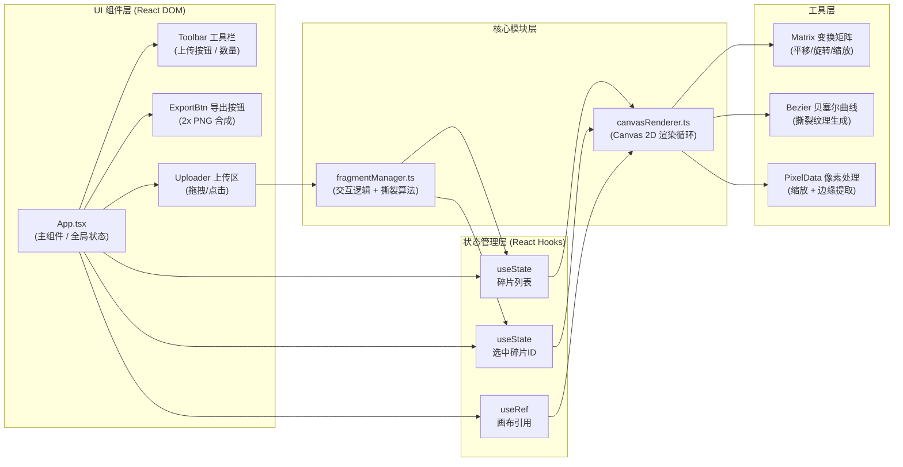
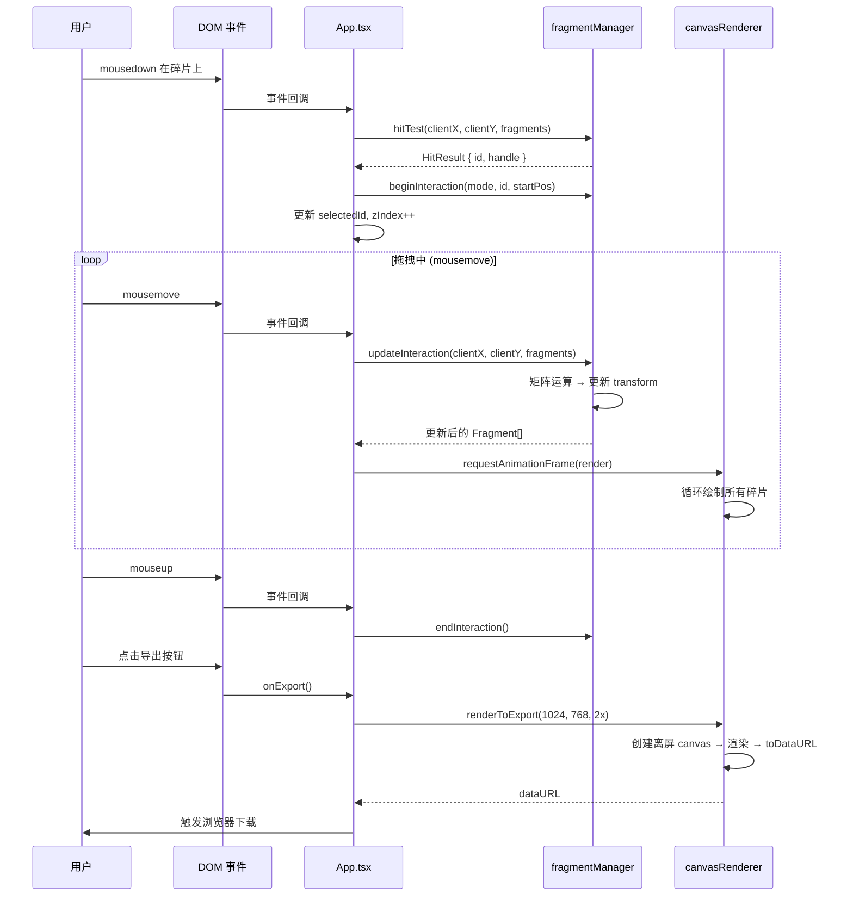

# 碎影拼贴 - 技术架构文档

## 1. 架构设计

本项目为纯前端浏览器应用，采用分层架构：UI 组件层负责渲染 DOM 界面与交互事件，状态管理层通过 React Hooks 维护碎片数据，核心渲染层使用 Canvas 2D API 实现高性能图像合成，工具层封装矩阵运算与撕裂纹理算法。



---

## 2. 技术选型

| 层级 | 技术 | 版本 | 说明 |
|------|------|------|------|
| 前端框架 | React + React DOM | ^18.2.0 | 函数组件 + Hooks 模式 |
| 编程语言 | TypeScript | ^5.3.0 | 严格模式 (strict: true)，target ES2020 |
| 构建工具 | Vite | ^5.0.0 | 冷启动 HMR，@vitejs/plugin-react ^4.2.0 |
| 渲染引擎 | Canvas 2D API | - | 原生浏览器 API，无第三方库 |
| 样式方案 | 原生 CSS + CSS 变量 | - | 模块化 CSS，无 UI 框架依赖 |
| 包管理工具 | npm | ≥9.0 | 官方推荐 |

---

## 3. 文件结构与调用关系

```
auto39/
├── package.json              # 依赖声明 + 启动脚本
├── vite.config.js            # Vite 构建配置（React + TS）
├── tsconfig.json             # TypeScript 严格配置 ES2020
├── index.html                # 入口页面（全屏布局）
└── src/
    ├── main.tsx              # React 入口挂载
    ├── App.tsx               # 主组件：初始化画布、状态管理、事件分发
    ├── styles/
    │   └── global.css        # 全局样式 + 响应式布局
    ├── types/
    │   └── index.ts          # 类型定义：Fragment / Transform / Point
    ├── core/
    │   ├── fragmentManager.ts  # 碎片管理：上传解析、交互逻辑、撕裂算法
    │   ├── canvasRenderer.ts   # 画布渲染：绘制循环、变换、阴影、光晕
    │   └── utils/
    │       ├── matrix.ts       # 2D 变换矩阵运算
    │       ├── bezier.ts       # 贝塞尔曲线撕裂纹理生成
    │       └── image.ts        # 图片缩放 + 像素数据提取
    └── components/
        ├── Toolbar.tsx       # 左上角工具栏（上传 + 数量）
        ├── ExportButton.tsx  # 右上角导出按钮
        └── UploadOverlay.tsx # 拖拽上传遮罩层
```

### 调用关系说明

| 文件 | 被谁调用 | 调用了谁 | 核心数据流 |
|------|----------|----------|------------|
| [App.tsx](src/App.tsx) | main.tsx 挂载 | Toolbar / ExportButton / UploadOverlay / fragmentManager / canvasRenderer | 用户操作 → 更新 Fragment[] → 触发 canvasRenderer.render() |
| [fragmentManager.ts](src/core/fragmentManager.ts) | App.tsx | utils/matrix / utils/bezier / utils/image | DOM 事件 → 计算变换矩阵 → 更新 Fragment 状态 → 通知 App 重绘 |
| [canvasRenderer.ts](src/core/canvasRenderer.ts) | App.tsx | 无（仅调用 Canvas API） | 接收 Fragment[] → 循环 applyTransform → 绘制撕裂轮廓 + 阴影 + 图片 → 返回 requestAnimationFrame ID |
| [utils/matrix.ts](src/core/utils/matrix.ts) | fragmentManager.ts | 无 | 输入: x,y,scale,rotation → 输出: 3×3 变换矩阵 / 逆矩阵（用于命中检测） |
| [utils/bezier.ts](src/core/utils/bezier.ts) | fragmentManager.ts | 无 | 输入: 宽/高 + 随机种子 → 输出: Path2D 贝塞尔撕裂路径 + 阴影路径 |
| [utils/image.ts](src/core/utils/image.ts) | fragmentManager.ts | 无 | 输入: File 对象 → 输出: 缩放至 200px 的 HTMLCanvasElement + ImageData |

---

## 4. 数据模型

### 4.1 核心类型定义

```typescript
// 碎片核心数据模型
interface Fragment {
  id: string;                     // 唯一标识 (uuid)
  imageCanvas: HTMLCanvasElement; // 预处理后的图片画布（含像素数据）
  pixelData: ImageData;           // 原始像素数据（撕裂边缘检测）
  width: number;                  // 原始宽度 (≤200px)
  height: number;                 // 原始高度 (≤200px)
  
  // 变换属性
  x: number;                      // 画布中心 X 坐标
  y: number;                      // 画布中心 Y 坐标
  scale: number;                  // 缩放系数 [0.3, 2.0]
  rotation: number;               // 旋转角度 弧度 [0, 2π)
  zIndex: number;                 // 图层顺序
  
  // 撕裂纹理
  tearPath: Path2D;               // 贝塞尔撕裂轮廓路径
  tearSeed: number;               // 随机种子（可复现）
  shadowOffset: { x: number; y: number }; // 阴影随机偏移
  
  // 状态
  isSelected: boolean;            // 是否被选中
}

// 交互状态
interface InteractionState {
  mode: 'none' | 'drag' | 'rotate' | 'scale';
  activeId: string | null;
  startMouse: { x: number; y: number };
  startTransform: { x: number; y: number; rotation: number };
}

// 命中检测结果
interface HitResult {
  id: string | null;
  handle: 'body' | 'rotate' | null;
}
```

### 4.2 数据流时序



---

## 5. 核心算法设计

### 5.1 撕裂纹理生成算法

1. **路径采样**：沿矩形四条边，每隔 8-12px 取一个控制点
2. **法线偏移**：每个控制点沿边的法线方向随机偏移 5-15px（向外撕裂）
3. **贝塞尔插值**：相邻控制点之间使用二次贝塞尔曲线连接，切线方向沿边的方向
4. **阴影路径**：在撕裂路径基础上再向外扩 4-6px，填充 `rgba(0,0,0,0.3)` 并 blur(3px)
5. **缓存策略**：每个碎片生成后 tearPath 不变，仅在首次上传时计算一次

### 5.2 命中检测算法

1. 对每个碎片，构建其变换矩阵（translate → rotate → scale）的**逆矩阵**
2. 将鼠标屏幕坐标通过逆矩阵变换到碎片**局部坐标系**
3. 在局部坐标系中：
   - 检查点是否在 tearPath 内部（`ctx.isPointInPath()`）
   - 检查点是否距离旋转手柄（右上角偏移30px）≤10px
4. 返回 zIndex 最高的命中碎片

### 5.3 性能优化策略

| 优化点 | 方案 |
|--------|------|
| 渲染循环 | 使用单一 requestAnimationFrame，脏标记模式（仅当状态变化时重绘） |
| 离屏缓存 | 每个碎片的 tearPath + image 预渲染到离屏 canvas，主循环仅 drawImage |
| 矩阵计算 | 仅在交互时重算矩阵，渲染时复用缓存的 transform |
| 像素操作 | 上传时一次性缩放并提取 ImageData，渲染时不再访问像素 |
| GC 控制 | 复用 Path2D 对象，避免每帧创建大量临时对象 |

---

## 6. 构建与部署配置

### 6.1 Vite 配置要点（vite.config.js）

```javascript
export default defineConfig({
  plugins: [react()],
  server: {
    host: '0.0.0.0',
    port: 5173
  },
  build: {
    target: 'es2020',
    minify: 'esbuild',
    sourcemap: false
  }
})
```

### 6.2 tsconfig.json 严格配置

- `strict: true` / `noImplicitAny: true` / `strictNullChecks: true`
- `target: "ES2020"` / `module: "ESNext"` / `moduleResolution: "bundler"`
- `jsx: "react-jsx"` / `lib: ["ES2020", "DOM", "DOM.Iterable"]`

### 6.3 启动命令

| 命令 | 用途 |
|------|------|
| `npm run dev` | 启动开发服务器（端口 5173） |
| `npm run build` | 构建生产产物到 dist/ |
| `npm run preview` | 本地预览生产构建 |
