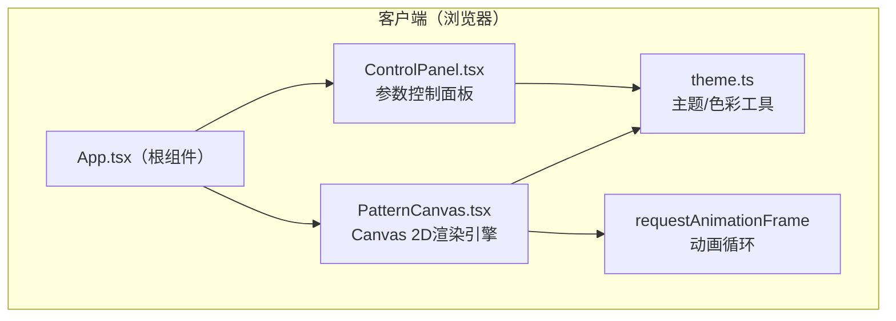

## 1. 架构设计



## 2. 技术选型

| 层级 | 技术栈 | 说明 |
|-----|-------|-----|
| 构建工具 | Vite 5.x | 快速开发构建，HMR热更新 |
| 前端框架 | React 18 + TypeScript | 严格类型检查，函数组件 + Hooks |
| UI渲染 | Canvas 2D API | 高性能碎片渲染，支持离屏导出 |
| 样式方案 | CSS Modules + 原生CSS | 自定义滑块样式，响应式布局 |
| 动画方案 | requestAnimationFrame + 自定义缓动 | 碎片飞散/收敛动画，60fps流畅度 |

## 3. 文件结构

```
auto39/
├── package.json
├── vite.config.js
├── tsconfig.json
├── index.html
└── src/
    ├── App.tsx              # 根组件：布局 + 状态管理
    ├── index.css            # 全局样式 + 变量
    ├── main.tsx             # React入口
    ├── components/
    │   ├── PatternCanvas.tsx  # Canvas核心：递归生成 + 动画引擎
    │   └── ControlPanel.tsx   # 控制面板：滑块 + 主题按钮 + 导出
    └── utils/
        └── theme.ts           # 主题定义 + 色彩计算函数
```

## 4. 核心数据结构

### 4.1 碎片（Fragment）
```typescript
interface Point { x: number; y: number; }

interface Fragment {
  id: number;
  // 四边形4个顶点
  vertices: [Point, Point, Point, Point];
  // 飞散动画目标位置
  scatterVertices: [Point, Point, Point, Point];
  // 最终收敛位置
  targetVertices: [Point, Point, Point, Point];
  // 颜色
  hue: number;
  saturation: number;
  lightness: number;
  // 递归层级
  depth: number;
  // 法线方向（用于飞散）
  normalAngle: number;
}
```

### 4.2 主题（Theme）
```typescript
interface Theme {
  id: string;
  name: string;
  baseHue: number;        // 基础色相
  hueRange: number;       // 色相变化范围
  gradientAngle: number;  // 渐变方向
  accentColors: number[]; // 辅助色色相数组
  saturation: [number, number]; // 饱和度范围
  lightness:  [number, number]; // 亮度范围
}
```

## 5. 关键算法

### 5.1 递归生成算法
- **初始层（depth=0）**：中心正N边形（12片花瓣四边形），沿圆周均匀分布
- **递归分裂**：每片四边形 → 沿径向分裂为3-4个更小四边形，顶点添加±5px随机噪声偏移
- **终止条件**：depth == maxDepth 或 总碎片数 ≥ 2000
- **数量控制**：每层碎片数 × (3~4)，深度6时约12×3.5^5≈1800片

### 5.2 飞散/收敛动画
- **飞散阶段（0-0.5s）**：
  - 飞行距离：50-150px随机
  - 方向：法线方向 ±45°随机
  - 插值：线性插值
- **收敛阶段（0.5s - totalDuration）**：
  - 缓动函数：`easeInOutCubic(t) = t<0.5 ? 4t³ : 1-(-2t+2)³/2`
  - 插值：从 scatterVertices → targetVertices

### 5.3 色彩计算
```typescript
function computeFragmentColor(
  theme: Theme,
  depth: number,
  maxDepth: number,
  angleOffset: number,
  colorShift: number
): { h: number; s: number; l: number }
```
- 基于角度偏移 + 递归深度映射到主题色相范围
- 叠加用户设置的colorShift（0-360°）
- 饱和度/亮度按深度渐变（外层更亮，内层更暗）

## 6. 性能优化策略

1. **对象池复用**：Fragment对象复用，避免频繁GC
2. **requestAnimationFrame循环**：单循环驱动所有碎片动画
3. **脏矩形渲染**：全屏重绘（图案较小，全屏清屏重绘性能可接受）
4. **阈值控制**：maxFragments = 2000，超过则停止递归
5. **离屏渲染导出**：创建临时Canvas（1920x1920），重绘所有碎片后导出
