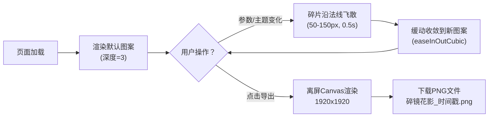

## 1. 产品概述

「碎镜花影」是一个基于Canvas 2D的动态递归图案生成器，用户通过调整参数实时观察由数百片四边形碎片构成的圆形万花筒图案的生成、飞散与收敛动画过程。

- **核心目的**：解决传统静态图案缺乏随机美感与交互反馈的问题，提供沉浸式的参数化艺术创作体验
- **目标用户**：艺术爱好者、设计师、教育者、对生成式艺术感兴趣的普通用户
- **产品价值**：通过实时交互的参数化动画，让用户直观感受递归分形美学，创造独一无二的对称花朵图案

## 2. 核心功能

### 2.1 功能模块
1. **主画布区域**：递归图案渲染、碎片飞散/收敛动画、实时参数响应
2. **控制面板**：参数滑块（递归深度、旋转角度、颜色偏移、动画速度）、主题切换按钮、导出图像按钮
3. **导出系统**：高分辨率PNG导出（1920x1920）

### 2.2 页面详情

| 页面名称 | 模块名称 | 功能描述 |
|---------|---------|---------|
| 主页面 | 图案画布 | Canvas 2D递归渲染中心圆形花朵图案，支持碎片飞散与收敛动画，最大2000碎片 |
| 主页面 | 参数滑块组 | 4个自定义样式滑块：递归深度(1-6)、旋转角度(0-360°)、颜色偏移(0-360°)、动画速度(0.5-3s)，实时显示当前值 |
| 主页面 | 主题切换 | 5套预设主题（极光幻彩、赛博霓虹、落日余晖、深海荧光、樱花细雨），圆形图标按钮，点击切换配色 |
| 主页面 | 导出按钮 | 一键导出当前图案为1920x1920 PNG格式，文件名含时间戳 |

## 3. 核心流程

用户打开页面 → 默认渲染递归深度3的图案 → 拖动滑块/点击主题按钮 → 触发碎片飞散动画（0.5s）→ 碎片按缓动函数收敛到新图案 → 点击导出按钮 → 下载PNG图片

## 4. 用户界面设计

### 4.1 设计风格
- **主色调**：深色背景 `#0A0A0F`，半透明毛玻璃面板
- **配色策略**：每套主题使用HSL色相环渐变，滑块描边从主题色渐变到补色
- **字体**：使用现代感无衬线字体，标题加粗
- **按钮风格**：主题按钮为圆形（直径44px），内部显示主题色环；导出按钮带发光效果
- **滑块样式**：渐变描边轨道，圆形发光拇指（16px，1px白色光晕）
- **视觉特效**：毛玻璃模糊（blur 12px）、按钮点击脉冲动画、颜色渐变过渡（0.8s）

### 4.2 页面布局

| 区域 | 模块 | UI元素 |
|-----|-----|-------|
| 左侧70% | 图案画布 | Canvas居中显示，背景深色，四周预留呼吸空间 |
| 右侧30%（桌面） | 控制面板 | 毛玻璃卡片（圆角16px），纵向排列：标题 → 4个滑块 → 主题按钮组 → 导出按钮 |
| 底部（<768px） | 控制面板 | 横向滚动布局，滑块改为紧凑排列 |

### 4.3 响应式设计
- **桌面端（≥1024px）**：左侧70%画布 + 右侧30%固定控制面板
- **平板端（768px-1023px）**：左侧60%画布 + 右侧40%控制面板
- **移动端（<768px）**：画布顶部占满，控制面板折叠到底部横向布局
- **触摸优化**：滑块触摸区域增大到48px，按钮最小点击区域44x44px

## 5. 性能指标
- 递归深度5（约1000-1500碎片）时动画帧率稳定 ≥55fps
- 参数调整后新动画起始延迟 ≤50ms
- 最大碎片数量限制：2000片
- 颜色切换过渡时间：0.8s
