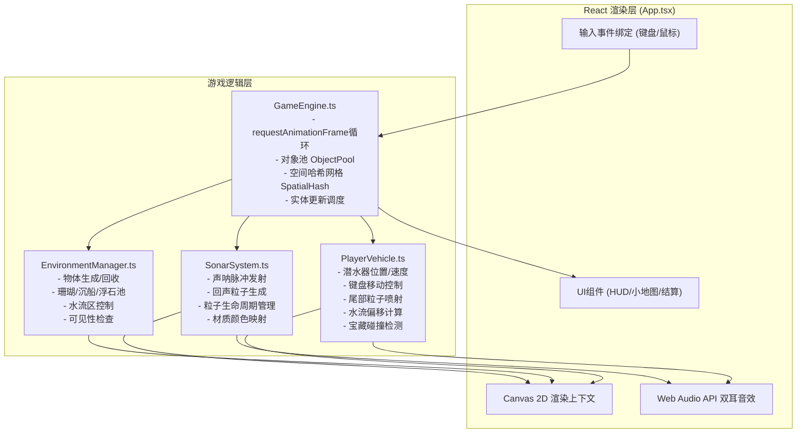

# 螺音灯塔·珊瑚回声 - 技术架构文档

## 1. 架构设计



---

## 2. 技术选型

- **前端框架**：React 18 + TypeScript 严格模式
- **构建工具**：Vite 5 + @vitejs/plugin-react
- **渲染**：HTML5 Canvas 2D API
- **音效**：Web Audio API（StereoPannerNode 实现双耳定位）
- **状态管理**：React useState/useRef（局部状态），引擎内部状态
- **无后端**：纯前端单机游戏，无服务器依赖

---

## 3. 模块接口定义

### 3.1 核心类型定义 (types.ts)

```typescript
// 二维向量
interface Vec2 { x: number; y: number; }

// 游戏物体类型
type ObjectType = 'coral' | 'metal' | 'rock' | 'treasure' | 'current';

// 物体材质映射
const MATERIAL_COLORS = {
  coral: '#FF6F61',
  metal: '#DFE6E9',
  rock: '#636E72',
} as const;

// 粒子基类
interface Particle {
  id: number;
  pos: Vec2;
  vel: Vec2;
  life: number;       // 当前生命
  maxLife: number;    // 最大生命
  radius: number;
  color: string;
  alpha: number;
  type: 'sonar' | 'echo' | 'thrust' | 'explosion';
}

// 场景物体
interface GameObject {
  id: number;
  type: ObjectType;
  pos: Vec2;
  width: number;
  height: number;
  rotation: number;
  shape: Vec2[];      // 多边形顶点（相对坐标）
  material?: keyof typeof MATERIAL_COLORS;
  treasureColor?: string;
  collected?: boolean;
  active: boolean;
}

// 水流区
interface WaterCurrent {
  id: number;
  pos: Vec2;
  radius: number;
  direction: number;  // 弧度
  strength: number;
}

// 声呐脉冲
interface SonarPulse {
  id: number;
  origin: Vec2;
  direction: number;
  spreadAngle: number;
  speed: number;
  distance: number;
  maxDistance: number;
  particles: Particle[];
  hitObjects: Set<number>;
}
```

### 3.2 GameEngine 接口

```typescript
class GameEngine {
  constructor(canvas: HTMLCanvasElement, callbacks: EngineCallbacks);
  start(): void;
  stop(): void;
  update(delta: number): void;
  render(ctx: CanvasRenderingContext2D): void;
  
  // 输入接口
  onKeyDown(key: string): void;
  onKeyUp(key: string): void;
  onMouseDown(pos: Vec2): void;
  onMouseMove(pos: Vec2): void;
  onMouseUp(pos: Vec2): void;
  
  // 对象池
  getObjectPool<T>(type: string): ObjectPool<T>;
  
  // 空间哈希
  spatialHash: SpatialHashGrid;
}
```

### 3.3 SonarSystem 接口

```typescript
class SonarSystem {
  emitPulse(origin: Vec2, direction: number, power: number): void;
  update(delta: number, objects: GameObject[]): EchoEvent[];
  render(ctx: CanvasRenderingContext2D): void;
  getParticles(): Particle[];
}
```

### 3.4 EnvironmentManager 接口

```typescript
class EnvironmentManager {
  update(playerPos: Vec2, viewport: Rect): void;
  getObjects(): GameObject[];
  getCurrents(): WaterCurrent[];
  render(ctx: CanvasRenderingContext2D): void;
}
```

### 3.5 PlayerVehicle 接口

```typescript
class PlayerVehicle {
  pos: Vec2;
  velocity: Vec2;
  sonarPower: number;   // 100% ~ 200%
  viewRadius: number;   // 120 ~ 250
  treasuresCollected: number;
  
  update(delta: number, keys: Set<string>, currents: WaterCurrent[]): TreasureEvent[];
  render(ctx: CanvasRenderingContext2D): void;
  getBounds(): Rect;
}
```

---

## 4. 性能优化策略

| 优化项 | 实现方案 |
|--------|---------|
| 粒子对象池 | 预分配800个Particle实例，循环复用，避免GC |
| 物体对象池 | 预分配30个GameObject实例，动态激活/停用 |
| 空间哈希网格 | 80x80px单元，碰撞检测时仅查询相邻9格 |
| 离屏渲染 | 小地图使用离屏Canvas缓存，探索过的区域预渲染 |
| 节流渲染 | 非关键UI使用CSS transition，避免每帧重绘DOM |
| 状态脏标记 | 仅当位置/状态改变时更新小地图 |

---

## 5. 文件结构

```
auto4/
├── package.json
├── vite.config.js
├── tsconfig.json
├── index.html
└── src/
    ├── main.tsx              # React入口
    ├── App.tsx               # 主组件：Canvas+UI+事件绑定
    ├── GameEngine.ts         # 核心引擎：循环/对象池/空间哈希
    ├── SonarSystem.ts        # 声呐系统：脉冲/回声/粒子
    ├── EnvironmentManager.ts # 环境管理：物体/水流
    ├── PlayerVehicle.ts      # 潜水器：移动/碰撞/收集
    ├── audio/
    │   └── AudioManager.ts   # Web Audio音效管理
    ├── utils/
    │   ├── ObjectPool.ts     # 通用对象池
    │   ├── SpatialHash.ts    # 空间哈希网格
    │   ├── Noise.ts          # 噪点函数(沉船纹理)
    │   └── Math.ts           # 数学工具(向量/插值)
    └── types/
        └── index.ts          # 全局类型定义
```
