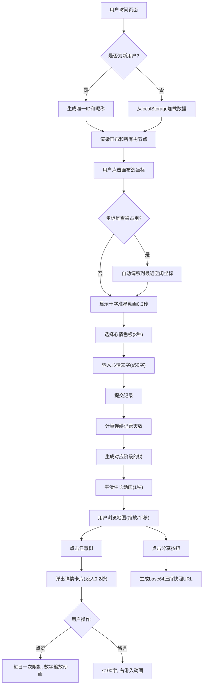

## 1. 产品概述
心情地图是一款基于2D网格画布的情感记录与分享Web应用，用户通过在星空地图上种植抽象小树来记录每日心情，所有用户的树在同一张共享画布上呈现，形成富有视觉沉浸感的情感社区。

- 核心问题：传统日记或情绪记录工具缺乏空间维度和视觉沉浸感
- 目标用户：需要情感表达、喜欢视觉化记录、乐于社交分享的年轻用户群体
- 产品价值：将抽象情绪转化为可视、可交互的生长树木，通过空间化表达增强情感记录的仪式感和连接感

## 2. 核心功能

### 2.1 用户角色
| 角色 | 注册方式 | 核心权限 |
|------|----------|----------|
| 普通用户 | 首次访问自动生成唯一用户ID（localStorage存储） | 记录心情、种植树木、浏览地图、点赞留言、分享快照 |

### 2.2 功能模块
1. **地图画布模块**：800x600固定画布、坐标映射、十字准星动画、缩放平移交互
2. **心情记录模块**：8种心情色板选择、50字短文输入、连续天数计算、树形态阶段生成
3. **树渲染模块**：嫩芽/小树/大树/开花四阶段、粒子系统、平滑过渡动画
4. **社交互动模块**：树详情卡片、每日一次点赞、100字留言、实时计数动画
5. **分享快照模块**：本地持久化、base64压缩URL、只读快照模式、实时地图切换

### 2.3 页面详情
| 页面名称 | 模块名称 | 功能描述 |
|-----------|-------------|---------------------|
| 主页面 | 星空地图画布 | 渐变星空背景、所有树节点渲染、滚轮缩放(0.5x-3x)、鼠标拖拽平移 |
| 主页面 | 心情色板面板 | 右上角毛玻璃8色板、点击放大反馈、心情选择状态 |
| 主页面 | 记录输入区 | 心情文字输入(≤50字)、提交种按钮、字数计数器 |
| 主页面 | 树详情卡片 | 从树冠弹出、昵称/心情色/文字/点赞数显示、淡入动画 |
| 主页面 | 留言列表 | 按时间倒序、右滑入动画、100字输入框 |
| 主页面 | 分享按钮 | 生成快照URL、复制到剪贴板提示 |
| 快照页面 | 只读画布 | 静态树渲染、缩放查看、顶部"回到实时地图"按钮 |

## 3. 核心流程

用户首次访问时，系统自动在localStorage中生成唯一用户ID和昵称。用户在画布上点击选择位置（十字准星动画），系统检查坐标占用情况，若冲突则自动偏移到最近空闲位置。接着用户从8种心情色板中选择心情颜色，输入最多50字短文，点击提交后根据连续记录天数生成对应阶段的树（嫩芽/小树/大树/开花），树生成时有1秒平滑生长动画。用户可在地图上缩放平移浏览，点击任意树弹出详情卡片进行点赞或留言。点击分享按钮生成包含地图快照的URL，他人打开链接可查看只读静态快照。

## 4. 用户界面设计

### 4.1 设计风格
- **主色调**：深色模式 #1A1A2E，星空渐变背景（上#16213E → 下#0F3460）
- **心情色板**：快乐#FFD700、平静#4FC3F7、忧伤#9575CD、愤怒#EF5350、惊喜#FF7043、满足#81C784、焦虑#FFB74D、孤独#90A4AE
- **交互元素**：毛玻璃效果（backdrop-filter: blur(8px)）、圆角12px、半透明背景
- **动画**：所有过渡使用平滑ease曲线，微交互有放大/回弹/滑入效果
- **排版**：标题使用优雅的衬线字体，正文使用现代无衬线字体

### 4.2 页面设计概述
| 页面名称 | 模块名称 | UI元素 |
|-----------|-------------|-------------|
| 主页面 | 星空画布 | 渐变纹理+星点粒子、居中800x600区域、树节点渲染、十字准星动画 |
| 主页面 | 心情色板 | 右上角毛玻璃容器、8个圆形色块、悬停放大、选中边框高亮 |
| 主页面 | 输入区域 | 画布底部浮动面板、文字输入框(带字数统计)、提交按钮(渐变高亮) |
| 主页面 | 详情卡片 | 树冠底部弹出、白色毛玻璃背景、头像+昵称+心情色条+文字、点赞按钮 |
| 主页面 | 分享按钮 | 画布顶部右上角、图标按钮、点击复制提示 |
| 快照页面 | 只读画布 | 相同星空背景、静态树渲染、左上角浮动"回到实时地图"按钮 |

### 4.3 响应式
- Desktop-first设计，断点750px
- ≥750px：画布800x600居中，色板右上，输入区底部浮动
- <750px：画布全屏铺满视口，色板固定底部60px高度横向滚动，输入区改为底部滑出面板

### 4.4 视觉氛围
- 背景随机分布微小星点，带有呼吸般的透明度变化
- 种树时周围产生涟漪扩散效果
- 粒子光环旋转流畅，开花粒子发射方向随机但自然
- 卡片弹出时伴随轻微阴影加深，增强层次感
