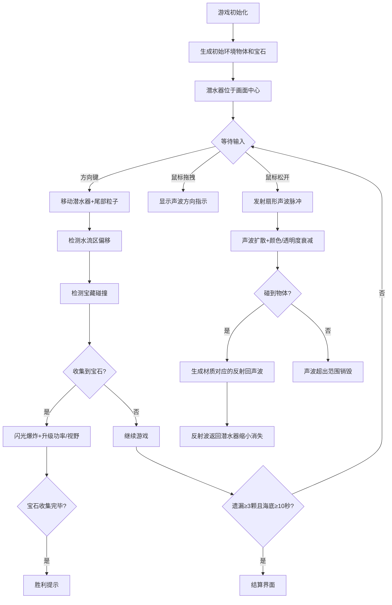

# 螺音灯塔·珊瑚回声 - 产品需求文档

## 1. 产品概述

「螺音灯塔·珊瑚回声」是一款基于浏览器的2D Canvas深海探索游戏，玩家操控由发光生物质构成的微型潜水器，通过声呐回声定位技术在随机生成的深海峡谷中探索，收集发光宝藏以提升能力。

- 核心目的：解决传统水下游戏缺乏沉浸式声景反馈和动态环境交互的问题，提供独特的回声定位探索体验
- 目标用户：休闲游戏爱好者、音效与视觉艺术爱好者

---

## 2. 核心功能

### 2.1 功能模块

1. **主游戏场景**：声呐脉冲发射、物体回声反射、粒子特效渲染、深海渐变背景
2. **潜水器控制系统**：键盘方向键移动、尾部粒子喷射、水流区域扰动、宝藏碰撞收集
3. **环境生成系统**：随机珊瑚/沉船/浮石生成、动态物体池管理、水流区方向箭头
4. **进度与UI系统**：声呐功率条、宝石计数、小地图探索度、游戏结算界面
5. **音效系统**：Web Audio API双耳音效、声呐发射/回声差异化音频

### 2.2 页面详情

| 页面名称 | 模块名称 | 功能描述 |
|---------|---------|---------|
| 主游戏页 | 声呐发射模块 | 鼠标拖拽设定方向、松开发射扇形声波脉冲、碰撞检测与回声生成 |
| 主游戏页 | 环境渲染模块 | 珊瑚多边形绘制、沉船噪点纹理、浮石不规则形状、水流半透明箭头 |
| 主游戏页 | 潜水器模块 | 发光生物质外观、尾部绿蓝粒子、方向键控制3px/帧移动、水流偏移 |
| 主游戏页 | 宝藏系统 | 6枚发光宝石、光晕脉冲、收集闪光爆炸、声呐功率+10%、视野+15px |
| 主游戏页 | HUD界面 | 声呐功率百分比、宝石计数0/6、小地图200x200px、磨砂玻璃风格 |
| 结算页 | 游戏结束模块 | 探索度百分比、宝石收集率、遗漏3颗+海底10秒触发、重新开始按钮 |

---

## 3. 核心流程

### 3.1 主游戏流程

---

## 4. 用户界面设计

### 4.1 设计风格

- **主色调**：深海渐变背景 #001133 → #000000（从上到下模拟深度光照递减）
- **强调色**：
  - 声呐脉冲：#00BFFF（青蓝）衰减至 #00008B（深蓝）
  - 珊瑚回声：#FF6F61（暖橙）
  - 金属回声：#DFE6E9（银白）
  - 岩石回声：#636E72（灰暗）
  - 宝石：#FFD700 / #FF69B4 / #00FF7F（金/粉/绿）
  - UI文字：#B0D4F1（淡蓝）
  - 分数发光：#FFD700 金色 text-shadow 0 0 10px rgba(255,215,0,0.6)
- **UI组件风格**：磨砂玻璃质感（背景 rgba(255,255,255,0.08)、边框 1px rgba(255,255,255,0.15)、圆角 8px）
- **过渡动画**：0.3s ease-in-out 平滑过渡
- **字体**：现代无衬线字体，分数字体带发光效果

### 4.2 页面设计概览

| 页面名称 | 模块名称 | UI元素 |
|---------|---------|--------|
| 主游戏页 | 顶部HUD | 左：声呐功率条磨砂框 + 百分比数字；中：宝石计数 0/6（金色发光）；右：小地图200x200px半透明 |
| 主游戏页 | 底部控制提示 | 方向键移动指示 + 声呐按钮可视化，间距12-16px响应式调整 |
| 主游戏页 | Canvas主体 | 居中潜水器、周围随机物体、声呐粒子流、宝石光晕、水流箭头 |
| 结算页 | 弹窗 | 磨砂玻璃大弹窗居中，显示探索度%、宝石收集率、重新开始按钮 |

### 4.3 响应式设计

- 桌面优先设计，1080p下Canvas占满视口
- UI间距随窗口缩放：间距范围12px ~ 16px
- 小地图固定200x200px，透明度0.5
- 结算弹窗响应式：宽度60%，最小400px

---

## 5. 性能要求

- 目标帧率：60 FPS（requestAnimationFrame驱动）
- 粒子数量上限：同时不超过800个（对象池管理）
- 场景物体总数上限：30个（动态生成/回收）
- 碰撞检测优化：空间哈希网格（80x80px单元）
- 每帧预算：至少保留15ms空闲处理输入和UI更新
