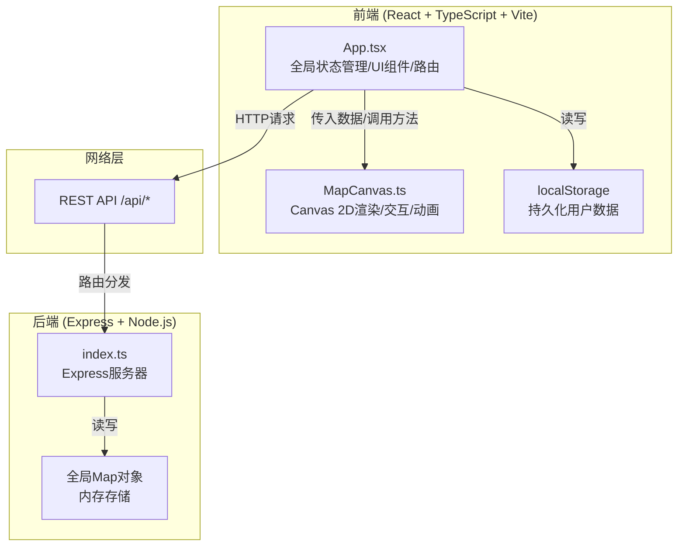
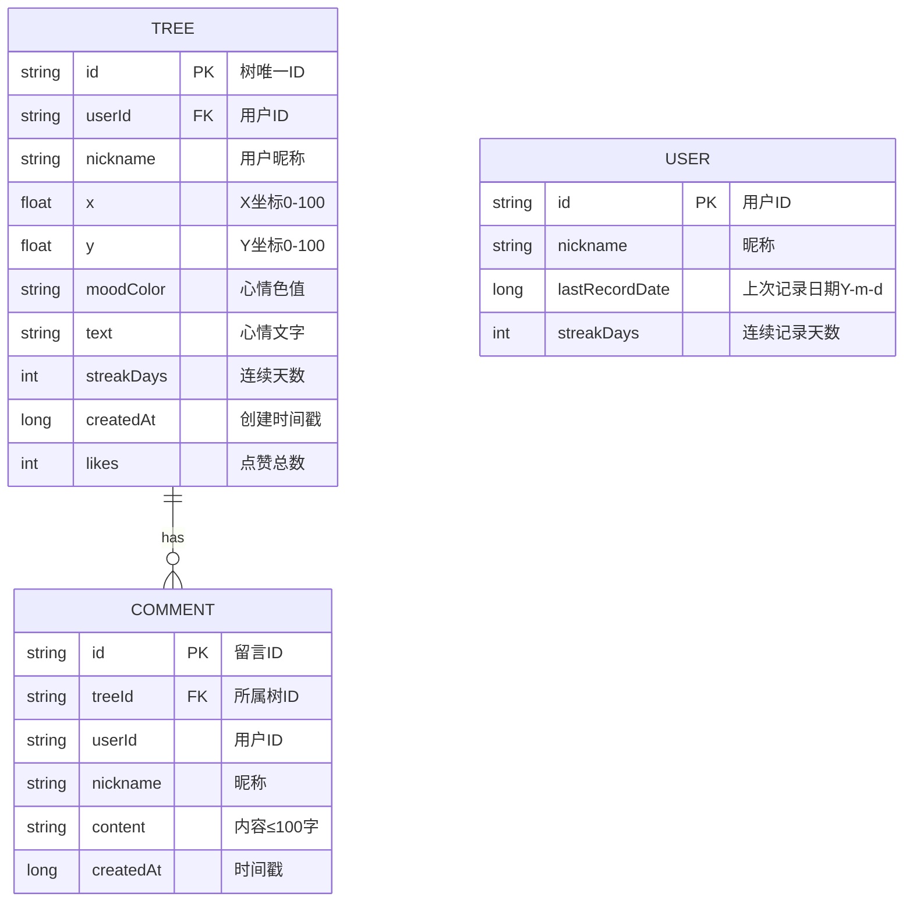

## 1. 架构设计


## 2. 技术描述
- **前端框架**：React 18 + TypeScript（严格模式，target: ES2020）
- **构建工具**：Vite 5 + @vitejs/plugin-react
- **前端核心**：Canvas 2D API（地图/树/粒子渲染）、requestAnimationFrame（动画驱动）
- **样式方案**：内联CSS + CSS变量（深色主题）、响应式媒体查询
- **状态管理**：React useState/useEffect + useRef（不引入额外库，保持轻量）
- **后端框架**：Express 4 + Node.js + ts-node
- **数据存储**：全局Map对象（内存存储，重启丢失）
- **依赖库**：uuid（唯一ID生成）、@types/express（类型定义）
- **编码压缩**：pako/zlib（快照压缩，可选使用Base64 + 轻量压缩）

## 3. 路由定义
| Route | Purpose |
|-------|---------|
| / | 主页面 - 实时心情地图，可交互种树/浏览/点赞/留言 |
| /?snapshot=xxx | 快照模式 - 只读静态地图查看，包含"回到实时地图"按钮 |

## 4. API 定义

### 4.1 TypeScript 类型定义
```typescript
// 共享类型 (前后端通用)
interface TreeData {
  id: string;
  userId: string;
  nickname: string;
  x: number;              // 浮点坐标 0-100
  y: number;              // 浮点坐标 0-100
  moodColor: string;      // 心情色值 #RRGGBB
  text: string;           // 心情文字 (≤50字)
  streakDays: number;     // 连续记录天数
  createdAt: number;      // 时间戳 ms
  likes: number;          // 点赞数
  likedUsers: string[];   // 已点赞用户ID列表 (防重复)
  comments: CommentData[]; // 留言列表
}

interface CommentData {
  id: string;
  userId: string;
  nickname: string;
  content: string;        // ≤100字
  createdAt: number;
}

// 请求/响应结构
type SaveTreeRequest = Omit<TreeData, 'id' | 'createdAt' | 'likes' | 'likedUsers' | 'comments'>;
type SaveTreeResponse = { success: boolean; tree: TreeData; occupied: boolean; newX?: number; newY?: number };
type GetTreesResponse = { trees: TreeData[] };
type LikeRequest = { treeId: string; userId: string };
type LikeResponse = { success: boolean; likes: number; alreadyLiked: boolean };
type CommentRequest = { treeId: string; userId: string; nickname: string; content: string };
type CommentResponse = { success: boolean; comment: CommentData };
```

### 4.2 接口详情

#### `POST /api/tree`
保存用户心情记录，创建新树节点
- **请求体**：`SaveTreeRequest`
- **响应**：`SaveTreeResponse`
  - 若坐标已被占用：`occupied: true`，返回最近空闲坐标 `newX/newY`，不创建树
  - 若坐标空闲：`occupied: false`，创建并返回完整 `TreeData`

#### `GET /api/trees`
获取所有树节点数据（最多1000条，按创建时间倒序）
- **响应**：`GetTreesResponse`

#### `POST /api/like`
对指定树点赞，限制每用户每天一次
- **请求体**：`LikeRequest`
- **响应**：`LikeResponse`
  - `alreadyLiked: true` 表示今日已赞过，不重复累加

#### `POST /api/comment`
对指定树添加留言
- **请求体**：`CommentRequest`
- **响应**：`CommentResponse`

## 5. 服务器架构图
```mermaid
graph LR
    A["客户端请求"] --> B["Express Router"]
    B --> C{路由分发}
    C -->|"POST /api/tree"| D["saveTree 控制器"]
    C -->|"GET /api/trees"| E["getTrees 控制器"]
    C -->|"POST /api/like"| F["likeTree 控制器"]
    C -->|"POST /api/comment"| G["addComment 控制器"]
    D --> H["Trees Map (内存)"]
    E --> H
    F --> H
    G --> H
    H --> I["树结构索引 Map<br/>key: treeId, value: TreeData"]
    H --> J["坐标占用集 Set<br/>\"x,y\" 字符串去重"]
```

## 6. 数据模型

### 6.1 数据模型定义


### 6.2 内存数据结构
```typescript
// 全局内存存储 (Express 进程内)
const trees = new Map<string, TreeData>();       // treeId → TreeData
const coordinateIndex = new Set<string>();       // "x.toFixed(2),y.toFixed(2)" 占用索引

// localStorage 结构 (浏览器端)
interface LocalUserState {
  userId: string;
  nickname: string;
  streakDays: number;
  lastRecordDate: string;  // YYYY-MM-DD
  myTreeIds: string[];     // 当前用户种过的树ID
}
```
