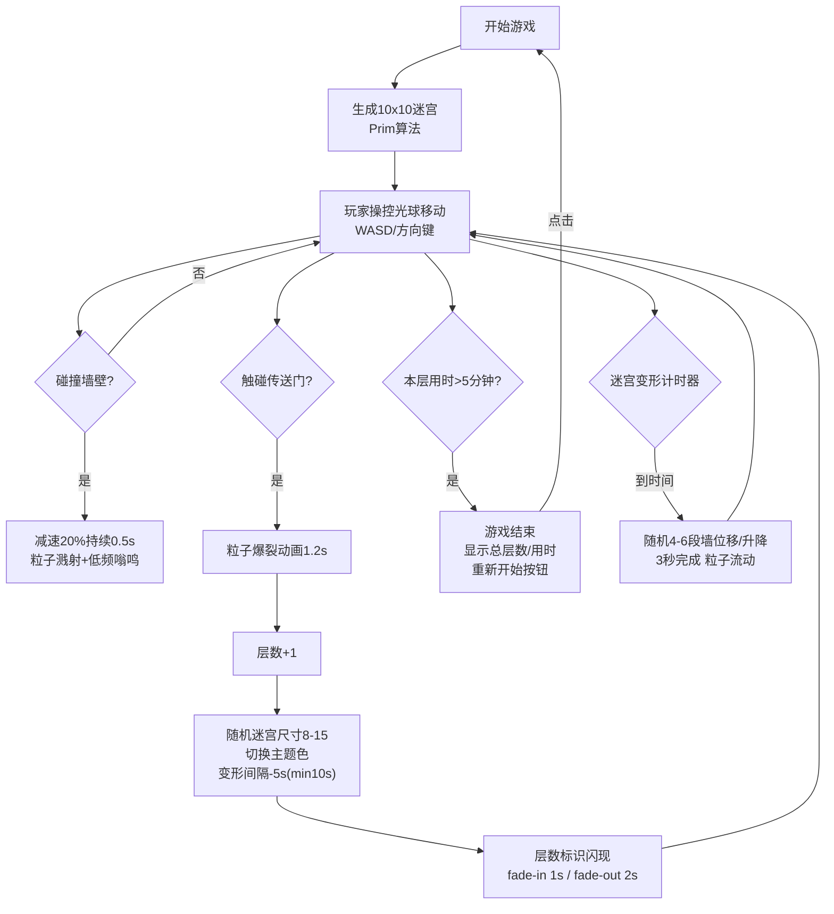

## 1. 产品概述
「幻境迷踪」是一款在浏览器中运行的2D迷宫探险游戏，玩家操控发光光球在由粒子墙构成的动态迷宫中寻找传送门。游戏解决传统迷宫游戏缺乏变化和沉浸感的问题，通过周期性的墙体变形、指引宝石和层次递进机制，为玩家带来持续的挑战与探索乐趣。
- 核心玩法：操控光球穿越动态变化的粒子迷宫，寻找传送门通往下一层
- 目标用户：喜欢解谜、探险类休闲游戏的玩家
- 产品价值：提供视觉震撼、玩法多变的沉浸式迷宫探险体验

## 2. 核心功能

### 2.1 用户角色
无需注册，直接进入游戏即可游玩。

### 2.2 功能模块
1. **主游戏画面**：Canvas 2D渲染的迷宫、玩家、传送门、指引宝石
2. **迷宫系统**：Prim算法生成迷宫、墙体粒子系统、周期性动态变形
3. **玩家系统**：WASD/方向键控制、碰撞检测、拖尾特效、弹性动画
4. **指引系统**：指引宝石闪烁频率与距离挂钩、颜色渐变
5. **层次系统**：层数递增、迷宫尺寸随机变化、主题色系切换、变形间隔缩短
6. **音频系统**：Web Audio API生成碰撞嗡鸣声
7. **游戏状态**：层数标识闪现、传送门粒子爆裂、死亡/游戏结束界面
8. **UI界面**：层数与计时显示、颜色主题条展示

### 2.3 页面详情
| 页面名称 | 模块名称 | 功能描述 |
|-----------|-------------|---------------------|
| 游戏主界面 | 迷宫渲染区 | 中央80%区域显示Canvas迷宫，粒子墙体动态变化 |
| 游戏主界面 | 玩家光球 | 白色发光球体，带拖尾残影，碰撞时减速+红光闪烁 |
| 游戏主界面 | 指引宝石 | 悬浮于玩家头顶，距离越近闪烁越快、颜色越偏金 |
| 游戏主界面 | 传送门 | 旋涡状彩色旋转粒子，触碰触发爆裂动画进入下层 |
| 游戏主界面 | 层数计时 | 左下角monospace字体显示当前层数和已用时间 |
| 游戏主界面 | 主题色条 | 右上角渐变条展示当前迷宫色系 |
| 过渡界面 | 层数标识 | 进入新层时中央大字fade-in/fade-out |
| 结束界面 | 游戏结束 | 超过5分钟未通关时显示总层数和用时，重新开始按钮 |

## 3. 核心流程
玩家打开游戏后自动生成10x10迷宫，操控光球移动寻找传送门。在移动过程中，迷宫墙体每30秒发生位移/升降变化，指引宝石持续提供方向反馈。触碰传送门后进入下一层，迷宫尺寸、主题色、变形间隔均发生变化。若某层超过5分钟未找到传送门，游戏结束并显示成绩。

## 4. 用户界面设计

### 4.1 设计风格
- **主色调**：深灰背景 `#1a1a2e`，半透明网格地板
- **主题色系预设**：
  - 暖橙-冷蓝渐变
  - 紫红-青绿渐变
  - 金黄-靛紫渐变
- **玩家光球**：亮白色 `#ffffff`，径向渐变光晕透明度0.3
- **墙体粒子**：直径3-5px，主题色渐变，透明度0.6
- **按钮风格**：圆角柔边，柔和科技感
- **字体**：monospace用于数字显示
- **布局**：游戏区中央80%，UI元素分布四角
- **整体风格**：柔和科技感，所有元素采用圆形/柔角，避免尖锐边缘

### 4.2 页面设计概述
| 页面名称 | 模块名称 | UI元素 |
|-----------|-------------|-------------|
| 游戏主界面 | 迷宫区域 | Canvas全屏渲染，中央区域，粒子墙体+网格地板 |
| 游戏主界面 | 玩家光球 | 圆形，白色，径向光晕，拖尾5帧透明度递减 |
| 游戏主界面 | 指引宝石 | 玩家头顶10px，圆形8px，蓝→金渐变，闪烁频率线性变化 |
| 游戏主界面 | 传送门 | 半径30px，彩色粒子旋涡，每帧旋转2° |
| 游戏主界面 | 状态显示 | 左下：monospace 14px白色，层数/时间 右上：垂直渐变条主题色展示 |
| 过渡界面 | 层数标识 | 屏幕中央大字，fade-in 1s后fade-out 2s |
| 结束界面 | 结算面板 | 半透明背景，居中显示成绩，圆角按钮 |

### 4.3 响应式
- **桌面优先**，适配移动设备
- Canvas宽度：窗口宽度的90%，最小360px，最大1920px
- Canvas高度：按16:9比例自适应计算
- 触摸设备支持虚拟方向键（可选扩展）

### 4.4 动画与特效
- **迷宫变形**：粒子线性插值流动，每帧移动1-2px，持续3秒
- **光球移动**：拖尾残影（前5帧轨迹，透明度逐帧降50%）
- **按键反馈**：光球微微压扁再弹出（0.1秒弹性动画）
- **碰撞反馈**：光球闪烁红光0.2秒，粒子溅射
- **传送门爆裂**：1.2秒彩色粒子扩散半径100px
- **层数标识**：fade-in 1s → fade-out 2s
- **帧率目标**：稳定60FPS，波动不超过5FPS
- **粒子总数**：≤3000（墙体约2500，特效500）
