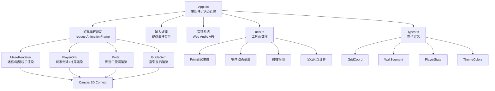

## 1. 架构设计



## 2. 技术描述
- **前端框架**：React@18 + TypeScript
- **构建工具**：Vite（含HMR热更新）
- **渲染引擎**：Canvas 2D API（所有游戏元素手绘）
- **音频系统**：Web Audio API（原生Oscillator生成音效）
- **状态管理**：React useState/useRef（游戏循环高频状态用useRef）
- **无需后端**：纯前端游戏，所有逻辑在客户端执行
- **初始化命令**：`npm init vite-init@latest -y . -- --template react-ts --force`

## 3. 文件结构

| 文件路径 | 作用描述 |
|----------|---------|
| `package.json` | 项目依赖与脚本（react、react-dom、typescript、vite、@vitejs/plugin-react） |
| `vite.config.js` | Vite构建配置，启用React插件与HMR |
| `tsconfig.json` | TypeScript严格模式配置，target ES2020 |
| `index.html` | 入口HTML，设置viewport meta |
| `src/types.ts` | 所有数据类型定义（坐标、墙体、玩家、主题等） |
| `src/utils.ts` | 迷宫生成Prim算法、墙体变形、碰撞检测、闪烁计算等工具函数 |
| `src/components.tsx` | 渲染组件集合：MazeRenderer、PlayerOrb、Portal、GuideGem |
| `src/App.tsx` | 主组件：游戏状态管理、requestAnimationFrame循环、键盘输入、音频 |
| `src/main.tsx` | React入口挂载 |
| `src/index.css` | 全局样式（背景、字体、Canvas容器） |

## 4. 核心类型定义

```typescript
// 迷宫格子坐标
interface GridCoord {
  x: number;
  y: number;
}

// 墙壁段（由多个粒子组成）
interface WallSegment {
  id: string;
  cells: GridCoord[];
  orientation: 'horizontal' | 'vertical';
  // 动态变形偏移
  offsetX: number;
  offsetY: number;
  // 变形动画状态
  morphTarget?: {
    targetOffsetX: number;
    targetOffsetY: number;
    startTime: number;
    duration: number;
  };
  particles: WallParticle[];
}

// 墙体粒子
interface WallParticle {
  baseX: number;  // 基础格子坐标内偏移
  baseY: number;
  size: number;   // 3-5px
  colorT: number; // 0-1 用于主题色渐变插值
  flowOffsetX: number;  // 变形时流动偏移
  flowOffsetY: number;
}

// 玩家状态
interface PlayerState {
  gridX: number;      // 格子坐标（浮点，用于平滑移动）
  gridY: number;
  pixelX: number;     // 像素坐标（计算后）
  pixelY: number;
  trail: { x: number; y: number; alpha: number }[];  // 拖尾
  speedMultiplier: number;  // 碰撞减速
  slowUntil: number;        // 减速结束时间戳
  hitFlashUntil: number;    // 红光闪烁结束时间戳
  squashTime: number;       // 弹性压扁时间戳
  squashDir: 'x' | 'y' | null;
}

// 传送门状态
interface PortalState {
  gridX: number;
  gridY: number;
  rotation: number;
  active: boolean;
}

// 指引宝石
interface GuideGemState {
  flickerFreq: number;  // 每秒闪烁次数
  colorT: number;       // 0=蓝 1=金
  lastFlicker: number;
  visible: boolean;
}

// 主题色系
interface ThemeColors {
  name: string;
  color1: [number, number, number];  // 深色端 RGB
  color2: [number, number, number];  // 浅色端 RGB
}

// 迷宫数据
interface MazeData {
  size: number;
  walls: WallSegment[];
  passages: Set<string>;  // "x,y" 可通行格子
  playerStart: GridCoord;
  portalPos: GridCoord;
}

// 游戏阶段
type GamePhase = 'playing' | 'bursting' | 'level_intro' | 'game_over';

// 特效粒子（爆裂、溅射等）
interface EffectParticle {
  x: number;
  y: number;
  vx: number;
  vy: number;
  life: number;
  maxLife: number;
  size: number;
  color: [number, number, number];
}
```

## 5. 核心算法说明

### 5.1 Prim迷宫生成
- 初始化：N×N网格，所有格子设为墙
- 随机选起点加入"已访问"集合
- 循环：从已访问集合的边界墙中随机选墙
- 若墙两侧格子一个已访问一个未访问：打通该墙，将新格子加入已访问
- 重复直至所有格子被访问

### 5.2 墙体变形逻辑
- 每变形间隔（30s起）：随机选4-6段WallSegment
- 每段墙随机选择：水平位移/垂直升降
- 位移范围0-50px，持续3秒（180帧）
- 每帧用线性插值计算当前offset：`current = start + (target-start) * t`
- 粒子沿位移方向产生流动偏移（正弦波延迟）

### 5.3 碰撞检测
- 玩家光球半径 = cellSize * 0.35
- 预测下一帧位置 → 检测该像素点是否落在任一墙体cell内
- 若碰撞：分别检查X/Y方向单独移动，允许沿墙滑动
- 碰撞命中时：speedMultiplier设为0.2，持续0.5秒

### 5.4 宝石闪烁计算
- 曼哈顿距离 `d = |px - tx| + |py - ty|`
- 归一化距离 `t = clamp((15 - d) / 14, 0, 1)` （d=15格→0, d=1格→1）
- 闪烁频率 = `1 + t * 4` （1次/秒 → 5次/秒）
- 颜色插值：蓝(60,120,255) → 金(255,200,50)

## 6. 性能优化策略
- **粒子池化**：墙体粒子预生成，变形时复用不重建
- **批量渲染**：同类粒子一次性beginPath/arc/fill，减少状态切换
- **离屏计算**：迷宫格子→像素坐标每帧批量计算一次缓存
- **requestAnimationFrame**：使用deltaTime保证动画速度与帧率无关
- **状态分离**：useRef存高频变化状态，useState存低频UI状态，避免重渲染
