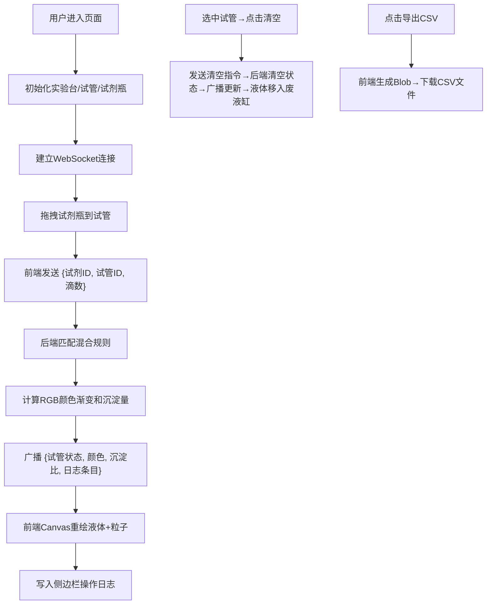

## 1. 产品概述

「化学幻境·试剂工坊」是一款面向化学教学的交互式Web实验模拟平台，教师可在线演示溶剂混合反应，学生通过拖拽试管、滴加试剂观察实时颜色渐变和沉淀反应。

- 核心目标：将真实实验室体验数字化，降低实验成本与安全风险，提升化学教学的互动性与趣味性
- 目标用户：中小学及大学化学教师、学生、在线教育平台

## 2. 核心特性

### 2.1 功能模块

1. **实验台主界面**：木质纹理实验台Canvas、5支试管架、4个试剂瓶（酸A/碱B/盐C/指示剂D）
2. **试剂滴加混合**：拖拽试剂瓶到试管上方滴入（每次5ml），WebSocket实时同步，后端按规则计算混合颜色（0.5s过渡）
3. **沉淀粒子模拟**：Canvas布朗运动粒子（10-30个，半径3-6px），盐C+酸A生成白色硫酸钡沉淀，缓慢沉降堆积
4. **试管操控系统**：选中试管→清空到废液缸（累积颜色），废液缸显示累计混合效果
5. **实验日志与导出**：侧边栏实时记录操作序列（试剂名+滴数+时间戳），一键导出CSV

### 2.2 页面详情

| 页面名称 | 模块名称 | 功能描述 |
|---------|---------|---------|
| 实验台主页 | 顶部标题栏 | 项目名称「化学幻境·试剂工坊」+ 深紫渐变标题栏 |
| 实验台主页 | 实验台Canvas | 木质纹理背景（渐变条纹，间距15px，透明度0.2） |
| 实验台主页 | 试剂瓶区域 | 4个半透明玻璃质感试剂瓶，显示标签和颜色 |
| 实验台主页 | 试管架区域 | 5支试管整齐排列，Canvas绘制液体和沉淀 |
| 实验台主页 | 废液缸 | 接收清空液体，累积混合颜色显示 |
| 实验台主页 | 侧边栏日志 | 实时操作日志列表 + CSV导出按钮 + 清空按钮 |
| 实验台主页 | 性能监控 | FPS指示器，低于50fps自动降级粒子数量并提示 |

## 3. 核心流程

## 4. 用户界面设计

### 4.1 设计风格
- **主色调**：#E8F5E9浅绿背景，#4A148C深紫标题栏，#1B5E20深绿边框
- **实验台**：Canvas绘制浅棕色木纹渐变条纹，间距15px，透明度0.2
- **玻璃质感**：试管/试剂瓶边框2px实色#B0BEC5，高光斜角渐变
- **液体效果**：径向渐变，中心→边缘透明度0.9→0.7
- **按钮交互**：悬停升高4px + 柔和阴影（偏移2px，透明度0.2），点击缩小至0.95倍
- **动画**：试管切换/液体颜色CSS transition 0.5s；沉淀粒子requestAnimationFrame 60fps
- **字体**：标题使用思源宋体，正文使用思源黑体，建立学术实验室氛围

### 4.2 页面设计概览

| 页面名称 | 模块名称 | UI元素 |
|---------|---------|--------|
| 实验台主页 | 标题栏 | 深紫渐变背景，白色标题文字，左侧图标，右侧性能FPS指示器 |
| 实验台主页 | 试剂瓶区 | 4瓶水平排列，每瓶：玻璃瓶身+液体颜色+标签文字+可拖拽手柄，滴管拖尾粒子5-8个彩色2px小圆点，0.3s生命周期 |
| 实验台主页 | 试管架区 | 木质试管架背景，5支试管垂直排列，选中状态发光边框，液体渐变+底部沉淀粒子 |
| 实验台主页 | 废液缸 | 位于右下角，大号烧杯形状，累积液体颜色，刻度标记 |
| 实验台主页 | 侧边栏 | 白色卡片，深绿标题「实验日志」，列表条目带时间戳，底部两个操作按钮（清空试管/导出CSV） |

### 4.3 响应式设计
- **桌面端（≥1024px）**：固定布局，左侧日志侧栏300px + 右侧实验台主区域
- **平板端（768-1023px）**：试管架自动折行，2行×3列排列
- **手机端（<768px）**：上下堆叠，顶部日志→中部试剂瓶→底部试管架，全宽适配

### 4.4 性能约束
- WebSocket消息延迟 ≤ 100ms
- 后端颜色重算 ≤ 10ms
- Canvas帧率稳定60fps，<50fps自动降至20粒子并Toast提示
