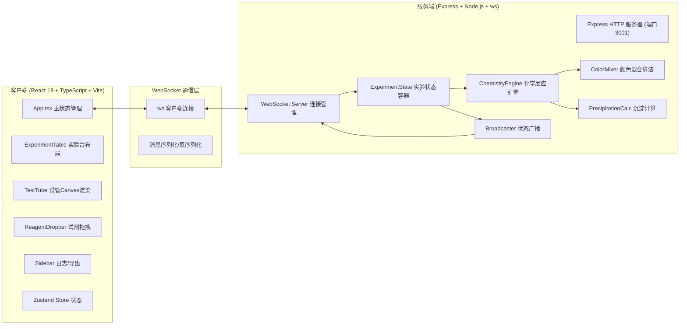
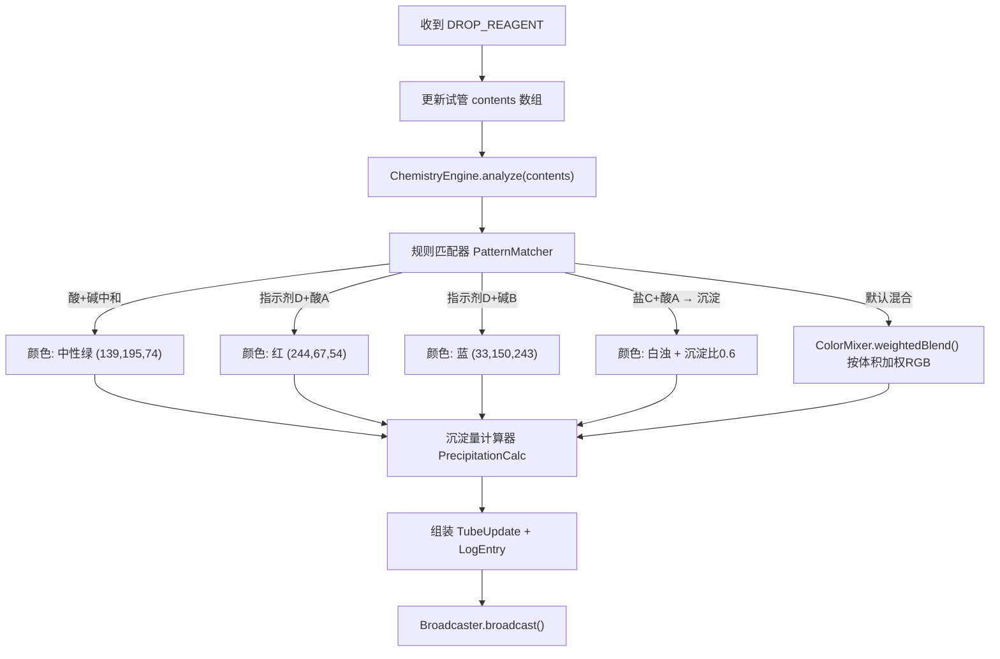

## 1. 架构设计



## 2. 技术描述

- **前端框架**：React 18 + TypeScript（严格模式）
- **构建工具**：Vite 5 + @vitejs/plugin-react
- **状态管理**：Zustand（轻量store，管理试管状态、选中状态、日志、废液缸）
- **样式方案**：原生CSS + CSS变量 + Flex/Grid响应式布局（不用Tailwind，满足用户精确颜色要求）
- **渲染引擎**：Canvas 2D API（实验台木纹、试管液体、沉淀粒子、拖尾粒子）
- **动画系统**：requestAnimationFrame（沉淀粒子60fps循环） + CSS transition（颜色过渡0.5s）
- **后端框架**：Express 4（静态资源+健康检查）
- **实时通信**：ws库（WebSocket Server）
- **跨域处理**：cors中间件
- **开发模式**：Vite开发服务器(5173端口) → WebSocket代理到Express(3001端口)

## 3. 路由与服务定义

| 服务/端口 | 用途 |
|-----------|------|
| :5173 | Vite开发服务器，提供前端React应用 |
| :5173/ws → :3001 | Vite代理WebSocket请求到后端 |
| :3001/health | Express健康检查端点 |
| :3001/ (WebSocket Upgrade) | WebSocket双向实时通信 |

## 4. WebSocket API 消息定义

```typescript
// ========== 前端 → 后端 ==========

// 滴加试剂
interface DropReagentMsg {
  type: 'DROP_REAGENT';
  payload: {
    tubeId: number;          // 试管ID 0-4
    reagentId: 'A' | 'B' | 'C' | 'D';  // 试剂ID
    drops: number;           // 滴数（每次5ml = 1滴）
    timestamp: number;
  };
}

// 清空试管到废液缸
interface ClearTubeMsg {
  type: 'CLEAR_TUBE';
  payload: {
    tubeId: number;
    timestamp: number;
  };
}

// 请求全量状态（连接建立后）
interface RequestStateMsg {
  type: 'REQUEST_STATE';
}

// ========== 后端 → 前端 ==========

// 试管状态更新（单支）
interface TubeUpdateMsg {
  type: 'TUBE_UPDATE';
  payload: {
    tubeId: number;
    contents: ReagentDrop[];     // 试剂内容列表
    totalVolume: number;         // 总容量 (ml)
    liquidColor: RGB;            // 当前液体RGB颜色
    colorTransitionMs: number;   // 颜色过渡时长 500ms
    precipitateRatio: number;    // 沉淀比例 0-1
    precipitateColor: RGB;       // 沉淀颜色
  };
}

// 废液缸更新
interface WasteUpdateMsg {
  type: 'WASTE_UPDATE';
  payload: {
    totalVolume: number;
    mixedColor: RGB;
  };
}

// 新增操作日志
interface LogEntryMsg {
  type: 'LOG_ENTRY';
  payload: {
    id: string;
    timestamp: number;
    tubeId: number;
    action: 'DROP' | 'CLEAR';
    reagentId?: 'A'|'B'|'C'|'D';
    drops?: number;
    description: string;
  };
}

// 全量状态快照（初次连接）
interface FullStateMsg {
  type: 'FULL_STATE';
  payload: {
    tubes: TubeState[];
    waste: WasteState;
    logs: LogEntry[];
  };
}

// 性能提示
interface PerformanceAlertMsg {
  type: 'PERF_ALERT';
  payload: {
    message: string;
    particleReduction: boolean;
  };
}

// ========== 共享类型 ==========
interface RGB { r: number; g: number; b: number; }
interface ReagentDrop { reagentId: string; volume: number; timestamp: number; }
interface TubeState { /* TubeUpdateMsg.payload 结构 */ }
interface WasteState { totalVolume: number; mixedColor: RGB; }
interface LogEntry { id: string; timestamp: number; /* 其他字段 */ }
```

## 5. 化学反应引擎架构



### 混合规则矩阵

| 组合 | 颜色结果 | 沉淀 | 说明 |
|------|---------|------|------|
| 酸A (无色→蓝) + 碱B (无色→紫) | 中性绿 #8BC34A | 0 | 中和反应 |
| 指示剂D + 酸A | 亮红 #F44336 | 0 | 酚酞遇酸变红 |
| 指示剂D + 碱B | 靛蓝 #2196F3 | 0 | 酚酞遇碱变蓝 |
| 盐C + 酸A | 白浊 #FAFAFA | 0.6 | 生成BaSO₄白色沉淀 |
| 盐C + 碱B | 蓝灰 #90A4AE | 0.3 | 少量氢氧化物沉淀 |
| A+B+C | 灰绿 #8D6E63 | 0.4 | 复杂混合 |
| 任意其他组合 | 加权RGB混合 | max(组合沉淀比,0.05) | 颜色插值 |

## 6. 文件结构与调用关系

```
auto41/
├── package.json                    # 统一管理前后端依赖
├── vite.config.js                  # Vite + React + WebSocket代理 /ws → :3001
├── tsconfig.json                   # strict: true, target: ES2020
├── index.html                      # 入口，挂载 #app + 字体链接
├── src/
│   ├── App.tsx                     # 顶层组件，建立WS连接 → 分发数据到子组件
│   │                                 调用关系：useStore ← ws.onmessage → <ExperimentTable/>
│   ├── main.tsx                    # ReactDOM渲染入口
│   ├── index.css                   # 全局CSS变量、主题色、按钮样式、响应式断点
│   ├── store/
│   │   └── useExperimentStore.ts   # Zustand: 管理 tubes/waste/logs/selectedTubeId
│   ├── hooks/
│   │   ├── useWebSocket.ts         # WebSocket连接管理、心跳、重连
│   │   └── useAnimationFrame.ts    # requestAnimationFrame循环Hook
│   ├── utils/
│   │   ├── canvasUtils.ts          # Canvas绘制辅助：玻璃高光、径向渐变液体
│   │   ├── colorUtils.ts           # RGB插值、加权混合、hex↔rgb转换
│   │   └── csvExport.ts            # 日志数组→CSV Blob下载
│   ├── components/
│   │   ├── ExperimentTable.tsx     # 布局组件：Canvas木纹背景、试剂瓶区、试管架区、废液缸、侧边栏
│   │   │                             父：App.tsx；子：ReagentDropper×4, TestTube×5, LogSidebar, WasteBeaker
│   │   ├── TestTube.tsx            # 试管Canvas组件：绘制玻璃管、液体径向渐变、沉淀粒子布朗运动循环
│   │   │                             Props: tubeState, selected, onClick() → setSelectedTube
│   │   ├── ReagentDropper.tsx      # 试剂瓶+滴管拖拽：HTML5 drag→drop到试管上→发送DROP_REAGENT WS消息
│   │   │                             自身Canvas绘制：滴加时拖尾粒子效果（5-8个2px圆点，0.3s衰减）
│   │   ├── WasteBeaker.tsx         # 废液缸Canvas：累积液体颜色，烧杯刻度
│   │   ├── LogSidebar.tsx          # 日志列表 + 清空试管按钮 + 导出CSV按钮
│   │   └── FPSMonitor.tsx          # 帧率监控组件：requestAnimationFrame计算FPS，<50发PERF_ALERT
│   └── types/
│       └── shared.ts               # 前后端共享类型：消息协议、RGB、TubeState等
└── server/
    ├── index.ts                    # Express启动 + WS挂载 + 状态实例初始化
    │                                 调用链：express() → wsServer.on('connection') → handleClient()
    ├── ExperimentState.ts          # 类：5试管状态对象 + 废液缸状态 + 日志数组 + 操作方法
    │                                 dropReagent(tubeId, reagentId, drops) → 触发ChemistryEngine
    │                                 clearTube(tubeId) → 液体加入废液缸，清空试管
    ├── ChemistryEngine.ts          # 纯函数集合：规则匹配矩阵 + 颜色加权混合 + 沉淀量计算
    │                                 analyzeReaction(contents: ReagentDrop[]) → {color, precipitateRatio, precipitateColor}
    ├── ColorMixer.ts               # 颜色算法：按体积加权RGB线性插值、hex↔rgb、亮度调整
    └── WebSocketManager.ts         # 连接管理：clients Set、广播方法、消息序列化
```

## 7. 数据流向详解

```
用户拖拽ReagentDropper → TestTube drop区域触发
    ↓
ReagentDropper.tsx 调用 ws.send(JSON.stringify(DropReagentMsg))
    ↓
Vite /ws 代理 → server/index.ts WebSocket 'message' 事件
    ↓
WebSocketManager.routeMessage() → ExperimentState.dropReagent()
    ↓
ChemistryEngine.analyze() → 匹配规则 → ColorMixer.blend() + PrecipitationCalc.compute()
    ↓
ExperimentState 更新内部 tubes[tubeId] 状态 + push新LogEntry
    ↓
Broadcaster.broadcast() → 发送 TubeUpdateMsg + LogEntryMsg 给所有客户端
    ↓
前端 useWebSocket.ts onmessage → useExperimentStore.setState() 更新Zustand
    ↓
TestTube.tsx 订阅 zustand → React重渲染 → useEffect触发Canvas重绘液体颜色 (CSS transition)
→ requestAnimationFrame循环启动沉淀粒子 (若无沉淀则暂停循环节约资源)
→ LogSidebar 订阅 zustand logs → 列表追加新条目
→ WasteBeaker.tsx 订阅 waste → Canvas累积颜色更新
```
