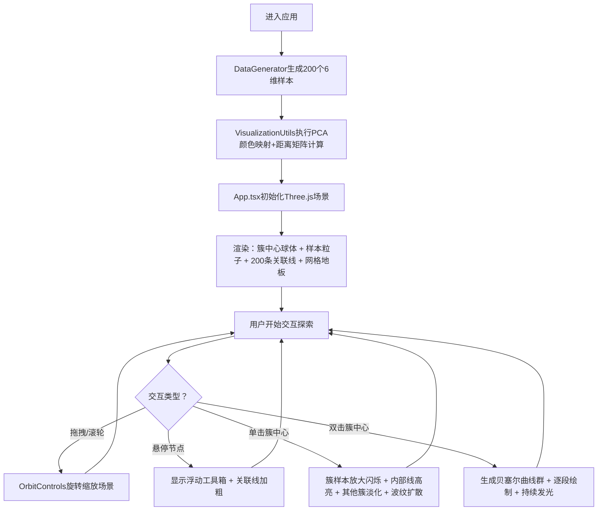

## 1. 产品概述

「关联藤蔓·数据脉络」是一款面向数据分析师的三维交互可视化工具，通过类藤蔓的动态彩色线条网络直观展示高维数据集的内在结构。它将抽象的多维度统计关系转化为可感知的空间形态，使复杂的聚类分析和关联探索如同观察一片生长的植物脉络一样自然直观。

- 目标用户：数据科学家、统计分析师、机器学习研究者
- 解决问题：高维数据难以通过传统图表理解，三维空间+颜色编码+动态交互提供更深层的洞察途径
- 产品价值：将冰冷的数值矩阵转化为富有生命力的视觉艺术，降低数据探索门槛，激发发现灵感

## 2. 核心特性

### 2.1 功能模块总览

1. **主页（三维可视化场景）**：数据集生成、粒子系统渲染、动态关联网络、交互探索、簇路径可视化、浮动工具箱

### 2.2 页面详情

| 页面名称 | 模块名称 | 功能描述 |
|----------|----------|----------|
| 三维可视化主页 | 高维数据集生成器 | 自动生成200个6维样本，划分为3个簇，输出平均特征向量 |
| 三维可视化主页 | 粒子系统与聚类映射 | PCA降维映射RGB，3个大网格球体簇中心 + 200个小粒子样本，距离感知透明度 |
| 三维可视化主页 | 动态关联网络渲染 | 200条最近邻居连线，颜色渐变，悬停加粗，点击波纹扩散 |
| 三维可视化主页 | 交互式数据探索 | 拖拽旋转、滚轮缩放（0.5~5.0），单击簇中心高亮闪烁，其他簇淡化 |
| 三维可视化主页 | 簇路径可视化 | 双击簇中心生成贝塞尔曲线群，逐段绘制+持续发光效果 |
| 三维可视化主页 | 浮动信息工具箱 | 悬停节点显示ID与前三维特征值，半透明圆角卡片 |
| 三维可视化主页 | 深空视觉设计 | #0a0a1a深空黑背景，径向渐变网格地板，呼吸发光光环 |

## 3. 核心流程

## 4. 用户界面设计

### 4.1 设计风格

- **主色调**：深空黑 `#0a0a1a`（背景），色相范围 240°（蓝紫）~ 30°（红橙）
- **辅助色**：白色发光（#ffffff，强度0.5~1.0），深灰半透明面板（rgba(20,20,35,0.8)）
- **视觉隐喻**：生长的彩色藤蔓——线条如藤蔓，节点如果实，簇中心如主茎节点
- **字体**：标题使用极具未来感的展示字体（如 Orbitron），正文使用清晰易读的等宽字体（如 JetBrains Mono）
- **动效**：所有过渡平滑缓动（ease-in-out cubic-bezier），呼吸式透明度变化，波纹扩散，逐段绘制
- **光照**：AmbientLight(0.3) + PointLight 暖色 + PointLight 冷色，营造深空霓虹氛围
- **后处理**：轻微 Bloom 发光效果，使线条和光晕具有穿透力

### 4.2 页面设计概览

| 页面名称 | 模块名称 | UI 元素细节 |
|----------|----------|-------------|
| 三维可视化主页 | 场景背景 | 纯黑 `#0a0a1a` 环境色，微弱星空粒子点缀 |
| 三维可视化主页 | 网格地板 | 中心径向渐变（中心半透明白 → 边缘透明），XZ 平面网格半径 8 |
| 三维可视化主页 | 簇中心球体 | 半径 0.3 大网格球（MeshStandardMaterial，wireframe），环绕呼吸光环（TorusGeometry，width 0.02，透明度 0.5~1.0 正弦呼吸） |
| 三维可视化主页 | 样本粒子 | 半径 0.08 小球（PointsMaterial + BufferGeometry），sizeAttenuation，距离感知透明度（远 0.3 / 近 1.0） |
| 三维可视化主页 | 关联线条 | LineSegments + BufferGeometry，200条边，顶点色渐变（两端颜色加权），透明度 0.4~0.8 动态 |
| 三维可视化主页 | 波纹效果 | 单击簇中心：CircleGeometry + 透明材质，半径 0.5 → 2.0 线性扩展，1秒后淡出 |
| 三维可视化主页 | 贝塞尔路径 | 4控制点三次贝塞尔，TubeGeometry 分段 200，渐变顶点色 + 白色发光（emissive 0.5），逐段动画 0.8秒 |
| 三维可视化主页 | 浮动工具箱 | HTML 覆盖层：深灰底 rgba(20,20,35,0.8)，圆角 8px，内边距 12px，等宽字体显示 ID + 三维特征（两位小数） |

### 4.3 响应式设计

- **桌面优先**：全屏 Canvas 占满视口，1920×1080 及以上获得最佳体验
- **移动端自适应**：Canvas 按视口缩放，触摸手势支持双指捏合缩放和单指旋转
- **性能降级**：检测到低性能设备时，自动将粒子数降至 100、关联线降至 100、贝塞尔分段降至 100

### 4.4 3D 场景指引

- **环境与氛围**：深空星夜氛围，微弱雾气（FogExp2，密度 0.02），无 HDRI（纯程序化）
- **光照设置**：AmbientLight(0xffffff, 0.3) → 整体基色；PointLight(0x6666ff, 1.2, 20) 位置 (5,5,5) + PointLight(0xff6666, 1.0, 20) 位置 (-5,3,-5) 冷暖对比
- **相机参数**：PerspectiveCamera，fov 60，aspect 自适应，near 0.1，far 100，初始位置 (0, 3, 8)，看向 (0,0,0)
- **相机运动**：OrbitControls，enableDamping，dampingFactor 0.08，minDistance 0.5，maxDistance 25，autoRotate 关闭（用户控制）
- **构图焦点**：数据点群集于半径 4 的球形空间内，地板在 y=-1.5 平面，簇中心三角分布构成视觉锚点
- **交互与动画**：requestAnimationFrame 60fps 循环，状态机管理（normal / hovered / clicked / doubleClicked），所有动画使用 lerp 平滑插值
- **后处理**：EffectComposer + UnrealBloomPass（strength 0.4, radius 0.5, threshold 0.7），使发光效果柔和自然
- **性能预算**：Draw calls ≤ 15，Triangles ≤ 50K，Points ≤ 200，Line segments ≤ 200，Curves ≤ 3 active
