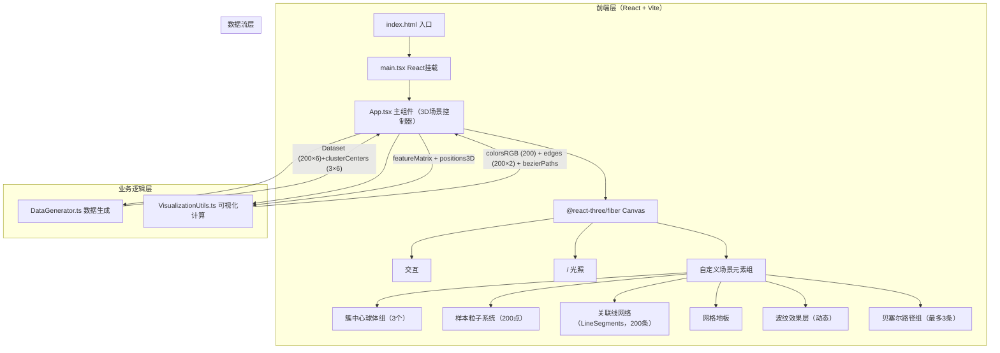

## 1. 架构设计



## 2. 技术栈说明

- **前端框架**：React@18 + ReactDOM@18（函数式组件 + Hooks）
- **构建工具**：Vite@5 + @vitejs/plugin-react（HMR 热更新，ESBuild 极速构建）
- **类型系统**：TypeScript@5（strict 模式，ESNext 模块，noUncheckedIndexedAccess）
- **3D 渲染引擎**：three@0.160 + @types/three@0.160
- **React 3D 桥接**：@react-three/fiber@8 + @react-three/drei@9（OrbitControls、EffectComposer、Bloom 等）
- **无后端**：纯前端应用，数据全部通过 DataGenerator.ts 程序化生成（种子固定确保可复现）
- **无数据库**：运行时内存存储，刷新重置

## 3. 项目目录结构

```
auto42/
├── index.html                          # Vite 入口 HTML，全屏黑色，加载字体
├── package.json                        # 依赖声明 + npm run dev 脚本
├── vite.config.js                      # Vite 配置（React + TS + 路径别名 @）
├── tsconfig.json                       # TS 严格模式配置
├── .trae/documents/
│   ├── PRD.md                          # 产品需求文档
│   └── TECH_ARCHITECTURE.md            # 本文档
└── src/
    ├── main.tsx                        # React 渲染入口
    ├── App.tsx                         # 主组件：Canvas 场景 + 状态管理 + 交互
    ├── DataGenerator.ts                # 200×6 高维数据生成 + 3 簇聚类 + 中心向量
    └── VisualizationUtils.ts           # PCA 降维→RGB / 欧氏距离→邻接矩阵 / 贝塞尔控制点计算
```

### 文件间调用关系

```
index.html
  ↓ 加载
main.tsx
  ↓ 渲染 <App />
App.tsx
  ├─ 调用 → DataGenerator.generateDataset()   获得 { samples, clusterLabels, clusterCenters }
  ├─ 调用 → VisualizationUtils.featuresToRGB(samples, clusterLabels)  获得 colors[]
  ├─ 调用 → VisualizationUtils.computeKNNEdges(samples, k=3, max=200) 获得 edges[][2]
  ├─ 调用 → VisualizationUtils.project3D(samples)  获得 positions[][3]（t-SNE/PCA 空间布局）
  ├─ 调用 → VisualizationUtils.buildBezierPath(center, sample) 获得 controlPoints[4]
  └─ 使用 → @react-three/fiber + drei 渲染 3D 场景
```

### 数据流向图

```
DataGenerator
  │
  ├─ samples: number[200][6]     ──────────────────┐
  ├─ clusterLabels: number[200]  ────┐             │
  └─ clusterCenters: number[3][6]    │             │
                                     ▼             ▼
VisualizationUtils              featuresMatrix  featuresMatrix
  │                              + clusterLabels + positions
  │
  ├─ colors: [number,number,number][200]  ──────────────────┐
  ├─ edges: [i,j][200]                                     │
  ├─ positions3D: [x,y,z][200]                             │
  └─ bezierControlPoints: [4][3] per path                  │
                                                           ▼
App.tsx (React State + Ref)
  ├─ useRef<THREE.Points>             → 粒子系统 BufferGeometry attributes
  ├─ useRef<THREE.LineSegments>       → 关联线 vertex colors + linewidth uniform
  ├─ useState<{hoveredId, clickedId, rippleId}> → 交互状态驱动动画
  └─ useFrame() 60fps → 更新 uniforms: uTime, uHovered, uClicked, uRipple
```

## 4. 核心模块详细技术设计

### 4.1 DataGenerator.ts

```typescript
// 类型定义
export interface DataSet {
  samples: number[][];        // 200 × 6：每个样本的6维特征
  clusterLabels: number[];    // 200：所属簇索引 [0,1,2]
  clusterCenters: number[][]; // 3 × 6：每个簇的平均特征向量
  clusterSampleCounts: number[]; // 3：各簇样本数
}

// 导出函数
export function generateDataset(seed?: number): DataSet;
```

**算法**：
- 使用 Mulberry32 伪随机数生成器（固定 seed=42 可复现）
- 为 3 个簇各生成 6 维高斯中心向量（中心间欧氏距离 ≥ 3.0，保证色相分离）
- 每个簇：60~70 个样本 = 中心 + 多维高斯噪声（协方差矩阵对角 0.5~1.2）
- 返回各簇真实平均向量（clusterCenters = 该簇样本算术平均）

### 4.2 VisualizationUtils.ts

```typescript
// PCA 简化：将 6 维特征映射到 RGB [0,1]
// 约束：3簇中心对应的 HSL 色相至少相差 90°（簇0: 240°蓝紫, 簇1: 120°绿青, 簇2: 30°红橙）
export function featuresToRGB(
  samples: number[][],
  clusterLabels: number[]
): [number, number, number][];

// 计算欧氏距离矩阵，取每个样本 k=3 最近邻居，去重后取前 maxEdges=200
export function computeKNNEdges(
  samples: number[][],
  k?: number,
  maxEdges?: number
): [number, number][];

// MDS/PCA 将 6 维投影到 3D 空间（簇中心构成等边三角形，半径 3.0）
export function projectTo3D(
  samples: number[][],
  clusterCenters: number[][]
): [number, number, number][];

// 构造 4 控制点三次贝塞尔：P0=center, P1=center+normal, P2=sample+normal, P3=sample
export function buildBezierControlPoints(
  center: [number, number, number],
  sample: [number, number, number],
  curveScale?: number
): [number, number, number][];
```

### 4.3 App.tsx 状态与动画

```typescript
// 交互状态
type InteractionState = {
  hoveredNode: number | null;     // -1=簇中心0,-2=簇中心1,-3=簇中心2, >=0=样本ID, null=无
  clickedCluster: number | null;  // 0,1,2 或 null
  doubleClickedCluster: number | null; // 0,1,2 或 null
  ripple: { clusterId: number; startTime: number } | null;
};

// 动画参数（useFrame 中每帧更新）
// 1. 粒子透明度：uDistanceAlpha = mix(0.3, 1.0, smoothstep(maxDist, minDist, distance))
// 2. 粒子放大闪烁：clicked → 1.5x scale, opacity 振荡 0.6↔1.0 (0.3s × 2 周期)
// 3. 关联线：uHoveredWeight = mix(0.02, 0.06, 悬停度)，内部线 brightness +50%，其他线 alpha=0.2
// 4. 波纹：uRippleRadius = mix(0.5, 2.0, t), uRippleAlpha = mix(0.8, 0.0, t), t∈[0,1] over 1s
// 5. 贝塞尔：uDrawProgress = clamp(t/0.8, 0, 1)，裁剪路径长度，完成后 emissiveIntensity=0.5
// 6. 光环：uHaloAlpha = 0.5 + 0.5 * sin(2π * uTime * 0.8)
```

## 5. 性能优化策略

| 优化点 | 技术方案 | 预期效果 |
|--------|----------|----------|
| 粒子系统 | BufferGeometry + Float32Array 存储 position/color，单 Points draw call | Draw call = 1，200 点零负担 |
| 关联线条 | 合并为单个 LineSegments + BufferGeometry，顶点色 attribute | Draw call = 1，避免 200 个单独 Line |
| 状态更新 | useRef 直接操作 three 对象 + useFrame 增量更新，避免 React 重渲染 | 无虚拟 DOM 开销，60fps 稳定 |
| 贝塞尔曲线 | TubeGeometry 预计算 200 段 × 8 面，通过 clip shader 裁剪实现逐段绘制 | 无需每帧重建几何 |
| 射线拾取 | drei 的 `<PointerEvents />` + Intersects 缓存，每帧最多一次 raycast | 交互响应延迟 < 16ms |
| 后处理 | UnrealBloomPass 降采样 half res，仅 Bloom 高光区域 | GPU 开销 < 2ms |

## 6. 类型定义总览

```typescript
// src/types.ts（如需要）
type SampleId = number;        // 0..199
type ClusterId = 0 | 1 | 2;
type Vec3 = [number, number, number];
type Vec6 = [number, number, number, number, number, number];
type RGB = [number, number, number];
type Edge = [SampleId, SampleId];

interface TooltipInfo {
  id: string;        // "簇 α" 或 "样本 #042"
  features: number[]; // 前3维，两位小数
  position: { x: number; y: number }; // 屏幕像素坐标
}
```
