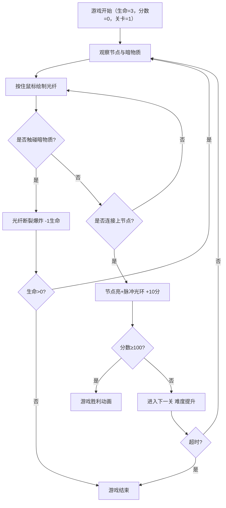

## 1. 产品概述

「光痕连线·量子纠缠」是一款在浏览器中运行的2D策略解谜游戏，玩家通过绘制由发光粒子组成的光纤路径连接上下两个量子节点，避开动态移动的暗物质团障碍。游戏融合了物理引擎反馈、粒子视觉特效与渐进式难度系统，解决传统连线游戏缺乏动态沉浸感的问题。

- 目标用户：休闲游戏玩家、解谜游戏爱好者
- 产品价值：提供视觉华丽、操作流畅、具有物理反馈的沉浸式连线解谜体验

## 2. 核心功能

### 2.1 功能模块

1. **游戏主画布**：Canvas 2D渲染引擎，60FPS游戏循环，所有实体渲染与碰撞检测
2. **光纤绘制系统**：鼠标拖拽绘制粒子光纤，弹性物理抖动，颜色渐变，光脉冲传播
3. **暗物质障碍系统**：贝塞尔曲线路径移动，自旋动画，碰撞检测与警示抖动
4. **量子节点系统**：上下双节点，节点摆动，脉冲光环扩散，暗物质击退
5. **关卡与计分系统**：关卡递进（障碍增多、速度提升），计分系统，生命系统，限时机制
6. **视觉特效层**：星空背景，发光边界，UI悬浮动效，爆炸粒子，胜利动画

### 2.3 页面详情

| 页面名称 | 模块名称 | 功能描述 |
|-----------|-------------|---------------------|
| 游戏主页面 | 星空背景层 | 100颗缓慢移动白色粒子，深空蓝紫色背景 |
| 游戏主页面 | 游戏画布区域 | 发光淡蓝色虚线边界，承载所有游戏实体 |
| 游戏主页面 | 光纤绘制引擎 | 鼠标拖拽生成发光粒子光纤，弹性物理抖动 |
| 游戏主页面 | 暗物质障碍 | 6-14个半透明紫色团块，贝塞尔曲线移动+自旋 |
| 游戏主页面 | 量子节点 | 上下两个发光球体，下节点摆动，上节点固定 |
| 游戏主页面 | 分数显示 | 左上方24px白色分数，带投影效果 |
| 游戏主页面 | 生命显示 | 右上方3颗心形图标，灰色显示丢失的生命 |
| 游戏主页面 | 提示UI | 十字准星光标、红色警示光晕、关卡信息 |
| 游戏主页面 | 胜利/结束界面 | 胜利动画（节点闪烁+粒子彩带）或游戏结束提示 |

## 3. 核心流程

玩家进入游戏 → 查看上下量子节点位置与暗物质分布 → 按住鼠标从下节点开始拖拽绘制光纤 → 光纤避开暗物质团 → 连接到上节点 → 节点亮起并释放脉冲光环 → 计10分进入下一关 → 重复直到分数达100分胜利 或 生命耗尽/超时游戏结束

## 4. 用户界面设计

### 4.1 设计风格

- **主色调**：深空蓝紫色背景 `#0A0E27`，光纤渐变 `#00BFFF → #FF69B4`，金色准星 `#FFD700`，紫色暗物质 `#9932CC`（透明度0.6）
- **发光效果**：所有核心元素使用 `shadowBlur` 实现辉光效果，边界与节点带有明显光晕
- **字体**：无衬线字体，分数24px粗体白色带投影
- **动效风格**：粒子系统驱动的流畅动画，微交互使用0.2-0.5秒缓动过渡

### 4.2 页面设计概述

| 页面名称 | 模块名称 | UI元素 |
|-----------|-------------|-------------|
| 游戏主页面 | 星空背景 | 100颗微小粒子，透明度0.2-0.6，缓慢移动+旋转 |
| 游戏主页面 | 画布边界 | 1px淡蓝色虚线，`#00BFFF`发光效果，透明度0.5 |
| 游戏主页面 | 分数UI | 左上角，24px白色粗体，`textShadow`投影，悬停放大1.1倍 |
| 游戏主页面 | 生命UI | 右上角，3颗心形SVG，丢失时灰色，缩放动画0.8→1.0 |
| 游戏主页面 | 光纤粒子 | 半径2-4px发光粒子，色相平滑渐变，弹性抖动 |
| 游戏主页面 | 光脉冲 | 从起点波浪式传播，速度200px/s，亮度增强 |
| 游戏主页面 | 暗物质团 | 半透明紫色，半径30-60px，自旋，边缘柔和 |
| 游戏主页面 | 量子节点 | 半径30px发光球体，暗淡态0.3透明度，点亮态1.0持续3秒 |
| 游戏主页面 | 脉冲光环 | 10px→120px扩散，透明度0.9→0，持续1.5秒 |
| 游戏主页面 | 十字准星 | 8px半径金色准星，2Hz闪烁，绘制时显示 |
| 游戏主页面 | 红色光晕 | 触碰暗物质时屏幕四周闪烁，透明度0.3，0.2秒 |
| 游戏主页面 | 胜利动画 | 节点持续闪烁，粒子彩带飘落，持续3秒 |

### 4.3 响应式设计

- **桌面优先**：Canvas自适应浏览器窗口大小，保持游戏区域居中
- **窗口缩放**：监听 `resize` 事件，动态调整Canvas尺寸与节点位置
- **交互优化**：鼠标事件精确命中检测，悬停UI元素放大1.1倍并变色
