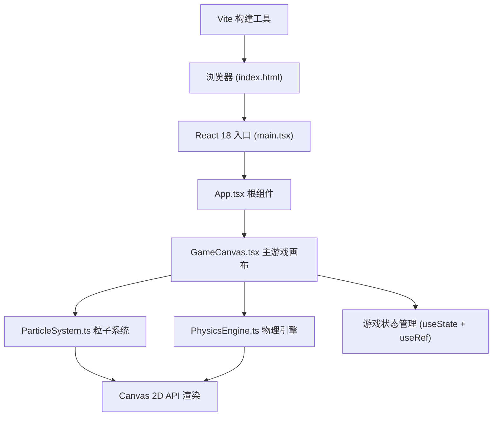
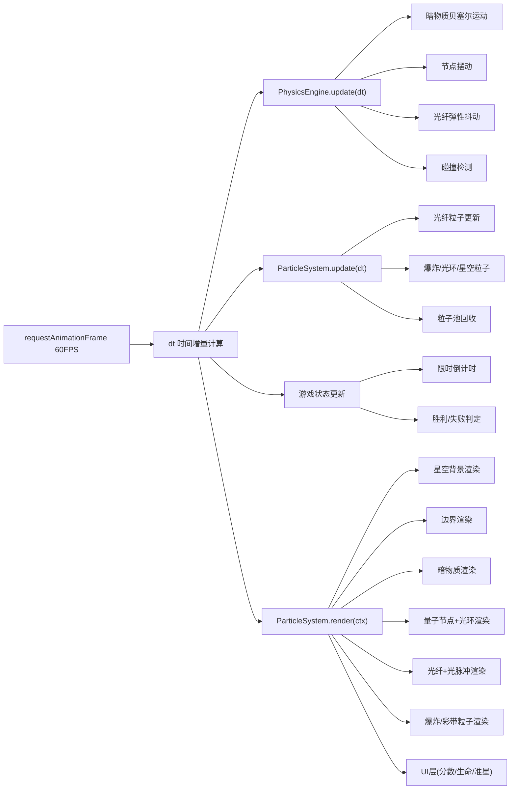

## 1. 架构设计



## 2. 技术描述

- **前端框架**：React 18 + TypeScript（严格模式）
- **构建工具**：Vite 5 + @vitejs/plugin-react
- **渲染引擎**：HTML5 Canvas 2D API（原生，无第三方游戏引擎）
- **物理引擎**：自研轻量物理模块（弹性抖动、贝塞尔曲线运动、碰撞检测）
- **粒子系统**：自研高性能粒子池（对象池模式，避免频繁GC）
- **状态管理**：React useState（UI状态）+ useRef（游戏循环高性能状态）
- **性能目标**：60FPS稳定帧率，400粒子渲染延迟≤8ms

## 3. 文件组织

| 文件路径 | 职责说明 |
|----------|---------|
| `package.json` | 项目依赖与脚本配置 |
| `vite.config.js` | Vite构建配置，React插件启用 |
| `tsconfig.json` | TypeScript严格模式配置 |
| `index.html` | 入口HTML，挂载点与全局样式 |
| `src/main.tsx` | React入口，渲染根组件 |
| `src/App.tsx` | 根组件，布局GameCanvas |
| `src/GameCanvas.tsx` | 主画布组件，游戏循环，事件监听，状态调度 |
| `src/ParticleSystem.ts` | 粒子系统：光纤粒子、爆炸粒子、光环粒子、星空粒子 |
| `src/PhysicsEngine.ts` | 物理引擎：弹性抖动、贝塞尔运动、碰撞检测、节点摆动 |
| `src/types.ts` | 全局类型定义（Particle, DarkMatter, Node等） |

## 4. 核心数据模型

### 4.1 粒子类型定义

```typescript
interface Particle {
  x: number;              // 当前X坐标
  y: number;              // 当前Y坐标
  prevX: number;          // 上一帧X（弹性计算）
  prevY: number;          // 上一帧Y（弹性计算）
  vx: number;             // X方向速度
  vy: number;             // Y方向速度
  radius: number;         // 粒子半径 2-4px
  hue: number;            // 色相 0-360（渐变计算）
  alpha: number;          // 透明度 0-1
  life: number;           // 生命值（爆炸粒子用）
  maxLife: number;        // 最大生命值
  type: 'fiber' | 'explosion' | 'pulse' | 'star' | 'confetti';
  pulsePhase: number;     // 光脉冲相位
  wobblePhase: number;    // 抖动相位
}

interface DarkMatter {
  x: number;
  y: number;
  radius: number;         // 30-60px
  rotation: number;       // 自旋角度
  rotationSpeed: number;  // 5-15度/秒
  bezierPath: BezierPoint[]; // 贝塞尔路径控制点
  pathProgress: number;   // 路径进度 0-1
  speed: number;          // 40-60px/秒（关卡提升）
  knockbackX: number;     // 击退偏移X
  knockbackY: number;     // 击退偏移Y
}

interface QuantumNode {
  x: number;
  y: number;
  baseX: number;          // 基础X（摆动计算用）
  radius: number;         // 30px
  alpha: number;          // 0.3暗淡 / 1.0点亮
  brightTimer: number;    // 点亮剩余时间
  swingPhase: number;     // 摆动相位
  swingAmplitude: number; // 摆动幅度 ±80px（关卡增加）
  swingPeriod: number;    // 摆动周期 4秒
  pulseRings: PulseRing[]; // 脉冲光环列表
}

interface PulseRing {
  x: number;
  y: number;
  radius: number;         // 10-120px
  maxRadius: number;
  alpha: number;          // 0.9-0
  life: number;           // 1.5秒
  maxLife: number;
}

interface GameState {
  score: number;
  lives: number;
  level: number;
  timeLeft: number;       // 30秒倒计时
  gameStatus: 'menu' | 'playing' | 'victory' | 'gameover';
  isDrawing: boolean;
  fiberParticles: Particle[];
  explosionParticles: Particle[];
  darkMatters: DarkMatter[];
  topNode: QuantumNode;
  bottomNode: QuantumNode;
  starParticles: Particle[];
  confettiParticles: Particle[];
  redFlashTimer: number;  // 红色光晕计时器
  victoryTimer: number;   // 胜利动画计时器
  lastMouseX: number;
  lastMouseY: number;
  mouseSpeed: number;
}
```

## 5. 游戏循环架构



## 6. 性能优化策略

1. **对象池模式**：粒子对象复用，避免频繁创建/销毁导致GC
2. **离屏Canvas**：静态背景（星空）可缓存到离屏画布
3. **批量渲染**：同类型粒子一次性设置样式批量绘制
4. **空间分区**：碰撞检测使用简单网格分区（本游戏粒子量小可省略）
5. **useRef存储游戏状态**：避免React重渲染影响游戏循环
6. **整数坐标绘制**：`Math.floor()` 避免抗锯齿开销
7. **requestAnimationFrame**：严格使用浏览器原生帧调度
