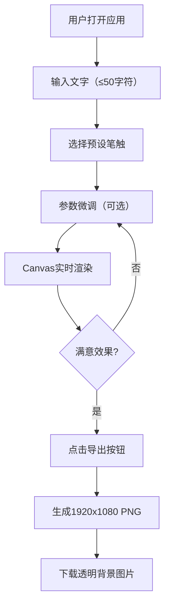

## 1. 产品概述

「质墨」是一款面向平面设计师和创意工作者的浏览器端艺术字生成工具，通过粒子系统模拟墨迹、水彩、沙粒、铅笔等真实材质笔触，让普通文字转变为富有肌理感的艺术作品。

- 核心价值：无需专业设计软件，浏览器内即可生成独特质感的艺术字
- 目标用户：平面设计师、UI设计师、社交媒体内容创作者

## 2. 核心功能

### 2.1 功能模块

1. **主编辑页面**：文本输入区、笔触选择面板、参数调节滑块、画布预览区、导出功能

### 2.2 页面详情

| 页面名称 | 模块名称 | 功能描述 |
|-----------|-------------|---------------------|
| 主编辑页 | 顶部导航栏 | 应用名称「质墨」、高清PNG导出按钮 |
| 主编辑页 | 文本输入模块 | 最多50字符中英文输入、字体选择下拉 |
| 主编辑页 | 笔触选择模块 | 4种预设笔触（墨迹扩散/水彩晕染/沙粒堆积/铅笔划痕） |
| 主编辑页 | 参数调节模块 | 粒子密度、扩散半径、透明度滑块实时调节 |
| 主编辑页 | 画布预览模块 | Canvas实时渲染、鼠标拖拽平移、粒子飘散特效 |

## 3. 核心流程

用户打开应用 → 输入文字内容 → 选择预设笔触风格 → 微调参数（可选）→ 画布实时渲染预览 → 点击导出PNG → 下载高清透明背景图片

## 4. 用户界面设计

### 4.1 设计风格
- **主色调**：低饱和度工业蓝灰 #7A8B99
- **强调色**：暖橙 #F05A28（用于导出按钮等关键操作）
- **背景色**：控制面板深灰 #2C2C2C，画布区纯黑 #1A1A1A
- **按钮风格**：圆角矩形（8px），hover时亮度提升15%，导出按钮点击缩放动画（0.95→1.0，0.15s）
- **字体**：全局无衬线体，标题采用有设计感的粗体无衬线
- **布局**：左窄右宽双栏（左侧300px控制面板 + 右侧画布区）

### 4.2 页面设计概览

| 页面名称 | 模块名称 | UI元素 |
|-----------|-------------|-------------|
| 主编辑页 | 顶部栏 | 「质墨」标题左对齐，导出按钮右对齐（橙色高亮） |
| 主编辑页 | 控制面板 | 深灰背景，分组卡片式布局，滑块带微光效 |
| 主编辑页 | 画布区 | 黑色背景，拖拽时光标变为grab，生成时粒子飘散1秒 |
| 主编辑页 | 响应式 | 移动端控制面板折叠为顶部下拉，画布全屏 |

### 4.3 响应性
- 桌面端（≥1024px）：左300px控制面板 + 右侧自适应画布区
- 平板端（768-1023px）：左260px控制面板
- 移动端（<768px）：控制面板折叠为顶部下拉菜单，画布占满全屏，触摸拖拽优化

### 4.4 动效设计
- 笔触切换：2秒渐变动画平滑过渡
- 滑块调节：0.5秒内重绘完成，防抖处理
- 画布生成：粒子飘散效果1秒后淡出
- 导出按钮：点击scale 0.95→1.0，0.15秒
- 所有交互：30fps以上流畅体验
