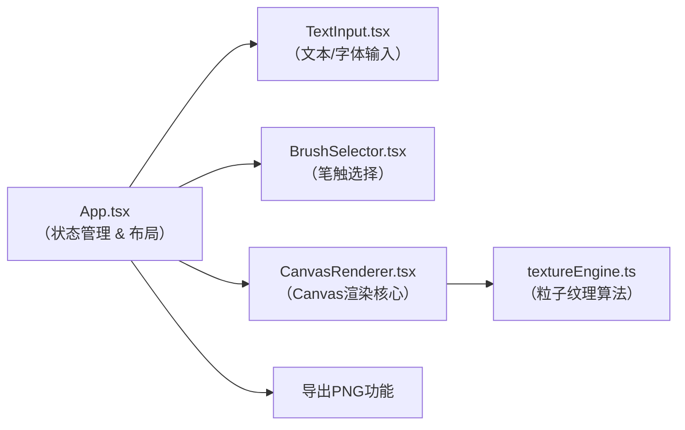

## 1. 架构设计



**数据流向**：
1. 用户在TextInput/BrushSelector操作 → 更新App.tsx中的状态
2. App状态变化 → 传递props给CanvasRenderer
3. CanvasRenderer调用textureEngine生成粒子数据 → 绘制到Canvas
4. 导出时从Canvas获取ImageData → 生成Blob下载

## 2. 技术描述

- **前端框架**：React 18 + TypeScript 5（严格模式）
- **构建工具**：Vite 5 + @vitejs/plugin-react
- **渲染引擎**：Canvas 2D API（像素级操作）
- **样式方案**：原生CSS（CSS变量 + 响应式媒体查询）
- **无后端、无数据库**：纯前端应用，数据仅存于内存

**文件结构**：
```
src/
├── App.tsx              # 主组件：状态管理、双栏布局、导出逻辑
├── components/
│   ├── TextInput.tsx        # 文本输入+字体选择（触发重绘）
│   ├── BrushSelector.tsx    # 4种预设笔触+参数滑块
│   └── CanvasRenderer.tsx   # Canvas渲染：文字蒙版+粒子绘制+动画
└── utils/
    └── textureEngine.ts     # 纹理引擎：4种粒子生成算法
```

## 3. 核心数据结构

### 3.1 BrushPreset（笔触预设）
```typescript
interface BrushPreset {
  id: string;
  name: string;
  particleDensity: number;   // 20-100
  diffusionRadius: number;   // 2-12px
  randomOffset: number;      // 0-8px
  opacityRange: [number, number]; // [0.3, 1.0]
  algorithm: 'ink' | 'watercolor' | 'sand' | 'pencil';
  colorPalette: string[];
}
```

### 3.2 Particle（粒子数据）
```typescript
interface Particle {
  x: number;
  y: number;
  size: number;
  opacity: number;
  color: string;
  rotation: number;
}
```

### 3.3 AppState（应用状态）
```typescript
interface AppState {
  text: string;               // ≤50字符
  fontFamily: string;
  brushPreset: BrushPreset;
  customDensity: number;
  customRadius: number;
  customOpacity: number;
  panOffset: { x: number; y: number };
}
```

## 4. 渲染管线

1. **文字蒙版生成**：离屏Canvas → 绘制文字 → 获取ImageData Alpha通道
2. **粒子采样**：遍历Alpha>0的像素 → 按密度随机采样生成粒子
3. **纹理算法应用**：
   - 墨迹：粒子大小正态分布+边缘羽化+渗流效果
   - 水彩：颜色随机偏移+湿边扩散+多重叠加
   - 沙粒：细小颗粒+噪点扰动+堆积阴影
   - 铅笔：细线条+随机角度+灰度层次+纸纹
4. **动画过渡**：oldParticles → newParticles 线性插值（2000ms）
5. **防抖重绘**：滑块变化后delay 500ms再重绘

## 5. 性能优化策略

- **离屏Canvas**：文字蒙版与粒子绘制分离，蒙版缓存复用
- **Web Worker**（如需要）：粒子生成计算移至Worker线程
- **防抖节流**：滑块input事件debounce 300ms，避免频繁重绘
- **粒子裁剪**：仅在文字轮廓范围内生成粒子，剔除无效计算
- **导出优化**：临时高分辨率Canvas（1920x1080）独立渲染，避免影响预览
