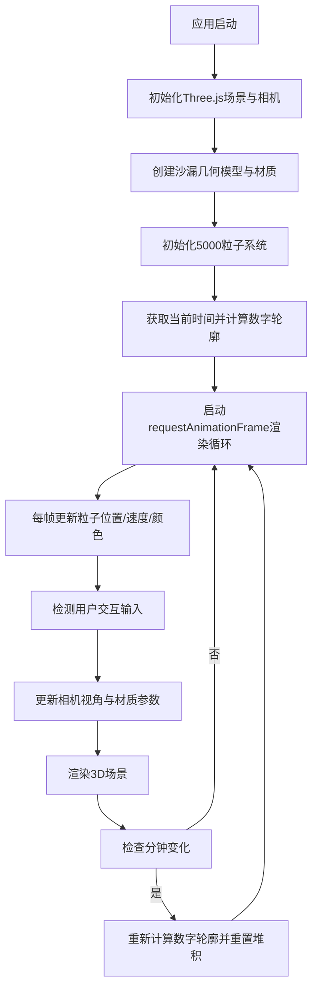

## 1. 产品概述

「记忆沙漏·时光视界」是一款浏览器端的交互式3D时间可视化应用，通过半透明沙漏与彩色沙粒的动态雕塑形式，将抽象的数字时间转化为具有情感温度和空间层次感的沉浸式视觉体验。用户可自由操控沙漏视角，观察沙粒随时间流淌堆积，在光影流转中感受时间的物质化存在。

- 核心价值：解决传统数字时钟缺乏情感共鸣与视觉深度的问题，为用户提供具有艺术观赏性和交互趣味的时间感知方式
- 目标用户：设计爱好者、艺术创作者、追求个性化桌面体验的用户

## 2. 核心功能

### 2.1 功能模块

1. **主场景页面**：3D沙漏渲染、粒子系统物理模拟、实时光影效果、用户视角操控

### 2.2 页面详情

| 页面名称 | 模块名称 | 功能描述 |
|---------|---------|---------|
| 主场景页面 | 沙漏3D模型 | 半透明玻璃球仓（上下双球体+中部细颈）、磨砂金属框架、玻璃环境反射光 |
| 主场景页面 | 沙粒物理模拟 | 5000粒子系统、螺旋下落轨迹、数字轮廓堆积算法、碰撞检测与火花效果 |
| 主场景页面 | 时间色彩系统 | 小时驱动主色调HSL映射、分钟辅助色分组、渐变色带过渡 |
| 主场景页面 | 用户交互模块 | 鼠标拖拽旋转（Y轴±180°/X轴±45°）、滚轮缩放（0.5x-3x）、双击重置视角、框架悬停发光描边 |
| 主场景页面 | UI信息层 | 左下角半透明数字时钟、右下角操作提示图标组 |
| 主场景页面 | 特效渲染层 | 粒子尾迹发光、碰撞火花粒子、玻璃径向渐变反光、数字浮雕柔和投影 |

## 3. 核心流程

用户打开应用后，场景自动加载并初始化当前时间状态。沙漏顶部持续释放沙粒，沿螺旋轨迹下落至底部，按当前时间的数字轮廓堆积。用户可随时通过鼠标交互调整观察视角，系统每帧以60FPS刷新物理状态与渲染画面，每分钟触发一次数字形态重组与色相随时间演进。

## 4. 用户界面设计

### 4.1 设计风格

- **主色调**：深空渐变背景 `#0B1026 → #1A1F3A`，营造科技感深邃氛围
- **辅助色**：时间驱动HSL色相环（0°-345°），饱和度80%，亮度65%，每分钟偏移15°
- **点缀色**：框架悬停发光 `#00D4FF`，碰撞火花 `#FFD700 ~ #FF6B35`
- **金属框架**：磨砂银灰 `#B8C4D4` 带微弱各向异性高光
- **玻璃材质**：透明度0.25，折射系数1.8，菲涅尔边缘发光
- **字体**：Helvetica Neue，时钟字号14px，透明度0.5
- **动效**：所有交互采用 ease-out 缓动（0.3s），粒子尾迹0.1s衰减，火花0.2s消散

### 4.2 页面设计概览

| 页面名称 | 模块名称 | UI元素 |
|---------|---------|--------|
| 主场景 | 背景层 | 径向渐变深色背景（中心略亮），微妙噪点纹理 |
| 主场景 | 沙漏主体 | 居中3D模型，占画布40%面积，上下球体对称 |
| 主场景 | 粒子系统 | 彩色发光沙粒（1.5-2.5px），带尾迹拖影 |
| 主场景 | 数字浮雕 | 底部堆积区按80px高/10px宽笔画轮廓成形 |
| 主场景 | 信息层 | 左下角时钟（Helvetica Neue 14px, opacity 0.5） |
| 主场景 | 提示层 | 右下角三枚图标：旋转↻、缩放⊕、双击⟳ |
| 主场景 | 交互反馈 | 框架悬停时#00D4FF发光描边1.5倍强度 |

### 4.3 响应式适配

采用桌面优先设计策略：
- **画布尺寸**：宽度90vw，高度85vh，居中显示
- **约束范围**：最小宽度400px，最大宽度1200px，沙漏模型按比例缩放
- **断点适配**：768px以上屏幕维持一致的交互体验与视觉比例
- **触摸兼容**：移动端支持单指拖拽旋转、双指捏合缩放

### 4.4 3D场景指引

- **环境光**：AmbientLight(0xffffff, 0.4) 基础照明 + HemisphereLight(0x8899bb, 0x223344, 0.6) 大气层次
- **主光源**：DirectionalLight(0xffffff, 0.8) 从左上45°投射，开启阴影投射(shadowMapSize 2048)
- **点光源**：PointLight(0x00d4ff, 1.2, 100) 位于沙漏前方，模拟环境反射与粒子受光
- **相机**：PerspectiveCamera(fov 50°)，初始距离8单位，观察目标为场景原点
- **合成效果**：Bloom后处理（阈值0.7，强度0.6）营造粒子辉光，轻微Vignette暗角聚焦视线
- **性能预算**：单帧物理更新≤4ms，DrawCall≤50，粒子使用Points+BufferGeometry单次drawArrays
