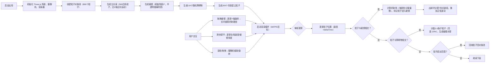

## 1. 产品概述

「光影棱镜」是一款基于 WebGL 的浏览器端三维光学可视化应用，通过交互方式让用户直观理解光线通过三棱镜发生色散的物理过程，解决传统光线传播可视化缺乏交互性和空间感的问题。

- 主要用途：物理教育演示、交互式科学可视化、设计灵感创作工具
- 目标用户：物理学习者、教育工作者、视觉设计师、艺术爱好者
- 市场价值：以低成本、易访问的方式呈现高质量光学模拟，支持教学演示与艺术创作双重场景

## 2. 核心特性

### 2.1 功能模块
1. **光束粒子系统**：主光源由500个白色发光粒子组成，穿过棱镜后分裂为七色光谱（红橙黄绿青蓝紫），每种颜色以不同折射角度射出，轨迹带有正弦波动模拟光的波动性。
2. **棱镜交互系统**：用户可通过鼠标拖拽棱镜绕Y轴旋转（0-360°），实时更新光束入射/出射角，棱镜半透明玻璃材质带微弱高光与浅蓝色反光纹理。
3. **环境碰撞反馈**：场景随机分布5-8个半透明障碍物，彩色光束碰撞后分裂为2-3条子光束（亮度降低20%），碰撞点产生0.3秒闪烁光晕。
4. **动态环境光（星尘）**：200个随机色相微小光点缓慢飘移，接近光束路径时短暂增亮，营造背景氛围。
5. **UI控制面板**：右上角半透明玻璃毛边控制面板，含光束速度滑块（0.5-5单位/秒）、棱镜角度滑块（0-360°）、重置视角按钮。

### 2.2 页面详情
| 页面名称 | 模块名称 | 功能描述 |
|---------|---------|---------|
| 主场景 | 光束粒子系统 | 500粒子白光源→7色分裂→正弦波动轨迹→辉光特效 |
| 主场景 | 棱镜交互 | Y轴拖拽旋转、半透明玻璃材质、边缘发光边框 |
| 主场景 | 障碍物碰撞 | 5-8个暖色随机障碍物、分支反射、碰撞光晕 |
| 主场景 | 动态星尘 | 200漂浮光点、接近光束时增亮50% |
| 主场景 | UI控制面板 | 速度滑块、角度滑块、重置按钮、玻璃毛边效果 |
| 主场景 | 摄像机控制 | OrbitControls 鼠标拖拽旋转视角、滚轮缩放 |

## 3. 核心流程

## 4. 用户界面设计

### 4.1 设计风格
- **主色调**：深空蓝黑渐变（#0B0E1A → #1A2035），冷色基调
- **点缀色**：七色光谱（红#FF4B4B / 橙#FF8C3E / 黄#FFE066 / 绿#6BE06B / 青#6BD8E0 / 蓝#5B8CFF / 紫#B46EFF），暖色障碍物材质
- **光束效果**：Canvas叠加模糊层实现辉光（Bloom后处理），棱镜边缘淡蓝色（#6BB4FF，透明度0.6）发光边框
- **字体**：现代无衬线字体，等宽数字用于参数显示
- **按钮风格**：半透明玻璃毛边（backdrop-filter: blur(12px)），圆角12px，悬停时轻微放大（1.0→1.03，0.2秒动画）
- **滑块风格**：自定义轨道+渐变填充，拇指带光晕

### 4.2 页面设计概述
| 模块名称 | UI元素 | 样式说明 |
|---------|--------|---------|
| 主画布 | Three.js Canvas | 全屏幕，深空蓝黑渐变背景，Bloom辉光后处理 |
| 棱镜 | 三棱锥几何体 | 透明度0.4，MeshPhysicalMaterial，清漆层，浅蓝色纹理，边缘发光线框 |
| 障碍物 | 立方体/球体（随机） | 暖色渐变半透明（透明度0.35），MeshStandardMaterial，悬停1.03缩放 |
| 星尘 | Points | 1-2px，随机色相，AdditiveBlending，接近光束增亮 |
| 控制面板 | 右上角浮层 | backdrop-filter: blur(16px)，rgba(255,255,255,0.08) 背景，细边框，16px内边距，圆角16px |
| 滑块组件 | 标签+数值+轨道 | 标签12px浅色，数值14px等宽加粗，轨道高度4px渐变，拇指直径14px |
| 重置按钮 | 文字按钮+图标 | 次要样式，点击触发摄像机复位动画（0.6秒缓动） |

### 4.3 响应式设计
- 桌面优先，适配 ≥1280×720 分辨率
- 控制面板固定右上角（right: 24px, top: 24px），宽度300px
- 小屏幕（<1024px）控制面板宽度240px，字体缩小1号
- 触控设备支持：双指缩放替代滚轮，单指拖拽控制视角/棱镜

### 4.4 3D场景指引
- **环境**：深空蓝黑渐变背景，无HDRI（自发光粒子系统主导照明）
- **光照设置**：
  - AmbientLight (强度0.15，颜色#4A6090)：提供基础冷色环境
  - DirectionalLight (强度0.4，颜色#B0C8FF，位置(5,8,5))：模拟场景主光源
  - PointLight ×2 (强度0.6-0.8，跟随棱镜/光束焦点)：强调折射区域
- **摄像机**：PerspectiveCamera (fov=60, aspect=w/h, near=0.1, far=200)，初始位置(8, 6, 10)，lookAt(0,0,0)
- **构图**：棱镜位于场景中心 (0,0,0)，光束从左侧(-8, 0, 0)入射，障碍物体积<1单位，分布于半径3-6区域
- **交互**：
  - OrbitControls：enableDamping=true，dampingFactor=0.08，minDistance=4，maxDistance=25
  - 棱镜拖拽：鼠标悬停棱镜时光标变手型，拖拽绕Y轴旋转，角度限制0-360°
- **后处理**：@react-three/postprocessing Bloom（强度0.8，半径0.5，阈值0.2），FXAA抗锯齿
- **性能预算**：粒子总数≤800，Draw Call≤20，每帧对象分配≈0（对象池复用）
