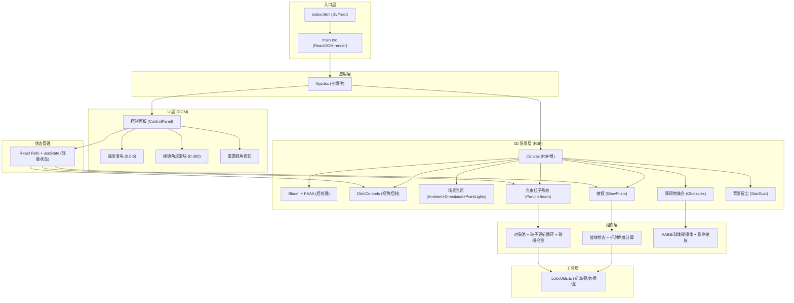

## 1. 架构设计



## 2. 技术说明
- **前端框架**：React@18 + TypeScript@5 + Vite@5
- **3D渲染**：three@0.160 + @react-three/fiber@8 + @react-three/drei@9 + @react-three/postprocessing@2
- **构建工具**：Vite (别名 @ → src，路径解析配置)
- **后处理**：Bloom（辉光）、FXAA（抗锯齿）
- **无后端**：纯前端可视化应用，无数据持久化需求
- **状态管理**：轻量级，使用 React useState/useRef（非zustand，因规模小且主要为场景引用）

## 3. 文件组织
```
auto45/
├── package.json                 # 依赖声明 + npm run dev 启动脚本
├── vite.config.js               # Vite 配置 + @ 别名
├── tsconfig.json                # TS 严格模式, ES2020, moduleResolution bundler
├── index.html                   # 入口 HTML, 加载 div#root
└── src/
    ├── main.tsx                 # React 入口, 渲染 <App />
    ├── App.tsx                  # 主组件: 组合Canvas+UI+光照+星尘+障碍物
    ├── components/
    │   ├── ParticleBeam.tsx     # 光束粒子系统: 对象池、运动、分裂、碰撞
    │   └── GlowPrism.tsx        # 棱镜组件: 拖拽旋转、折射计算、玻璃材质
    └── utils/
        └── colorUtils.ts        # 光谱生成、颜色插值、亮度调整
```

## 4. 核心数据模型
### 4.1 粒子结构 (内存中对象池)
```ts
interface BeamParticle {
  id: number
  active: boolean
  position: THREE.Vector3     // 当前位置
  velocity: THREE.Vector3     // 速度向量（单位向量 × speed）
  color: THREE.Color          // 当前颜色
  baseColorIndex: number      // 0=白, 1-7=红橙黄绿青蓝紫
  size: number                // 3-6px (映射到 Points sizeAttenuation)
  enteredPrism: boolean       // 是否已进入棱镜
  exitedPrism: boolean        // 是否已出射（分裂后）
  wavePhase: number           // 正弦波动相位
  brightness: number          // 亮度系数 (1.0 = 正常, 0.8 = 碰撞后)
  life: number                // 粒子生命周期 (秒)
}
```

### 4.2 星尘粒子结构
```ts
interface StarDust {
  position: THREE.Vector3
  velocity: THREE.Vector3
  color: THREE.Color
  baseSize: number
  boostIntensity: number  // 接近光束时的增亮系数 (0-1)
  boostTimer: number      // 增亮剩余时间
}
```

### 4.3 障碍物结构
```ts
interface Obstacle {
  id: number
  type: 'box' | 'sphere'
  position: THREE.Vector3
  size: THREE.Vector3 | number  // box: Vector3, sphere: radius
  color: THREE.Color            // 暖色系随机
  hovered: boolean
}
```

## 5. 关键算法说明

### 5.1 棱镜折射与色散模拟
- **简化模型**：非严格物理 Snell 定律（兼顾性能与视觉效果）
- **入射判定**：粒子 position.x 进入 [-0.5, 0.5] 且 y/z 在棱镜横截面内时标记 `enteredPrism`
- **出射判定**：粒子 position.x > 0.5 时分配光谱组
- **折射角偏移**：
  - 红光 (index 1)：原方向 ±5°
  - 橙 (2)：±7°
  - 黄 (3)：±9°
  - 绿 (4)：±11°
  - 青 (5)：±13°
  - 蓝 (6)：±14°
  - 紫 (7)：±15°
- **棱镜旋转影响**：速度向量先绕 Y 轴旋转 prismRotation 度，再添加色散偏移，最后反向旋转回世界坐标

### 5.2 正弦波动轨迹
出射后每帧更新：
```
offset.y = sin(wavePhase) × 0.3
offset.z = cos(wavePhase) × 0.2
wavePhase += deltaTime × 2π × 2  (2Hz)
```
波动叠加到 position，不影响 velocity 方向（保留粒子出射主方向）

### 5.3 碰撞检测与分支
- 使用简化球体碰撞：障碍物包裹为球体，distance(particle, obstacleCenter) < obstacleRadius + 0.05
- 碰撞触发：
  1. 父粒子 active=false（回收到对象池）
  2. 从对象池获取 2-3 个子粒子
  3. 子粒子继承父粒子 position/baseColorIndex
  4. 子粒子 velocity = 父粒子 velocity 绕随机轴旋转 (10-30°)
  5. 子粒子 brightness = 父粒子 brightness × 0.8
  6. 在碰撞点生成临时光晕对象（0.3秒淡出）

### 5.4 对象池模式
- 预分配 800 个 BeamParticle，保存在 Float32Array + 对象数组双结构中
- `acquire()`: 找到第一个 active=false 的粒子并初始化返回
- `release(id)`: 标记 active=false，重置 position/velocity
- 粒子几何：使用 THREE.BufferGeometry，每帧直接写入 position/color attribute，避免创建/销毁 Three.js 对象

## 6. 性能优化策略
1. **单 Draw Call**：所有光束粒子合并到单个 Points，使用 ShaderMaterial 实现大小/颜色变化
2. **无 GC 分配**：粒子状态存放在预先分配的 TypedArray 中，渲染循环零对象分配
3. **距离剔除**：粒子超出 ±15 单位范围立即回收
4. **碰撞空间划分**：障碍物数量少（5-8个），直接 O(m×n) 检测，无需 BVH
5. **后处理限制**：Bloom 仅对高亮度像素（阈值0.2）生效，半径0.5避免大范围模糊

## 7. 构建与运行
```bash
# 安装依赖
npm install
# 启动开发服务器
npm run dev
# 访问 http://localhost:5173
```
