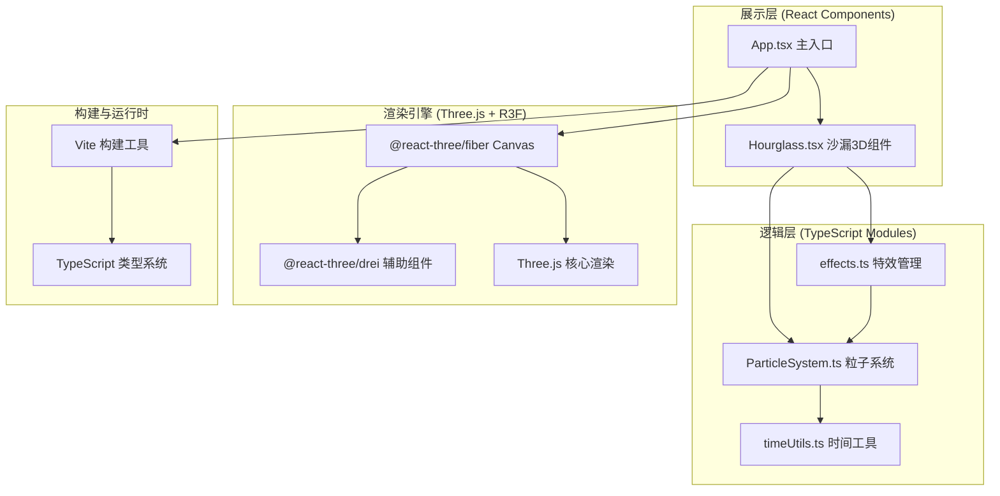

## 1. 架构设计



## 2. 技术描述

- **前端框架**：React@18 + TypeScript@5（strict模式，禁用implicitAny，启用strictNullChecks）
- **3D渲染栈**：Three.js@0.160 + @react-three/fiber@8 + @react-three/drei@9
- **构建工具**：Vite@5 + @vitejs/plugin-react@4（开启严格模式）
- **状态管理**：React useState/useRef + useFrame（R3F每帧钩子）
- **数据结构**：Float32Array存储粒子位置/速度/颜色，避免GC压力

## 3. 路由定义

| 路由 | 用途 |
|-----|------|
| / | 主场景页（单页应用，唯一入口） |

## 6. 数据模型

### 6.1 粒子数据结构（ParticleSystem内部）

```
ParticleState:
  - positions: Float32Array(5000 * 3)    // x,y,z 三维坐标
  - velocities: Float32Array(5000 * 3)   // vx,vy,vz 速度向量
  - colors: Float32Array(5000 * 3)       // r,g,b 颜色值
  - sizes: Float32Array(5000)            // 粒子半径 1.5-2.5px
  - lifetimes: Float32Array(5000)        // 生命周期状态 0=待激活 1=下落 2=堆积
  - trailAlphas: Float32Array(5000)      // 尾迹透明度衰减
```

### 6.2 数字轮廓数据模型（timeUtils输出）

```
DigitContour: {
  hourTens:   Vector2[]    // 小时十位笔画采样点
  hourOnes:   Vector2[]    // 小时个位笔画采样点
  minuteTens: Vector2[]    // 分钟十位笔画采样点
  minuteOnes: Vector2[]    // 分钟个位笔画采样点
  allPoints:  Vector2[]    // 合并后所有目标点
  colorGroup: number[]     // 每点所属颜色分组索引
}
```

## 7. 项目文件结构

```
auto45/
├── package.json              # 依赖与脚本定义
├── vite.config.js            # Vite配置
├── tsconfig.json             # TypeScript严格配置
├── index.html                # 入口HTML（全屏无滚动）
└── src/
    ├── main.tsx              # React挂载入口
    ├── App.tsx               # 主组件：Canvas场景+时间状态
    ├── Hourglass.tsx         # 沙漏3D模型+粒子容器+交互控制
    ├── ParticleSystem.ts     # 5000粒子物理引擎（类模块）
    ├── timeUtils.ts          # 时间→HSL颜色/数字轮廓计算
    └── effects.ts            # 尾迹/火花/玻璃反光特效
```

## 8. 关键性能优化策略

- **粒子批处理**：使用 `THREE.Points` + `BufferGeometry`，所有粒子单次 `drawArrays` 调用，无逐片元分支
- **内存优化**：粒子状态存储于 `Float32Array`，避免创建临时对象，减少V8 GC频率
- **物理简化**：每帧物理计算控制在4ms内，粒子碰撞采用空间网格哈希（10×10×10网格）而非O(n²)检测
- **渲染调度**：`useFrame` 中分离逻辑更新（1步/帧）与渲染，`delta` 时间归一化保证不同帧率体验一致
- **材质复用**：玻璃（MeshPhysicalMaterial）、金属（MeshStandardMaterial）、粒子（PointsMaterial）各仅创建1份实例
