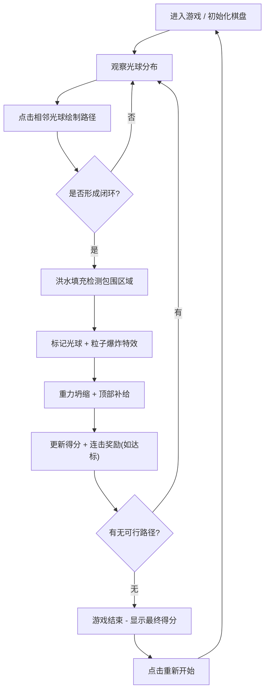

## 1. 产品概述

「光痕连珠」是一款在浏览器中运行的2D回合制连珠消除游戏，通过发光六边形网格和动态物理粒子特效，为玩家提供沉浸式的策略消除体验。
- 解决传统消除游戏缺乏动态物理反馈和空间切割策略的问题，引入路径闭合机制与洪水填充区域检测
- 目标用户为休闲游戏爱好者、策略游戏玩家，提供从移动端到桌面端的全适配体验

## 2. 核心功能

### 2.1 用户角色
| 角色 | 注册方式 | 核心权限 |
|------|----------|----------|
| 玩家 | 无需注册，直接进入 | 进行游戏、查看得分、重置游戏 |

### 2.2 功能模块
1. **游戏主页面**：六边形棋盘画布、得分面板、操作引导提示
2. **游戏引擎模块**：网格初始化、路径绘制与闭合检测、洪水填充算法、重力坍缩算法
3. **粒子特效模块**：光球爆炸粒子、冲击波特效、路径流光动画
4. **计分系统模块**：基础得分、连击奖励、特大号数字动画
5. **游戏结束模块**：无解检测、最终得分展示、重新开始按钮

### 2.3 页面详情
| 页面名称 | 模块名称 | 功能描述 |
|----------|----------|----------|
| 游戏主页面 | 六边形棋盘画布 | 7列×8行六边形网格，半透明白色边框线，发光光球带径向光晕 |
| 游戏主页面 | 路径绘制系统 | 点击相邻格子绘制发光线段（3px厚度，颜色渐变），0.8秒发光淡出，流光高光动画 |
| 游戏主页面 | 闭合回路检测 | 洪水填充算法检测闭环区域，包围光球标记待清除 |
| 游戏主页面 | 粒子爆炸系统 | 0.2秒炸裂成10-15颗粒子，0.6秒放大消失；正弦曲线冲击波（25px→60px，0.3秒） |
| 游戏主页面 | 重力坍缩补给 | 清除后光球向底部坍缩，顶部300px/s随机延迟降落补球，6种预设颜色随机 |
| 游戏主页面 | 计分连击系统 | 每球10分，≥5球触发连击（球数²额外分），弹性数字动画（40→70→50px） |
| 游戏主页面 | 游戏结束重置 | 无可行路径时结束，显示最终得分，重新开始生成30颗初始光球 |
| 游戏主页面 | 毛玻璃UI界面 | 得分面板、结束弹窗采用毛玻璃效果（backdrop-blur:10px） |
| 游戏主页面 | 响应式适配 | 320px移动端到1920px桌面端，棋盘自动缩放，格子≥30px |

## 3. 核心流程

玩家进入游戏后，观察棋盘上的彩色光球分布，依次点击两个相邻的光球，在它们之间绘制发光路径线段。玩家继续连接相邻光球，形成一条连续的路径。当路径首尾相接形成闭合回路时，系统使用洪水填充算法检测包围区域，区域内所有光球标记待清除，触发粒子爆炸特效。清除完成后，剩余光球因重力向底部坍缩，顶部随机生成新光球补入空缺。系统更新得分，若清除球数≥5则触发连击奖励动画。玩家继续游戏，当棋盘上所有光球彼此孤立无法形成闭环时，游戏结束，显示最终得分和重新开始按钮。

## 4. 用户界面设计

### 4.1 设计风格
- **主色调**：深空蓝紫渐变背景（#0B0B2B → #1A1A3E 径向渐变）
- **强调色**：6种光球配色（珊瑚红#FF6B6B、薄荷青#4ECDC4、暖阳黄#FFE66D、薰衣草紫#A78BFA、蜜橙#F97316、翡翠绿#6EE7B7）
- **呼吸边框**：薰衣草紫#A78BFA，透明度0.4→0.8循环，3秒周期
- **网格线**：半透明白色#FFFFFF 15%透明度
- **按钮风格**：毛玻璃圆角按钮（背景模糊10px，半透明浅色叠加）
- **字体**：现代无衬线字体（Segoe UI / 系统默认），得分用亮白色描边
- **布局风格**：居中棋盘布局，顶部得分面板，居中浮动结束弹窗
- **动效风格**：流光路径（10px高光条，0.5秒周期左右移动）、粒子爆炸、弹性缩放动画

### 4.2 页面设计概览
| 页面名称 | 模块名称 | UI元素 |
|----------|----------|--------|
| 游戏主页面 | 背景与边框 | 深空径向渐变背景，薰衣草紫呼吸光边框 |
| 游戏主页面 | 六边形棋盘 | 半透明白色网格，光球带25px径向光晕（0.6→0.0透明度渐变） |
| 游戏主页面 | 路径系统 | 3px渐变发光线段，0.8秒发光→半透明淡出，10px高光流光动画 |
| 游戏主页面 | 粒子特效 | 10-15颗随机方向粒子（50-150px/s），正弦冲击波（球体色→白色渐变） |
| 游戏主页面 | 得分面板 | 毛玻璃效果，当前分数显示，大号亮白色描边数字动画 |
| 游戏主页面 | 结束弹窗 | 毛玻璃居中弹窗，最终得分，重新开始按钮 |
| 游戏主页面 | 响应式 | 320px-1920px自适应，棋盘等比缩放，格子≥30px |

### 4.3 响应式
- 桌面优先设计，移动端降级适配
- 棋盘采用等比缩放策略，基于视口最小边计算尺寸
- 格子尺寸最低保障30px，确保移动端可点击
- UI面板固定定位，不随棋盘缩放变形
- 触摸事件与鼠标事件双支持

### 4.4 性能目标
- 稳定60帧/秒渲染
- 粒子总数上限500颗
- 重力坍缩过程零卡顿
- Canvas 2D渲染所有游戏实体
