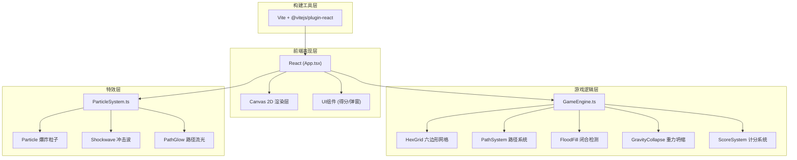

## 1. 架构设计



## 2. 技术描述
- **前端框架**：React@18 + TypeScript@5（严格模式，目标ES2020）
- **构建工具**：Vite@5 + @vitejs/plugin-react
- **渲染引擎**：Canvas 2D API（所有游戏实体）
- **状态管理**：React useState/useRef（无需额外状态库，游戏状态由GameEngine内部管理）
- **游戏循环**：requestAnimationFrame驱动，单循环统一更新与渲染
- **无后端**：纯前端游戏，数据本地内存存储

## 3. 路由定义
| 路由 | 用途 |
|------|------|
| / | 游戏主页面（单页应用，无额外路由） |

## 4. 数据模型

### 4.1 核心数据结构

```typescript
// 6种光球配色
const BALL_COLORS = [
  '#FF6B6B', '#4ECDC4', '#FFE66D',
  '#A78BFA', '#F97316', '#6EE7B7'
] as const;

type BallColor = typeof BALL_COLORS[number];

// 六边形坐标（轴向坐标系 q, r）
interface HexCoord {
  q: number; // 列
  r: number; // 行
}

// 光球实体
interface Ball {
  id: number;
  coord: HexCoord;       // 逻辑坐标
  x: number;             // 像素X
  y: number;             // 像素Y
  color: BallColor;
  radius: number;
  toClear: boolean;      // 待清除标记
  clearing: boolean;     // 清除动画中
  clearProgress: number; // 清除动画进度 0~1
  falling: boolean;      // 下落动画中
  fallTargetY: number;   // 下落目标Y
  fallDelay: number;     // 下落延迟ms
}

// 路径线段
interface PathSegment {
  from: HexCoord;
  to: HexCoord;
  colorFrom: BallColor;
  colorTo: BallColor;
  createdAt: number;     // 创建时间戳
  duration: number;      // 总时长ms
  opacity: number;       // 当前透明度
}

// 爆炸粒子
interface Particle {
  id: number;
  x: number;
  y: number;
  vx: number;            // 速度X
  vy: number;            // 速度Y
  color: string;
  life: number;          // 剩余寿命ms
  maxLife: number;       // 总寿命ms
  size: number;          // 初始大小
}

// 冲击波
interface Shockwave {
  id: number;
  x: number;
  y: number;
  color: string;
  progress: number;      // 0~1
  duration: number;      // ms
  elapsed: number;       // 已过时间ms
}

// 连击数字动画
interface ComboPopup {
  value: number;
  x: number;
  y: number;
  progress: number;      // 0~1
  duration: number;
  elapsed: number;
}

// 游戏状态
type GameState = 'playing' | 'clearing' | 'collapsing' | 'gameover';
```

## 5. 文件结构

```
auto46/
├── package.json              # 项目依赖与脚本
├── index.html                # 入口HTML（div#root）
├── vite.config.js            # Vite构建配置
├── tsconfig.json             # TypeScript严格配置
└── src/
    ├── App.tsx               # React根组件（状态管理+游戏循环）
    ├── GameEngine.ts         # 核心游戏逻辑（不依赖React）
    └── ParticleSystem.ts     # 粒子系统模块
```

## 6. 核心算法说明

### 6.1 六边形坐标系
- 采用**轴向坐标系（Axial Coordinates）**：(q, r)
- 棋盘尺寸：7列 × 8行
- 像素坐标转换：pointy-top六边形布局
  - `x = size * (√3 * q + √3/2 * r)`
  - `y = size * (3/2 * r)`
- 相邻判定（6方向）：东(1,0)、东北(1,-1)、西北(0,-1)、西(-1,0)、西南(-1,1)、东南(0,1)

### 6.2 路径闭合检测
- 玩家点击形成连续路径链：`[C0, C1, C2, ..., Cn]`
- 每次新增点时检查：是否与路径中某点重合（形成闭环）
- 闭环提取：从重复点开始的子路径即为闭合环
- **洪水填充算法**：
  1. 将闭环线段标记为边界
  2. 从棋盘外围进行BFS填充，标记"外部可达"格子
  3. 未被标记且不在边界上的格子即为"包围区域"
  4. 包围区域内所有光球加入待清除列表

### 6.3 重力坍缩算法
- 按列处理，每列独立向下坍缩
- 对每列从底向上扫描：
  1. 收集该列所有现存光球
  2. 按行号排序，重新分配到底部连续行
  3. 上方空缺位置标记为空
- 补球：从顶部生成新光球，逐列填充空缺位置，带随机下落延迟

### 6.4 无解检测
- 检查棋盘上是否存在任意两个相邻光球
- 若所有光球均孤立（6邻居均无球），判定为无解
- 触发游戏结束状态

### 6.5 渲染优化
- 单层Canvas，脏区域最小化重绘
- 粒子对象池复用，避免频繁GC
- 路径透明度衰减使用时间差值计算
- requestAnimationFrame时间戳驱动，确保动画速度一致
